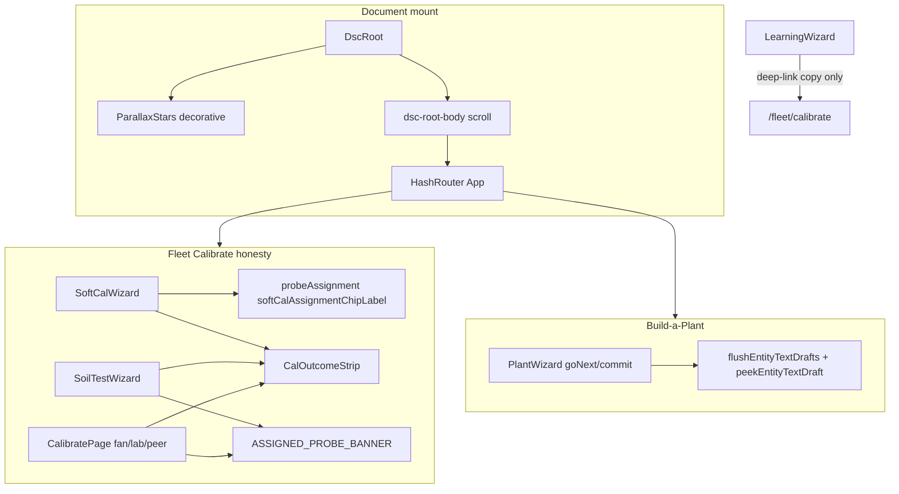

# Operator correctness Wave 1 + pinned star wash

**In one line:** SoftCal / Soil / lab assignment chrome stays honest, cal wizards share a What→Process→Expected strip, Build-a-Plant nickname survives Next, and the page atmosphere stays fixed behind the desk so gauges remain readable.

**Tip:** `94705f0` (landed `bae50fa` / `28953ae`) · **Spec:** [`docs/superpowers/specs/2026-08-31-operator-correctness-wave1-design.md`](../superpowers/specs/2026-08-31-operator-correctness-wave1-design.md) · **FOLLOWUPS:** Wave 1 section (2026-08-31) · **Waves 2–5:** [OPERATOR-POLISH.md](OPERATOR-POLISH.md)

Notion: [Local webserver UI](https://app.notion.com/p/3b52b4cda37081c19048e794d4bdf819)

## Intent

Operators could not treat SoftCal, Build-a-Plant, and fan calibration as one honest path: assignment looked “ready” without chrome, cal types lacked a shared outcome contract, nickname drafts vanished on Next without blur, and native selects clipped under overflow. Wave 1 is an honesty-first SPA pass — **no** silent auto-detach, **no** mega-wizard merge.

Pinned star wash (`ParallaxStars` / `DscRoot`) is decorative atmosphere only. Scroll lives on `.dsc-root-body` so the wash does not move with the desk; gauges stay the content.

## Architecture

| Layer | Path | Job |
|---|---|---|
| Mount | `components/ParallaxStars.tsx` | `DscRoot` wraps Pi (`main.tsx`) and HA panel (`panel-element.tsx`) |
| CSS | `styles/dsc.css` | `.dsc-stars*` absolute wash; `.dsc-root-body` scrolls; wizard select stacking |
| Assignment | `lib/probeAssignment.ts` | Resolve `assigned_plant_id` → chip / banner labels |
| Strip | `components/CalOutcomeStrip.tsx` | Shared What / Process / Expected |
| SoftCal | `SoftCalWizard.tsx` | Chip `Probe N · {label\|Unassigned} · SoftCal OK` + strip |
| Soil / lab | `SoilTestWizard.tsx`, `CalibratePage.tsx` | Assigned banner + strips; fan Start holds live fans |
| Nickname | `ui.tsx` `EntityText` + `PlantWizard.tsx` | Draft map flushed before step / commit |
| Learning | `LearningWizard.tsx` | Points to Fleet → Calibrate as fan SoT |

## Assignment resolution

`probeAssignedPlantId(pot, fleet, state)` order:

1. Fleet inventory row `seat_id === potN` → `extra.assigned_plant_id`
2. HA helper `text.dsc_probeN_assigned_plant_id` (skip `unknown` / `unavailable`)
3. Else empty → **Unassigned**

Display label prefers plant name helper → roster nickname/strain → `shortPlantId`.

**Policy (verified):** SoftCal **allowed** while assigned. Chip shows assignment. Detach remains Roster SoT — never force-detach on SoftCal open.

Banner copy (Soil Test / lab when assigned):

> Probe has a plant — SoftCal OK; detach before Soil Test move if relocating the probe.

## CalOutcomeStrip contract

| Type | What (summary) | Expected (summary) |
|---|---|---|
| Fan | Map duct % → CFM with anemometer | Curves status for that duct; **Start holds live fans** |
| SoftCal | Soft offsets vs tap / after-water (Got plane) | SoftCal plane offsets; dual stack blocks; N/P/K not SoftCal channels |
| Lab wet | Stamp one channel with buffer | Lab wet script success; peer median ≠ substitute |
| Soil test | Hold reading at station timing | Confirmed soil-test row in brain history |
| Peer | Capture / push peer offsets | Peer script status; peer ≠ lab |

Fan Start button / copy must state live hold — do not imply dry-run.

## Nickname flush

`EntityText` keeps in-flight drafts in a module `Map`. Before PlantWizard `goNext` / commit:

1. `flushEntityTextDrafts(callService)` blurs active element and writes drafts via `input_text.set_value`
2. Review reads `peekEntityTextDraft("input_text.dsc_build_nickname")` so typed-then-Next without blur still survives

## Pinned star wash

- Deterministic Mulberry32 seeds (`0xdc501` / `502` / `503`) — wash does not reshuffle on remount
- Three box-shadow layers + token radial `.dsc-stars-atmosphere`
- `aria-hidden="true"`; **not** a live sensor viz
- `prefers-reduced-motion: reduce` disables drift animation
- Do not put operator chrome inside `.dsc-stars` — content stays in `.dsc-root-body`

## spa-dist (tip `94705f0` / `28953ae`)

| Asset | Hash |
|---|---|
| Index | `index-JuWgMbJV.js` · CSS `index-YHuXqGUv.css` |
| Calibrate chunk | `calibrate-BNJCw6ba.js` |
| Tune fleet | `tune-fleet-DFrH_SAo.js` |
| Twin | `twin-three-B0t1gmm4.js` |

Bundle smoke: SoftCal OK · `What:` · holds live fans (see `.superpowers/sdd/progress-operator-polish.md`). Wave 1 chrome remains in this train; hashes supersede `index-XS57jN-m.js`.

## Constraints / pitfalls

- Kit probes only (`KIT_PROBE_NUMBERS` = 1–2). pot3/4 are inventory/Advanced restore — not SoftCal kit chrome.
- Operator language: **Probe** / **Plant**, not Seat / POT.
- SoftCal samples Soil \* Raw Got offsets — not lab ESP stamp; dual_cal_stack blocks apply.
- Do not invent height / chem / PPFD / NPK channels.
- Catalog drawer scroll must keep `:has(.dsc-catalog-picker)` overflow; only non-picker decision panels go `overflow: visible`.
- Waves 2–5 landed on tip `28953ae` — see [OPERATOR-POLISH.md](OPERATOR-POLISH.md).

## Verify

1. SoftCal chips show pot1/pot2 assignment or Unassigned · SoftCal OK
2. Soil Test / lab show assigned banner when plant bound
3. Nickname → Next without blur still on review
4. Fan strip + “holds live fans” visible on `/fleet/calibrate`
5. Compose assign native select not clipped
6. Star wash fixed while scrolling desk content
