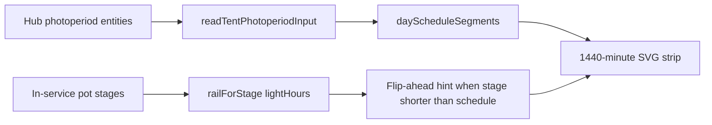

# Per-tent photoperiod timeline (7.4 D1)

**Intent:** Show a **calendar-day 24h on/off strip** per tent on the Light page so operators see scheduled light hours vs stage Want — separate from duty/history strips.

**Tip:** `b84edc2` · QA walk [`docs/qa/LIGHT-AUDIT-7.4-live.md`](../qa/LIGHT-AUDIT-7.4-live.md)

## Where it lives

| Piece | Path |
|-------|------|
| UI | `PhotoperiodTimeline.tsx` on Light page (4×8 + 2×4) |
| Schedule math | `lib/lightSchedule.ts` — `readTentPhotoperiodInput`, `dayScheduleSegments` |
| Stage hours hint | `lib/tentWant.ts` `railForStage` vs schedule hours |
| Crop desk | Split `CropScheduler` (per-tent) |

Firmware still owns SNTP, sunrise/sunset ramps, and dark-period safety. The SPA timeline is **presentation** over hub number/datetime entities.

## Operator story

- Lit segments render for the local calendar day (midnight-based).
- Meta line: On / Off clock labels, hours lit, optional sunrise+sunset ramp minutes.
- If stage Want light-hours are **>0.5h shorter** than the schedule, show a flip-countdown hint (shorten the window before flip day).
- Duty / window history remains on the separate duty strip below — different axis.

## Follow vs Independent

When the 2×4 window source is **Follow 4×8**, Independent lights-on/hours editors stay locked (same Follow-mode lock as TentLightClock desks). Timeline still draws the effective followed schedule.

## Constraints

- Do not treat the SVG as lamp actuation proof — use DutyStrip + hub OLED for live duty.
- 4×8 may still be a **virtual window** until GPIO5 lamp hardware (F-008-adj); schedule remains real.
- Prefer updating this file + Light audit over duplicating Photoperiod Notion history.

## Related

- Notion [Photoperiod & Lighting](https://app.notion.com/p/39c2b4cda3708194a606fa0b1e6098a2)
- [`WEBUI.md`](WEBUI.md) · [`PLAN-7.4.md`](../qa/PLAN-7.4.md)
