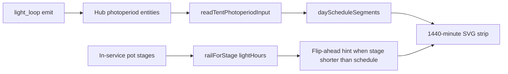

# Per-tent photoperiod timeline

**Intent:** Show a **calendar-day 24h on/off strip** per tent on the Light page so operators see scheduled light hours vs stage Want — separate from duty/history strips and from local energy estimates.

**Tip:** `ee636f9` (spa-dist `index-BoyhWWR_.js`) · prior v7.4.0 light audit [`docs/qa/LIGHT-AUDIT-7.4-live.md`](../qa/LIGHT-AUDIT-7.4-live.md) · Live UX Light desk gate [`../qa/LIVE-UX-LIGHT-WALK-2026-09.md`](../qa/LIVE-UX-LIGHT-WALK-2026-09.md) · Overview glance SoT in [`LIVE-UX-HONESTY.md`](LIVE-UX-HONESTY.md) (Passes **1–5 proven / closed** — timeline SVG still schedule presentation, not DutyStrip)

## Where it lives

| Piece | Path |
|-------|------|
| UI | `PhotoperiodTimeline.tsx` on Light page (`#/live/light`, 4×8 + 2×4) |
| Clocks | `TentLightClock.tsx` + `hooks/useTentLightSchedule.ts` |
| Schedule math | `lib/lightSchedule.ts` — `readTentPhotoperiodInput`, `dayScheduleSegments` |
| Stage hours hint | `lib/tentWant.ts` `railForStage` vs schedule hours |
| Brain SoT | `brain/dsc_brain/light_loop.py` (`build_light_loop` / `emit_light_loop`); hub ingest `HUB_TIME_OID_TO_ENTITY` |
| Energy / journals (same tip) | [`SPACE-ENERGY-JOURNAL.md`](SPACE-ENERGY-JOURNAL.md) — LightEnergyPanel + TentOccupancyJournal below the clocks; Overview hosts Room + DSC-Core |

Firmware still owns SNTP, sunrise/sunset ramps, and dark-period safety. The SPA timeline is **presentation** over hub number/datetime entities.

## Operator story

- Lit segments render for the local calendar day (midnight-based).
- Meta line: On / Off clock labels, hours lit, optional sunrise+sunset ramp minutes.
- If stage Want light-hours are **>0.5h shorter** than the schedule, show a flip-countdown hint (shorten the window before flip day).
- Duty / window history remains on the separate duty strip — different axis.
- Local $ estimates and approve-only slides live in **LightEnergyPanel** (not this SVG).

## Follow vs Independent

When the 2×4 window source is **Follow 4×8**, Independent lights-on/hours editors stay locked (same Follow-mode lock as TentLightClock desks). Timeline still draws the effective followed schedule.

## Ownership

**SHIPPED:** tent helpers + stage automation still can write 2×4 photoperiod (`apply_clone_tent_automation` / `PlantSeatPanel.applyTent`). Climate Mode Follow Plants writes `clone_*` climate bands only — not lighting.

**Same tip:** space model + `/energy/shift/plan` (`confirm=true`) is the approve-only slide path; plant card is journal-only. Both tents proven live — see [`SPACE-ENERGY-JOURNAL.md`](SPACE-ENERGY-JOURNAL.md) and [`../qa/SPACE-ENERGY-PI-WALK-2026-09.md`](../qa/SPACE-ENERGY-PI-WALK-2026-09.md).

Room + DSC-Core journals are **not** Light-page surfaces — they live on **Overview** (`RoomJournal` / `CoreJournal`).

## Constraints

- Do not treat the SVG as lamp actuation proof — use DutyStrip + hub OLED for live duty.
- 4×8 may still be a **virtual window** until GPIO5 lamp hardware (F-008-adj); schedule remains real.
- Prefer updating this file + Light audit over duplicating Photoperiod Notion history.

## Related

- Notion [Photoperiod & Lighting](https://app.notion.com/p/39c2b4cda3708194a606fa0b1e6098a2)
- [`WEBUI.md`](WEBUI.md) · [`SPACE-ENERGY-JOURNAL.md`](SPACE-ENERGY-JOURNAL.md) · [`LIVE-UX-HONESTY.md`](LIVE-UX-HONESTY.md) · [`../qa/PLAN-7.4.md`](../qa/PLAN-7.4.md)
