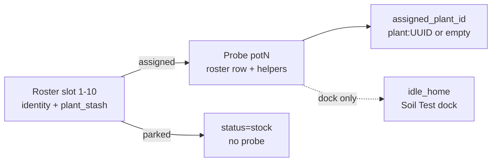
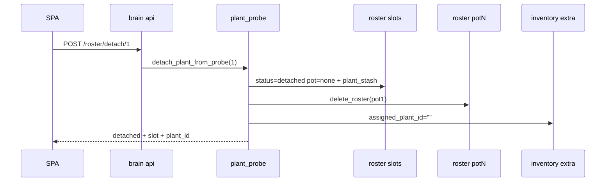

# Plant ↔ probe lifecycle

**In one line:** Assign / move / **detach** keep plant identity on the roster without retire; **stock** parks with no probe; **slot retire** destroys by roster number and clears **`plant_uuid`**; SPA Roster / Root / seat drawer are clients of one Assignment SoT.

**Tip (post-stress audit):** `a2f5f08` / `3a452f0` · SPA `index-D7pAmjOB.js`  
**Prior (computed refresh after retire):** `149657d`  
**Prior (capacity + stock + slot retire):** `15d7016` · Bar 2: `fe55e4e`  
**Code:** `brain/dsc_brain/plant_probe.py` · `compose_ops.py` · `compose_store.py` · `api.py` · SPA `fleetApi.ts` · `useBrain.tsx` · `GrowPages.tsx` · `PlantSeatPanel.tsx` · `brain/tests/test_roster_stress.py`  
**Rules:** [`.cursor/rules/dsc-roster-probe.mdc`](../../.cursor/rules/dsc-roster-probe.mdc)  
**Plan / trail:** [`../superpowers/plans/2026-08-29-plant-probe-lifecycle.md`](../superpowers/plans/2026-08-29-plant-probe-lifecycle.md) · tip SoT [ROSTER-STOCK.md](ROSTER-STOCK.md)  
**Notion:** [Pi offline brain](https://app.notion.com/p/3b52b4cda370818e8b66f671689f7a57) · [Local webserver UI](https://app.notion.com/p/3b52b4cda37081c19048e794d4bdf819)

## Intent

Operators swap probes, free a stick for SoftCal / Soil Test, stage stock for later seating, or park a plant without destroying its recipe. Retire (Delete) is the only destroy path — **slot-keyed** so stock and detached rows can be removed, and emptied slots must not keep a prior `plant_uuid`.

## Three objects (do not conflate)

| Object | Meaning | SoT |
|--------|---------|-----|
| **Probe** | Hardware soil stick + inventory seat `potN` / entities `dsc_probeN_*` | Kit Probe **1–2** live; 3–4 OOS / Advanced |
| **Plant** | Roster identity (nickname, strain, sprout, notes, optional `plant_uuid`) | Roster slots **1–10** (`ROSTER_SLOT_COUNT`) |
| **Assignment** | Which plant this probe’s Got represents | Inventory `extra.assigned_plant_id` + helper `text.dsc_probeN_assigned_plant_id` (`plant:…`) |

`idle_home` = Soil Test **dock** only. SoftCal ≠ probe-station home ≠ tent place ≠ **detach** ≠ retire.



## Ops

| Op | Effect | Does **not** |
|----|--------|--------------|
| **Stock commit** | `dsc_build_plant_commit` with assign `none` → slot `status=stock` | Bind a probe |
| **Detach** | Deletes pot-keyed roster row; clears helpers + `assigned_plant_id`; slot → `detached`, `pot=none`, keeps `plant_stash` | Destroy plant; touch idle_home / SoftCal |
| **Assign** | Binds detached/unassigned/stock slot onto a vacant probe; `release_conflicting_slot_pots` clears stale claims | Silently overwrite another plant’s true occupancy (400) |
| **Move** | Atomic detach(src) + assign(dst) | Swap onto occupied dst |
| **Slot retire** | `POST /roster/slots/{n}/retire` empties slot (**incl. `plant_uuid`**); clears probe if this slot owns it | Same as detach |
| Compose `assign_to_pot` | Seats build helpers; conflict release + occupancy check | Separate wizard path; same fields |

## REST + scripts

Brain HTTP (`:8787`):

| Method | Path | Body | Notes |
|--------|------|------|-------|
| `POST` | `/roster/detach/{pot_n}` | — | Keep slot |
| `POST` | `/roster/assign` | `{ "slot": N, "pot": M }` | Vacant or same-slot rebind |
| `POST` | `/roster/move` | `{ "from_pot": A, "to_pot": B }` | Dst vacant |
| `POST` | `/roster/slots/{slot_n}/retire` | — | Destroy slot 1–10; clear identity |

Script aliases via `POST /control/service`:

- `script.dsc_plant_detach` — `pot`
- `script.dsc_plant_assign_slot` — `slot` + `pot`
- `script.dsc_plant_move` — `from_pot` + `to_pot`
- `script.dsc_plant_retire` — wipe plant; pass `slot` for slot-keyed retire
- `script.dsc_build_plant_commit` — roster only (stock when assign none)
- `script.dsc_build_plant_commit_and_assign` — seated path

```bash
curl -sS -X POST "http://dsc-brain.local:8787/roster/detach/2"
curl -sS -X POST "http://dsc-brain.local:8787/roster/assign" \
  -H 'Content-Type: application/json' -d '{"slot":3,"pot":1}'
curl -sS -X POST "http://dsc-brain.local:8787/roster/slots/3/retire"
```

Constraints (verified in `plant_probe.py` / `compose_ops.py` / tests):

- `pot` ∈ 1–4; `slot` ∈ 1–**10**
- Assign rejects occupied destination when incumbent is a **different** slot
- Stale `pot=` claims on other slots are released before assign
- Detach requires a resolvable pot-keyed row + slot (otherwise refuse — would lose plant)
- Empty slots cannot assign or retire
- After retire, emptied slot `plant_uuid` is `""` (tip `3a452f0`)

## SPA surfaces

| Surface | Actions |
|---------|---------|
| `#/grow/compose` | Stock or seated create — [PLANT-WIZARD.md](PLANT-WIZARD.md) |
| `#/grow/roster` | Detach · Assign · **Delete** (slot retire; drawer close uses captured `retirePot`) |
| Crop scheduler | Stock/detached lanes on tent rail — [ROSTER-STOCK.md](ROSTER-STOCK.md) |
| Plant seat drawer | Detach · Move · Retire |
| `#/live/root` | Vacant probe ≠ station ≠ planted Got |

Kit assign options stay Probe 1–2 (`KIT_PROBE_NUMBERS`).

## Persistence sketch



## Pitfalls

- **Retire ≠ detach** — Delete destroys recipe; Detach keeps `plant_stash`.
- **Settings “Unassign pot”** clears `idle_home` only — not plant assignment.
- **Do not** clear helpers by hand and leave a pot-keyed roster row (Root/Roster diverge).
- **Move** is not a swap — destination must be vacant.
- After slot retire, SPA refreshes via **serialized** `/fleet/computed` (cache-busted) — wait ~one 5s poll if the row sticks; hard-reload only as fallback ([ROSTER-STOCK.md](ROSTER-STOCK.md) § Fleet computed refresh).
- After Delete with a probe drawer open, close uses **`retirePot === pot`** — do not re-read stale roster from the pre-refresh closure (tip `3a452f0`).
- Follow Plants still primarily keys 2×4 via roster tent + seated name (full `assigned_plant_id` switch remains residual).

## Verify

```bash
pytest brain/tests/test_plant_probe.py brain/tests/test_roster_stress.py -q
```

Related: [ROSTER-STOCK.md](ROSTER-STOCK.md) · [PLANT-WIZARD.md](PLANT-WIZARD.md) · [WEBUI.md](WEBUI.md) · [`../ops/PI-HOTPATCH.md`](../ops/PI-HOTPATCH.md)
