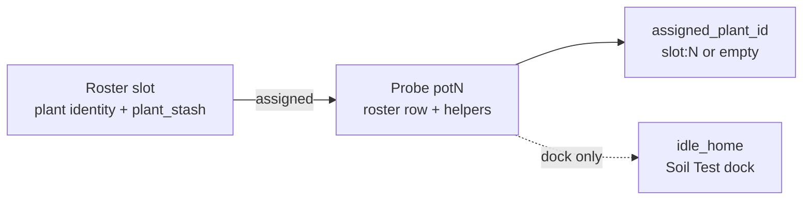
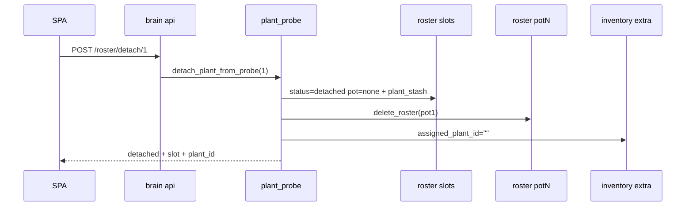

# Plant ↔ probe lifecycle (Bar 2)

**In one line:** Assign / move / **detach** are first-class brain ops so a plant can leave a probe without being retired; SPA Roster / Root / seat drawer are clients of one Assignment SoT.

**Tip:** `fe55e4e` · SPA bundle `index-CEeqi1BT.js`  
**Code:** `brain/dsc_brain/plant_probe.py` · `api.py` · `compose_ops.py` · SPA `fleetApi.ts` · `GrowPages.tsx` · `PlantSeatPanel.tsx` · `RootPage.tsx`  
**Plan / trail:** [`../superpowers/plans/2026-08-29-plant-probe-lifecycle.md`](../superpowers/plans/2026-08-29-plant-probe-lifecycle.md) · [`.audit/bar2-plant-probe.tsv`](../../.audit/bar2-plant-probe.tsv)  
**Evidence:** `docs/qa-screenshots-2026-08-29/bar2-roster.png` · `bar2-root.png`  
**Notion:** [Pi offline brain](https://app.notion.com/p/3b52b4cda370818e8b66f671689f7a57) · [Local webserver UI](https://app.notion.com/p/3b52b4cda37081c19048e794d4bdf819)

## Intent

Operators swap probes, free a stick for SoftCal / Soil Test, or park a plant without destroying its recipe. Before Bar 2 the only way to clear a probe was **retire** (wipes the plant). Detach keeps identity on the roster; assign / move rebind without inventing a second SPA assignment story.

## Three objects (do not conflate)

| Object | Meaning | Tip SoT |
|--------|---------|---------|
| **Probe** | Hardware soil stick + inventory seat `potN` / entities `dsc_probeN_*` | Kit Probe 1–2 live; 3–4 OOS |
| **Plant** | Roster identity (nickname, strain, sprout, stage, notes) | Roster **slot** 1–8; transitional plant key `slot:N` |
| **Assignment** | Which plant this probe’s Got represents | Inventory `extra.assigned_plant_id` + helper `text.dsc_probeN_assigned_plant_id` |

`idle_home` = Soil Test **dock** only. SoftCal ≠ probe-station home ≠ tent place ≠ **detach** ≠ retire.



## Ops

| Op | Effect | Does **not** |
|----|--------|--------------|
| **Detach** | Deletes pot-keyed roster row; clears probe helpers + `assigned_plant_id`; slot → `status=detached`, `pot=none`, keeps `plant_stash` JSON | Destroy plant; touch idle_home / SoftCal |
| **Assign** | Binds detached/unassigned slot onto a **vacant** probe; restores helpers + `assigned_plant_id=slot:N`; slot → `active` | Overwrite an occupied probe (400) |
| **Move** | Atomic detach(src) + assign(dst) | Swap onto occupied dst (detach dst first) |
| **Retire** | Still destructive — clears assignment then empties slot | Same as detach |
| Compose `assign_to_pot` | Writes assignment SoT via `sync_assignment_on_compose_assign` | Separate wizard path; same field |

Transitional plant id: `slot:{1-8}` until a dedicated plant UUID exists (FOLLOWUPS deferred).

## REST + scripts

Brain HTTP (`:8787`):

| Method | Path | Body | Returns (shape) |
|--------|------|------|-----------------|
| `POST` | `/roster/detach/{pot_n}` | — | `{ pot, slot, plant_id, nickname, detached: true }` |
| `POST` | `/roster/assign` | `{ "slot": N, "pot": M }` | `{ pot, slot, plant_id, tent, assigned: true }` |
| `POST` | `/roster/move` | `{ "from_pot": A, "to_pot": B }` | `{ from_pot, to_pot, slot, plant_id, moved: true }` |

Script aliases via `POST /control/service`:

- `script.dsc_plant_detach` — `pot`
- `script.dsc_plant_assign_slot` — `slot` + `pot`
- `script.dsc_plant_move` — `from_pot` + `to_pot`
- `script.dsc_plant_retire` — still wipe plant

```bash
# Detach plant from Probe 2 (keep roster slot)
curl -sS -X POST "http://dsc-brain.local:8787/roster/detach/2"

# Re-bind slot 1 onto vacant Probe 1
curl -sS -X POST "http://dsc-brain.local:8787/roster/assign" \
  -H 'Content-Type: application/json' \
  -d '{"slot":1,"pot":1}'

# Move Probe 1 → Probe 2 (dst must be vacant)
curl -sS -X POST "http://dsc-brain.local:8787/roster/move" \
  -H 'Content-Type: application/json' \
  -d '{"from_pot":1,"to_pot":2}'
```

Constraints (verified in `plant_probe.py` + tests):

- `pot` ∈ 1–4; `slot` ∈ 1–8
- Assign / move reject occupied destination (`ValueError` → HTTP 400)
- Detach requires a pot-keyed roster row **and** a resolvable slot (otherwise refuse — would lose plant)
- Empty / unavailable slots cannot assign

## SPA surfaces

| Surface | Actions |
|---------|---------|
| `#/grow/roster` | **Detach** (confirm) · **Assign** detached row → vacant kit probe · Delete stays retire |
| Plant seat drawer | **Detach** · **Move** to vacant probe · Retire separate with destroy copy |
| `#/live/root` | Vacant probe (no assignment) ≠ probe_station strip ≠ planted Got; stations refresh on entity `tick` |

Client wrappers: `detachPlantFromProbe` · `assignPlantToProbe` · `movePlantBetweenProbes` in `fleetApi.ts`. Kit assign options stay Probe 1–2 (`KIT_PROBE_NUMBERS`).

## Persistence sketch



## Pitfalls

- **Retire ≠ detach** — Delete plant destroys recipe; Detach keeps `plant_stash` on the slot.
- **Settings “Unassign pot”** clears `idle_home_pot_id` only — not plant assignment.
- **Do not** clear helpers by hand and leave a pot-keyed roster row (Root/Roster diverge).
- **Move** is not a swap — destination must be vacant.
- Follow Plants still primarily keys 2×4 via roster tent + seated name (not fully switched to `assigned_plant_id`).
- Dual-home station lie (e.g. pot2 idle_home → pot1) remains a **next-plan** soak item (FOLLOWUPS) — not a Bar 2 ship gate.

## Verify

```bash
# Unit
pytest brain/tests/test_plant_probe.py

# Pi (after hot-patch): OpenAPI + lifecycle smoke — see .audit/bar2-pi-smoke.ps1
# Expected: BAR2_SMOKE_OK · BAR2_MOVE_DETACH_REASSIGN_OK · screenshots bar2-*.png
```

Related model / seat edit docs (draft tip SoT PR #133 / older plant-seat drafts): probe rename + Expected chips live under tip SoT branches; this page is the **Bar 2 write-path** SoT on `master` tip `fe55e4e`.
