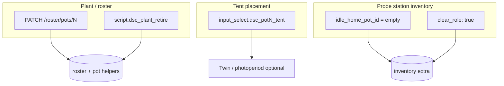

# Plant seat edit, delete, and probe unassign

**In one line:** After Compose creates a plant, operators edit identity in the seat drawer (blur-save), delete via retire script, and manage probe-station home / role from Settings — three separate layers.

**Tip:** `174e14e` · SPA `index-DL1EcjhX` (+ `calibrate-D1D5CnxU` · `tune-fleet-IPnSFs3d`)  
**Code:** `PlantSeatPanel.tsx` · `fleetApi.ts` · `SettingsPage.tsx` · `compose_ops.update_pot_recipe` / `retire_plant` · `soil_tests.patch_probe_station` · `api.py`

## Intent

Compose (Plant Wizard) is create-only. Day-to-day changes — rename, sprout, stage, notes, tent placement, retire, probe home — live on the shared seat panel and Settings probe table so operators do not re-run the wizard or hand-edit SQLite.

## Three layers (do not conflate)



| Action | What it changes | What it does **not** change |
|--------|-----------------|------------------------------|
| **Edit plant** | Roster recipe + pot helpers (name, strain display, blend, sprout, stage, notes, tent via PATCH) | Probe role, idle home, soil readings |
| **Delete plant** | Clears pot helpers, deletes roster seat, empties matching roster slot | Probe-station home / role, confirmed soil tests |
| **Tent → Unassigned** | Twin placement helper only (optional photoperiod template when moving *to* clone/main) | Plant identity, probe home |
| **Unassign pot** (Settings) | Clears `idle_home_pot_id` on a probe seat; keeps `role=probe_station` | Plants, readings |
| **Remove probe role** | Drops `role`, `idle_home_pot_id`, `probe_attached`; sets `reading_mode=idle` | Plants, readings |

FOLLOWUPS shorthand: soft calibrate ≠ probe home ≠ tent unassign ≠ plant retire.

## Plant edit (dirty blur-save)

**UI:** Identity fields on `PlantSeatPanel` (Root / Roster / Twin / Live drawers).  
**API:** `PATCH /roster/pots/{1-4}` body fields (all optional):

| Field | Persist path |
|-------|----------------|
| `plant_name` | recipe + `text.dsc_potN_plant_name` (+ nickname mirror) |
| `strain_display` | recipe + `strain_id` on roster row |
| `blend` | recipe only |
| `sprout_date` | recipe + datetime helper; **re-derives** `growth_stage` when possible |
| `growth_stage` | recipe + `select.dsc_potN_growth_stage` (+ stage family) |
| `tent` | recipe + `input_select.dsc_potN_tent` |
| `notes` | recipe (+ roster slot notes when a slot matches) |

Client behavior (`PlantSeatPanel`):

- Drafts baseline on pot change; **blur** (or stage `<select>` change) calls `patchPotPlant` only when dirty.
- Notes stay disabled without a roster slot — assign from Compose first.
- Sprout save may refresh stage draft from the brain response.
- Errors surface on the Identity card; tent apply errors stay on the tent card.
- Empty pot → `400` `"No plant on pot N — nothing to edit"`.

```bash
# Example — rename + sprout (brain on :8787)
curl -sS -X PATCH "http://dsc-brain.local:8787/roster/pots/2" \
  -H 'Content-Type: application/json' \
  -d '{"plant_name":"Clone A","sprout_date":"2026-08-01"}'
```

## Delete plant

**UI:** Overflow → **Delete plant…** or the Delete plant card → `DecisionLayer` confirm.  
**Path:** `script.dsc_plant_retire` → `compose_ops.retire_plant` (also exposed via `/control/service`).

Clears plant name / stage / tent→`unassigned` / sprout helpers, deletes roster seat `potN`, empties matching roster slot (`status=empty`, pot=`none`). Parent drawers close via `onRetired`. Does **not** touch probe inventory.

## Tent placement (seat panel)

Buttons **2×4** / **4×8** / **Unassigned** open `DecisionLayer`. Confirm writes `input_select.dsc_potN_tent` via fleet `callService`. Optional photoperiod template (clone 18h independent / main 12h dark) applies only when moving onto clone or main — not when unassigning.

## Probe stations (Settings)

**UI:** Settings → Probe stations table.  
**API:** `GET/PATCH /settings/probe-stations/{seat_id}`

| Control | Body | Effect |
|---------|------|--------|
| **Save** | `{ idle_home_pot_id, tent }` | Keeps/sets `role=probe_station`, `probe_attached` |
| **Unassign pot** | `{ idle_home_pot_id: "" }` | Probe stays a station; no idle home pot |
| **Remove probe role** | `{ clear_role: true }` (confirm) | Demotes seat; drops idle home + attachment |

Default demo inventory seeds pot2 / pot4 as probe stations. Assign role via inventory (`role: probe_station`) when a seat is missing from the table.

```bash
# Unassign idle home only
curl -sS -X PATCH "http://dsc-brain.local:8787/settings/probe-stations/pot2" \
  -H 'Content-Type: application/json' \
  -d '{"idle_home_pot_id":""}'

# Demote probe role
curl -sS -X PATCH "http://dsc-brain.local:8787/settings/probe-stations/pot2" \
  -H 'Content-Type: application/json' \
  -d '{"clear_role":true}'
```

## Pitfalls

- Editing a vacant pot fails — Compose / commit+assign first ([PLANT-WIZARD.md](PLANT-WIZARD.md)).
- Seat drafts do **not** live-resync from the entity bus while typing (only on pot change); Crop Scheduler shows committed helpers.
- Soft calibrate writes HA Got offsets only — unrelated to probe home / clear_role ([../ops/LAB-WET-CAL.md](../ops/LAB-WET-CAL.md)).
- Do not invent height / chem / PPFD / NPK when catalog bands are missing; Want chips stay honest.

## Related

- Create flow: [PLANT-WIZARD.md](PLANT-WIZARD.md)
- Routes: [WEBUI.md](WEBUI.md)
- Cal / probe wet path: [../ops/LAB-WET-CAL.md](../ops/LAB-WET-CAL.md)
- Process: [../FOLLOWUPS.md](../FOLLOWUPS.md) (2026-08-28 plant edit/delete)
- Notion: [Catalogs and Build a Plant](https://app.notion.com/p/3b52b4cda37081a6b661f7e4697b39cf) · [Local webserver UI](https://app.notion.com/p/3b52b4cda37081c19048e794d4bdf819)
