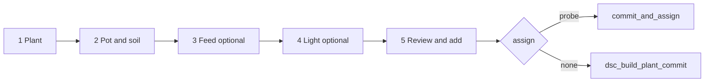

# Plant Wizard (Build a Plant)

**In one line:** Stepper at `/grow/compose` writes compose helpers / scripts via `composePlantLogic`; probe assign is **optional** — stock lands on the roster with no probe.

**Tip (stock path + draft flush):** `15d7016` · SPA `index-Bx0-MSV-.js`  
**Route:** `/grow/compose` (Grow → Compose)  
**Code:** `PlantWizard.tsx` · `composePlantLogic.ts` · `CatalogPicker.tsx` · `ui.tsx` (`flushEntityTextDrafts` / `EntityDatetime`)

Day-2 edit / detach / slot delete: [PLANT-PROBE-LIFECYCLE.md](PLANT-PROBE-LIFECYCLE.md) · [ROSTER-STOCK.md](ROSTER-STOCK.md)

## Intent

Operators add a plant without hunting Strain / Soil / Nutrients / Light cards. Strain is required; Feed and Light can skip. Probe may be **none** for stock.

## Steps

| Step | Must have | Writes |
|------|-----------|--------|
| **Plant** | Strain (probe optional) | strain, nickname, sprout, tent, assign pot |
| **Pot & soil** | Vessel label | vessel, blend helpers, total L |
| **Feed** | Optional | Nutrient slots 1–8 (+ dose when catalog has `dose_ml_l`) |
| **Light** | Optional — **Skip light** to advance | fixture select or custom name |
| **Review** | Confirm | Stock: commit only · Seated: vessel→pot + commit_and_assign |

Soil presets (`SOIL_PRESETS`) fill blend layers via `applyBlendLayers`. Custom 3-layer mix stays behind **Custom 3-layer blend**.

## Commit honesty

Before Next (plant step) and before Add:

1. `syncComposeTextToBus()` — strain + nickname (catalog pick is async)
2. `flushEntityTextDrafts()` — includes `input_datetime.*` via `data-entity-id`
3. Branch on assign; on success `clearComposeDraft` (clears **sprout**) + `refreshBrain`

Failures surface as an honesty chip (`commitErr`) instead of a silent no-op.

CTA labels:

- Assign none → **Add to roster (stock)** / confirm **Add to Roster stock (no probe)**
- Assign N → **Add plant to Probe N**

## Catalog picks

| Kind | Behavior |
|------|----------|
| Strain | Sets build strain; client filters type / auto\|photo / breeder |
| Medium | `composition` (≤3 layers) or 100% named medium |
| Nutrient | First empty slot; turns inventory on |
| Light | Fuzzy-match fixture options; else custom name |

Does **not** invent catalog climate / chem / height when the pack lacks them. Expected stage chips come from hub/brain sensors after sprout — not invented client bands for stock Got.

## Constraints

- Roster full when all **10** slots occupied (`ROSTER_SLOT_COUNT`) — commit raises.
- Kit Compose assign options: Probe 1–2 (+ none); pot 3/4 not offered on the kit path.
- HA dual-mode and Pi (`VITE_DSC_PI=1`) share the wizard; Pi prefers brain `/v1/catalogs/*`.

## Related

- Capacity / slot retire / scheduler: [ROSTER-STOCK.md](ROSTER-STOCK.md)
- Detach / assign / move: [PLANT-PROBE-LIFECYCLE.md](PLANT-PROBE-LIFECYCLE.md)
- Pipeline: [`../qa/BUILD-A-PLANT-DATA-PIPELINE.md`](../qa/BUILD-A-PLANT-DATA-PIPELINE.md)
- Routes: [WEBUI.md](WEBUI.md)
- Notion: [Catalogs and Build a Plant](https://app.notion.com/p/3b52b4cda37081a6b661f7e4697b39cf)
