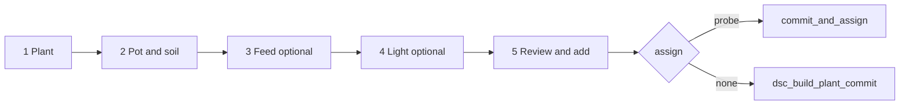

# Plant Wizard (Build a Plant)

**In one line:** Stepper at `/grow/compose` writes compose helpers / scripts via `composePlantLogic`; probe assign is **optional** — stock lands on the roster with no probe.

**Tip (v7.4.0 signed off):** `32836fe` · SPA `index-K2_ziUnM.js`
**Prior (Post-mega D-C-A-B):** `f029702` · `index-CXq-NptO.js`  
**Prior Mega Pass:** `a307dc7` · `index-DlMHgtYz.js`  
**Prior audit:** `a2f5f08` / `3a452f0`  
**Prior (nickname DOM + Skip light footer):** `149657d`  
**Prior (stock path + draft flush):** `15d7016`  
**Route:** `/grow/compose` (Grow → Compose)  
**Code:** `PlantWizard.tsx` (orchestrator) · `components/plantWizard/*` · `composePlantLogic.ts` · `CatalogPicker.tsx` · `ui.tsx` (`flushEntityTextDrafts` / `EntityDatetime`) · `useBrain` / `fleetApi` (roster refresh after commit)  
**Module map:** [SPA-MODULE-MAP.md](SPA-MODULE-MAP.md) · kit assign filter: [KIT-SCOPE.md](KIT-SCOPE.md)  
**Rule:** [`.cursor/rules/dsc-roster-probe.mdc`](../../.cursor/rules/dsc-roster-probe.mdc)

Day-2 edit / detach / slot delete: [PLANT-PROBE-LIFECYCLE.md](PLANT-PROBE-LIFECYCLE.md) · [ROSTER-STOCK.md](ROSTER-STOCK.md)

## Intent

Operators add a plant without hunting Strain / Soil / Nutrients / Light cards. Strain is required; Feed and Light can skip. Probe may be **none** for stock. Wizard Next / Add must **not** wait on entity-bus round-trip — local drafts are SoT until flush/commit.

## Steps

Track **D** (`f029702`) keeps `PlantWizard.tsx` as orchestrator (drafts, `canNext`, flush, commit) and renders UI from step modules under `components/plantWizard/`:

| Module | Owns |
|--------|------|
| `plantWizardSteps.ts` | `STEPS`, `strainOk`, types |
| `PlantWizardPlantStep.tsx` | Strain, nickname, assign, sprout |
| `PlantWizardSoilStep.tsx` | Vessel + soil presets / blend |
| `PlantWizardFeedStep.tsx` | Optional nutrients |
| `PlantWizardLightStep.tsx` | Optional fixture |
| `PlantWizardReviewStep.tsx` | Summary + Add CTA |



| Step | Must have | Writes |
|------|-----------|--------|
| **Plant** | Strain (probe optional) | strain, nickname, sprout, tent, assign pot |
| **Pot & soil** | Vessel label | vessel, blend helpers, total L |
| **Feed** | Optional | Nutrient slots 1–8 (+ dose when catalog has `dose_ml_l`) |
| **Light** | Optional — footer **Skip light** when unset, or inline Skip | fixture select or custom name; `goNext` sets `skippedLight` if none |
| **Review** | Confirm | Stock: commit only · Seated: vessel→pot + commit_and_assign |

Soil presets (`SOIL_PRESETS`) fill blend layers via `applyBlendLayers`. Custom 3-layer mix stays behind **Custom 3-layer blend**.

### Review soil label honesty (Mega Pass MP-010)

Review step `mixLabel` prefers the selected preset’s **human label** (`soilPresetId` → `SOIL_PRESETS[].label`) over a raw `blendSummary(state)` layer dump. Operators see the same name they tapped on the soil step — not a mismatched composition string when presets write helpers asynchronously.

## Commit honesty

Before Next (plant step) and before Add:

1. `syncComposeTextToBus()` — strain + nickname (catalog pick is async)
2. `flushEntityTextDrafts()` — includes `input_datetime.*` via `data-entity-id`
3. Branch on assign; on success `clearComposeDraft` (clears **sprout**) + `refreshBrain`

Nickname sync (tip `149657d`): prefer live DOM

```text
input[data-entity-id="input_text.dsc_build_nickname"]
```

over the React draft map — native setters / mid-blur can leave the map empty while the input still shows the typed nick (fixes strain-as-nickname stock commits when the bus lags). Constraint: uses `document.querySelector` — correct for a **single** wizard instance; fragile if compose mounts twice.

Light Next (tip `149657d`): when `light` is empty/`unknown`, footer label is **Skip light** and `goNext` sets `skippedLight` so the wizard does not stall on the catalog.

Failures surface as an honesty chip (`commitErr`) instead of a silent no-op.

CTA labels:

- Assign none → **Add to roster (stock)** / confirm **Add to Roster stock (no probe)**
- Assign N → **Add plant to Probe N**

## Catalog picks

| Kind | Behavior |
|------|----------|
| Strain | Sets build strain; client filters type / auto\|photo / breeder |
| Medium | `composition` (≤3 layers) or 100% named medium |
| Nutrient | First empty slot; turns inventory on |
| Light | Fuzzy-match fixture options; else custom name |

Does **not** invent catalog climate / chem / height when the pack lacks them. Expected stage chips come from hub/brain sensors after sprout — not invented client bands for stock Got.

## Browser automation

- Catalog hits: **JS `.click()`** on `.dsc-catalog-hits button` (coordinate clicks fail silently).
- Footer Next: `.dsc-btn-primary.click()` with ~3s wait between steps.
- Stock: modal **Add to Roster stock (no probe)** — primary footer alone is not enough.

## Constraints

- Roster full when all **10** slots occupied (`ROSTER_SLOT_COUNT`) — commit raises.
- Kit Compose assign options: Probe 1–2 (+ none); pot 3/4 not offered on the kit path ([KIT-SCOPE.md](KIT-SCOPE.md)).
- Step UI lives under `components/plantWizard/` — do not re-inflate the orchestrator with presentational JSX ([SPA-MODULE-MAP.md](SPA-MODULE-MAP.md)).
- HA dual-mode and Pi (`VITE_DSC_PI=1`) share the wizard; Pi prefers brain `/v1/catalogs/*`.
- After Delete elsewhere, emptied slots clear `plant_uuid` so re-compose does not inherit identity ([ROSTER-STOCK.md](ROSTER-STOCK.md)).

## Related

- Capacity / slot retire / scheduler: [ROSTER-STOCK.md](ROSTER-STOCK.md)
- Detach / assign / move: [PLANT-PROBE-LIFECYCLE.md](PLANT-PROBE-LIFECYCLE.md)
- Module map: [SPA-MODULE-MAP.md](SPA-MODULE-MAP.md)
- Pipeline: [`../qa/BUILD-A-PLANT-DATA-PIPELINE.md`](../qa/BUILD-A-PLANT-DATA-PIPELINE.md)
- Routes: [WEBUI.md](WEBUI.md)
- Hotpatch: [`../ops/PI-HOTPATCH.md`](../ops/PI-HOTPATCH.md)
- Notion: [Catalogs and Build a Plant](https://app.notion.com/p/3b52b4cda37081a6b661f7e4697b39cf)
