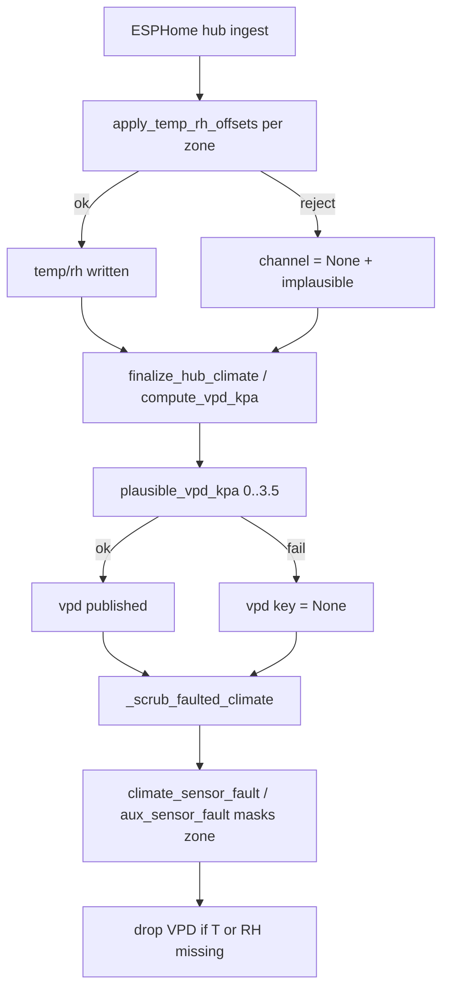

# Climate plausibility (reject, don't clamp-to-rail)

**Tip SoT:** `17aa6bd`. Incident (2026-09-08): a railed DHT reported **50 °C / 100 %** for ~47 minutes. The old layer **clamped** 50 → 45 and handed history, VPD, and learning a confident-looking number while `climate_sensor_fault` was already ON.

## Intent

A bad reading must become **unknown** (`None`), not a nearby legal number. Stability is not correctness.

## Pipeline



## `sensor_clamp` (global modifiers)

Defaults sit **inside** the sensor rail on purpose:

| Channel | Default min/max | Why |
|---|---|---|
| `temp_c` | −5 … **45** | Rail is ~50 °C; clamp AT 50 accepted railed readings. |
| `rh_pct` | 0 … **100** | Saturation can be real when temperature is sane. |

Hard limits when patching: `temp_c` (−40…85), `rh_pct` (0…100); require `min < max`.

```http
PATCH /settings/global-modifiers
{"sensor_clamp":{"temp_c":{"max":45.0}}}
```

`set_global_modifiers` **persists and reads back** `sensor_clamp`. Empty-setting path returns a **deep** copy of defaults (shallow copy used to mutate module-level `DEFAULT_MODIFIERS`).

## Reject rules (`apply_temp_rh_offsets`)

After applying zone offsets:

1. Raw temperature ≥ **49.9 °C** → reject temperature (always).
2. Offset temperature outside `sensor_clamp.temp_c` → reject.
3. Offset RH outside clamp → reject.
4. **Railed pair:** raw T ≥ 49.9 and raw RH ≥ 99.9 → reject RH too (the classic fault signature).
5. Return `(temp|None, rh|None, rejected:bool)`. Never clamp to the bound.

Ingest writes `None` back onto the value keys so the railed number does not survive (`sensor_clamp_active`, `implausible` list).

## Fault masks + orphan VPD

| Hub binary | Masks |
|---|---|
| `binary_sensor.dsc_hub_climate_sensor_fault` | `temp_c`, `rh_pct`, `vpd_kpa`, `leaf_vpd_kpa` |
| `binary_sensor.dsc_hub_aux_sensor_fault` | room + clone T/RH/VPD (+ clone leaf VPD) |

If either T or RH for a zone is missing after scrub, that zone's VPD keys are cleared — hub template `0.0` must not outlive its inputs.

`plausible_vpd_kpa` (0.0…3.5) gates recompute in `finalize_hub_climate` (was previously dead code).

## Operator / SPA honesty

- Missing climate after reject should render as **unknown / fault**, not a plain number near the rail.
- Do not treat a clamped historical series from before `17aa6bd` as ground truth for learning.

## Tests

`brain/tests/test_plausibility_layer.py`

## Codepaths

`global_modifiers.py` · `climate_math.py` · `esphome_client._apply_hub_climate_modifiers` · `_scrub_faulted_climate` · `settings_manifest` (global-modifiers schema)
