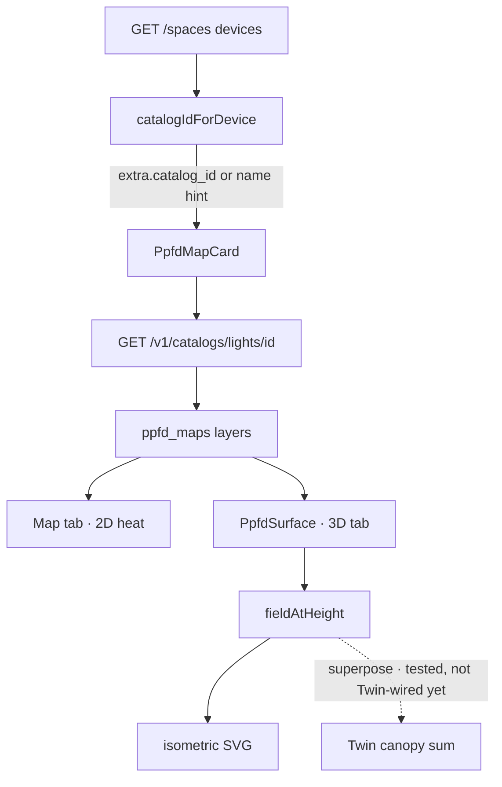

# Maker PPFD field model

**In one line:** Dense canopy PPFD grids derived from CannaLib maker layers — for the Light desk **3D** surface today, and for multi-fixture twin placement later — always labeled measured vs estimated, never a PAR sensor.

Tip verified: `7017bfb` (`7238c13`). Tests: `frontend/src/lib/ppfdField.test.ts` (Node assert script).

## Intent

Operators need shape of maker-published PPFD at hang height without inventing a live PAR channel. The model:

1. Binds each **enabled** fixture-table lamp to a CannaLib lights record.
2. Fetches layers via brain `GET /v1/catalogs/lights/{id}`.
3. Builds a dense field (bilinear or IDW) and optionally estimates other heights.
4. Renders Map / **3D** / Spectrum / Bands on `PpfdMapCard` — provenance chips stay honest.

Separately: operator **calibration PPFD** (25/50/75/100 % curve → DLI) is still `readCalibratedPpfd` / Kit › Calibrate. Static crops under `/dsc-catalog/ppfd/` are kit archive assets, not this field model.

## Data path

| Piece | Path | Job |
|---|---|---|
| Kit seed | `brain/dsc_brain/space_model.py` `KIT_DEVICE_DEFAULTS` | 2×4 `sf1000` seeds `extra.catalog_id = spider_farmer_sf1000` on ensure |
| Binding | `frontend/src/lib/lightCatalog.ts` `catalogIdForDevice` | Explicit `extra.catalog_id` wins; else name/id hints (`sf1000`, `sf600`, `fc3000`, `ts1000`); else `null` → **"no catalog record"** |
| Spaces type | `fleetApi.SpaceDevice.extra` | Free-form brain JSON; SPA reads `catalog_id` |
| Detail fetch | `fetchLightDetail` | Same-origin `/v1/catalogs/lights/{id}` → `ok` / `missing` / `unavailable` |
| Field math | `frontend/src/lib/ppfdField.ts` | Resample, height fit, dim, superpose, DLI helper |
| UI | `PpfdMapCard` + `PpfdSurface` | Tabs Map · **3D** · Spectrum · Bands |
| Light desk | `pages/LightPage.tsx` | One card per enabled fixture with a catalog id; fixtures panel prints binding |

## Catalog binding rules

1. **Operator / kit SoT:** `space_device.extra_json.catalog_id` (seeded for kit SF1000).
2. **Hints (fallback only):** regex on `device_id` + `label` — never invent an unbound brand.
3. **Null:** fixtures panel shows `no catalog record`; no `PpfdMapCard` is mounted for that lamp.
4. **4×8 nameplate fixture** defaults without `catalog_id` until the operator binds one.

## Field rules (verified in `ppfdField.ts`)

| Rule | Behavior |
|---|---|
| Grid layer | Null cells → mean of orthogonal neighbours (not zero, not global fill); dense resample **bilinear** between cell centres |
| Point layer | Inverse-distance weighting (power 2); exact hit on a reading |
| Exact height | Returns that full-power layer; `estimated: false` |
| Between heights | Per-cell `v ∝ h^-k` blend from the two bracketing layers; `estimated: true` |
| Outside range | Nearest layer × `h^-k` with **`k = max(fitted, 2)`** (inverse-square floor); `estimated: true` |
| Single layer | Fit returns `k=2`, `fitted: false` |
| Dim | Linear scale unless a maker dimmed layer is used (surface uses full-power layers) |
| Superpose | Fixtures **add**; outside a footprint → 0 + `gapCells` (no invent fill) |
| DLI helper | `dliFromPpfd(ppfd, hours) = ppfd × hours × 3600 / 1e6` (steady PPFD × photoperiod) |

Full-power layers for height work: `dim_pct === 100` (or unset), no `mode`, provenance not `rejected`.

## Light desk UX

- **3D tab:** hang-height slider (≈0.7×–1.5× measured span) + chips snapping to measured heights; isometric SVG (no WebGL / rAF).
- Stats row: `MEASURED LAYER` vs `ESTIMATED`, avg / min / max / uniformity (`min÷avg`).
- Footnote always includes the field `note` (blend / extrapolate rule) + “shape only” honesty.
- Color ramp matches maker maps (`rampColor` in `lightCatalog.ts`).

## Twin placement (library ready, desk not wired)

`superpose({ width_cm, depth_cm }, placements)` is covered by unit tests for multi-fixture canopy grids and gap counting. **Twin desk does not import `ppfdField` yet** — do not claim live canopy PPFD in `#/twin`. When wired, every projected field must keep `estimated` / gap labels (same honesty contract as the Light card).

## Constraints / pitfalls

- Maker data ≠ tent measurement. Never feed these numbers into Want/Need as Got PPFD.
- Rejected provenance layers are excluded from height construction.
- Sparse maps with &lt;4 points stay dots on Map; surface still needs at least one full-power layer.
- CannaLib down → card `unavailable` with detail (no silent empty heat).
- Static `/dsc-catalog/ppfd/` images remain CDN-refused kit crops — orthogonal to CannaLib layers.
- Existing DBs only pick up `catalog_id` when `ensure_kit_spaces` inserts the device row; already-present rows keep prior `extra_json` until edited.

## Related

- [`WEBUI.md`](WEBUI.md) — Light desk
- [`TWIN.md`](TWIN.md) — composed twin (placement future)
- [`../ops/CANNALIB-API.md`](../ops/CANNALIB-API.md) — catalog proxy
- Calibration DLI: `frontend/src/lib/dliEstimate.ts` (operator curve, not maker maps)
