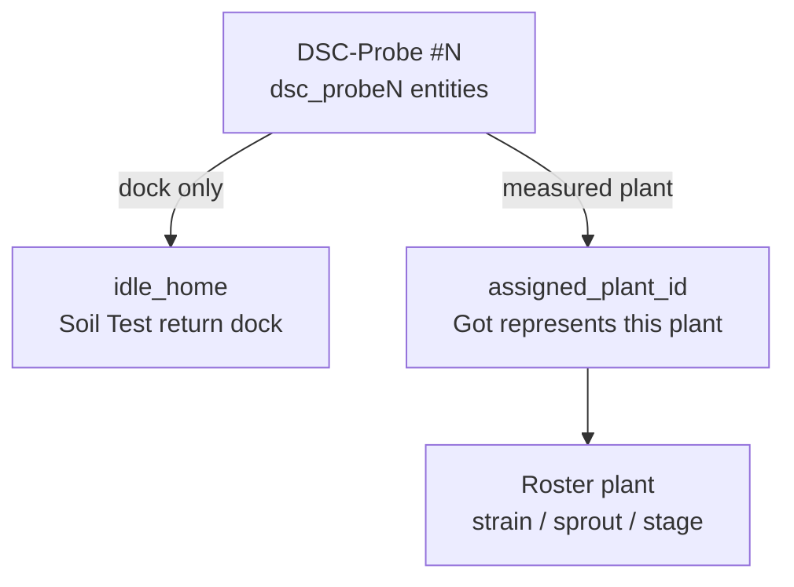

# Probe / plant / assignment model

**In one line:** Hardware probe ≠ roster plant ≠ dock assignment. Entity ids are `dsc_probeN_*` (renamed from `dsc_potN`); assignment is a separate field from idle dock.

Verified tip: `654d0f8` against `firmware/v4/dsc-pot-common.yaml`, hub providers, SPA `softCalibrate.ts` / fleet maps, brain `sensor_trust.py`, HA packages. **Live OTA soak pending** — see [`PROBE-RENAME-CLEANUP.md`](../qa/PROBE-RENAME-CLEANUP.md) and [`ESPHOME-OTA-PI.md`](../ops/ESPHOME-OTA-PI.md).

## Three objects

| Object | Meaning | Tip `654d0f8` |
|--------|---------|----------------|
| **Probe** | Physical Modbus soil stick + ESP seat | Device `name: dsc_probeN`, friendly **DSC-Probe #N**; entities `sensor.dsc_probeN_*` |
| **Plant** | Roster organism (strain, sprout, stage, notes) | Grow Roster / Plant Seat; brain roster rows |
| **Assignment** | Which plant this probe’s Got represents | Firmware `text.dsc_probeN_assigned_plant_id` (roster id \| empty); brain peer MAD skips vacant |

## Do not conflate

| Action | Layer | API / UI |
|--------|--------|----------|
| Unassign idle home | Probe ↔ dock | `PATCH` probe station `idle_home_pot_id: ""` — keeps probe role |
| Remove probe role | Probe demotion | `clear_role` — frees dock; seat no longer probe_station |
| Retire plant | Roster | Plant Seat delete / retire — **not** the same as unassign |
| Soft ≠ lab | Calibration | SoftCal → HA offsets; lab wet → ESP — see [`SOFT-CAL.md`](../ops/SOFT-CAL.md) |

## Entity rename (shipped in tree)

| Before | After |
|--------|--------|
| `dsc_potN_*` / dual `dsc_pot_N_*` | `dsc_probeN_*` (single form) |
| Friendly “Pot N” | **DSC-Probe #N** |
| Hub `packet_transport` providers | Must match `dsc_probeN` device names |

**Secrets stay:** `dsc_potN_api_key` / `_ota_password` / `_ap_password` — do **not** rename secret keys.

YAML stubs remain named `dsc-potN.yaml` / `DSC-ProbeN.yaml` for path stability; **device `name:`** is `dsc_probeN`.

## Assignment + peer MAD

- Firmware: `text.dsc_probeN_assigned_plant_id` — optimistic, restore, vacant = `""` (not `"Unassigned"`).
- Brain `sensor_trust._exclude_from_peer_mad`: probe_station **or** empty `assigned_plant_id` → skip peer MAD.
- Inventory `extra.assigned_plant_id` is also read when present.
- Follow Plants still primarily keys 2×4 via roster tent + seated name/strain (not fully switched to assigned_plant_id yet).

## Probe-station fields (Settings)

`soil_tests._probe_station_config` / `patch_probe_station`:

- `role: "probe_station"`
- `tent` (`2x4` / `4x8`)
- `idle_home_pot_id` — empty string unassigns dock
- `reading_mode` (`idle` / active soil-test)
- `probe_attached`

Defaults seed pot2 → 2×4 and pot4 → 4x8 (`init_probe_station_defaults`).

## Pitfalls

- Flash **hub providers before / with** probes — mismatched provider names drop soil ESP-NOW.
- Orphan HA entities `sensor.dsc_potN_*` after rediscovery — cleanup checklist.
- Dual `in_service`: inventory SoT vs hub switch — rename does not fix sync by itself.
- Soft ≠ probe home ≠ tent unassign ≠ plant retire ≠ assigned_plant_id clear.

## Related

- [`CLIMATE-MODE-POLICY.md`](CLIMATE-MODE-POLICY.md)
- [`SOFT-CAL.md`](../ops/SOFT-CAL.md) · [`ESPHOME-OTA-PI.md`](../ops/ESPHOME-OTA-PI.md)
- Cleanup: [`../qa/PROBE-RENAME-CLEANUP.md`](../qa/PROBE-RENAME-CLEANUP.md)
- Spec: [`../superpowers/specs/2026-08-29-climate-mode-probe-rebuild-design.md`](../superpowers/specs/2026-08-29-climate-mode-probe-rebuild-design.md)
