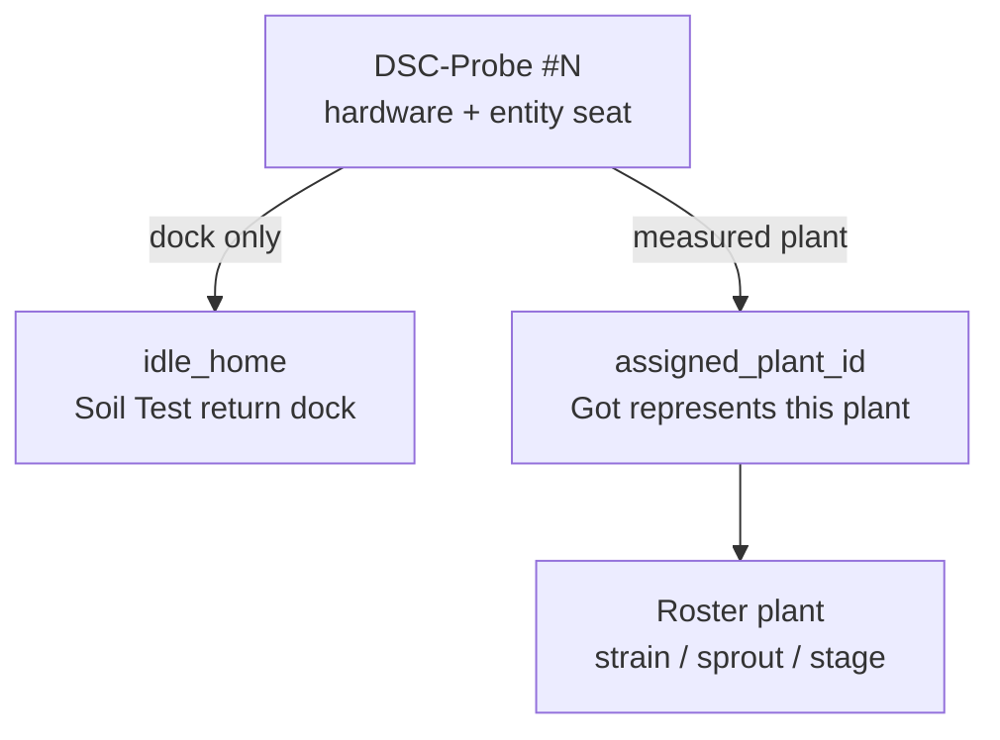

# Probe / plant / assignment model

**In one line:** Hardware probe ≠ roster plant ≠ dock assignment. Renaming Pot→DSC-Probe without this split worsens dual identity.

Source findings: [`docs/superpowers/plans/2026-08-29-pre-rebuild-interrogate.md`](../superpowers/plans/2026-08-29-pre-rebuild-interrogate.md)  
Verified tip: `906ad71` against `brain/dsc_brain/soil_tests.py`, Settings / SoftCal SPA, pot entity ids.

## Three objects

| Object | Meaning | Today |
|--------|---------|--------|
| **Probe** | Physical Modbus soil stick + ESP seat | Inventory seat `potN` with optional `role: probe_station` |
| **Plant** | Roster organism (strain, sprout, stage, notes) | Grow Roster / Plant Seat; brain roster rows |
| **Assignment** | Which plant this probe’s Got represents | **Missing** as first-class field — often conflated with pot seat or idle dock |

## Do not conflate

| Action | Layer | API / UI |
|--------|--------|----------|
| Unassign idle home | Probe ↔ dock | `PATCH` probe station `idle_home_pot_id: ""` — keeps probe role |
| Remove probe role | Probe demotion | `clear_role` — frees dock; seat no longer probe_station |
| Retire plant | Roster | Plant Seat delete / retire — **not** the same as unassign |
| Soft ≠ lab | Calibration | SoftCal writes HA offsets; lab wet stamps ESP — see [`SOFT-CAL.md`](../ops/SOFT-CAL.md) |

Cosmetic SPA rename “Pot → Probe” alone is **insufficient**. Three SoTs remain: pot NVS, brain roster, HA `dsc_potN_*` entities.

## Phase 0 rename (safe)

1. Friendly name **DSC-Probe #1–4** in UI / inventory labels.
2. Keep entity object_ids `dsc_potN_*` until a shim soak + migration plan.
3. Add `assigned_plant_id: string | None` (roster id or empty) **separate from** `idle_home_pot_id`.
4. Settings: dropdown under each probe — Home plant (roster | None) for assignment; idle dock stays Soil Test return.

## Current probe-station fields (verified)

`soil_tests._probe_station_config` / `patch_probe_station`:

- `role: "probe_station"`
- `tent` (`2x4` / `4x8`)
- `idle_home_pot_id` — empty string unassigns dock
- `reading_mode` (`idle` / active soil-test)
- `probe_attached`

Defaults seed pot2 → 2×4 and pot4 → 4x8 (`init_probe_station_defaults`).

There is **no** `assigned_plant_id` yet — Got/Want are still largely keyed by pot seat.

## Pitfalls

- Peer MAD / trust must exclude `probe_station` and unassigned probes (brain `sensor_trust` already skips probe stations for moisture rate).
- Vacant seats: empty string, not `"Unassigned"` ghost veg labels.
- Dual `in_service`: inventory SoT vs hub switch — rename does not fix sync by itself.
- Panel vitals 0xD1 still carries pot1–4 link bits (cosmetic until protocol bump).
- After migration: strip plant_name / strain / sprout from probe NVS; remint names from roster.

## Related

- [`CLIMATE-MODE-POLICY.md`](CLIMATE-MODE-POLICY.md) — Follow Plants needs assigned plants in 2×4
- [`SOFT-CAL.md`](../ops/SOFT-CAL.md)
- FOLLOWUPS: Soft ≠ probe home ≠ tent unassign ≠ plant retire
- Code: `brain/dsc_brain/soil_tests.py`, Settings probe stations UI
