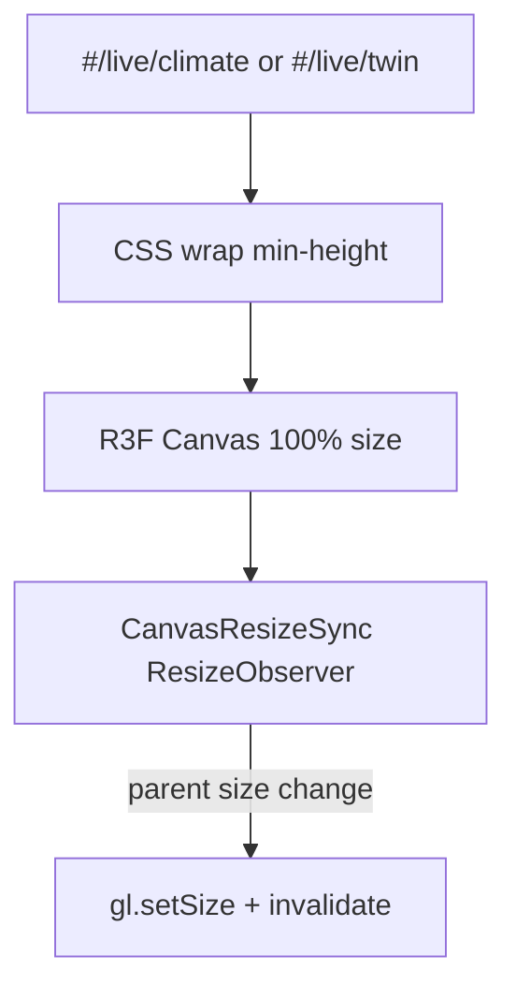

# Climate / Twin R3F canvas sizing

**In one line:** Operator Climate airflow and Twin WebGL must occupy a real CSS box (and resize when portaled) — never a zero-height blank that looks like a live scene.

**Tip (Post-mega D-C-A-B):** `f029702` · SPA `index-CXq-NptO.js` · `twin-three-BjdbWAdH.js` (unchanged chunk)  
**Prior Mega Pass:** `a307dc7` · `index-DlMHgtYz.js`  
**Issues:** MP-020 (Climate blank) · MP-021 (Twin blank) — closed Mega Pass; Gate 0 route matrix still holds  
**Code:** `AirflowParticleScene.tsx` · `DscTwinCanvas.tsx` · `dsc.css` (`.dsc-airflow-canvas-wrap` · `.dsc-twin-canvas-wrap`)  
**Rule:** [`.cursor/rules/dsc-viz-honesty.mdc`](../../.cursor/rules/dsc-viz-honesty.mdc)  
**Closure:** [`../qa/GATE0-SOAK-2026-09.md`](../qa/GATE0-SOAK-2026-09.md) · [`../qa/AUDIT-CLOSURE-2026-09.md`](../qa/AUDIT-CLOSURE-2026-09.md)

## Intent

KeepAlive / portal mounts can paint R3F before the parent slot has layout. Without an explicit wrap + resize sync, `clientHeight` stays 0 → blank black theater that reads as “broken live viz.” Mega Pass closed that for Climate particles and Twin.

## Architecture



| Surface | Wrap class | Sizing contract |
|---------|------------|-----------------|
| Climate airflow | `.dsc-airflow-canvas-wrap` | `width: 100%`; `min-height: 320px`; canvas forced `height: 320px` |
| Twin | `.dsc-twin-canvas-wrap` | `width/height: 100%`; `min-height: min(68vh, 700px)`; canvas same min-height |
| Twin resize | `CanvasResizeSync` in `DscTwinCanvas` | `ResizeObserver` on canvas parent → `gl.setSize(w,h,false)` + `invalidate()` when slot mounts after first paint |

## Constraints

- Prefer honesty card / gated surface over a zero-height canvas (see viz-honesty rule).
- Do **not** invent CFM / mass-balance numbers when producers are missing (`massBalanceOk={null}` stays gated).
- Twin HELD chip (hub link down) remains independent of sizing — rotation frozen is a trust signal, not a layout bug.
- Re-verify after KeepAlive / portal changes: navigate away and back; canvas must keep non-zero height.

## Verify

| Route | Check |
|-------|-------|
| `#/live/climate` | Airflow wrap / canvas height ≥ 320px |
| `#/live/twin` | Twin wrap / canvas non-zero; ResizeObserver fires on slot resize |

```bash
# After spa build / hotpatch — served tip hash
curl -sf http://127.0.0.1:8787/ | grep -oE 'assets/(index|twin-three)-[^"]+\.js'
```

## Related

- [WEBUI.md](WEBUI.md) · [`../ops/PI-HOTPATCH.md`](../ops/PI-HOTPATCH.md)
- Twin SF1000 product: [`../superpowers/specs/2026-08-29-twin-sf1000-design.md`](../superpowers/specs/2026-08-29-twin-sf1000-design.md)
