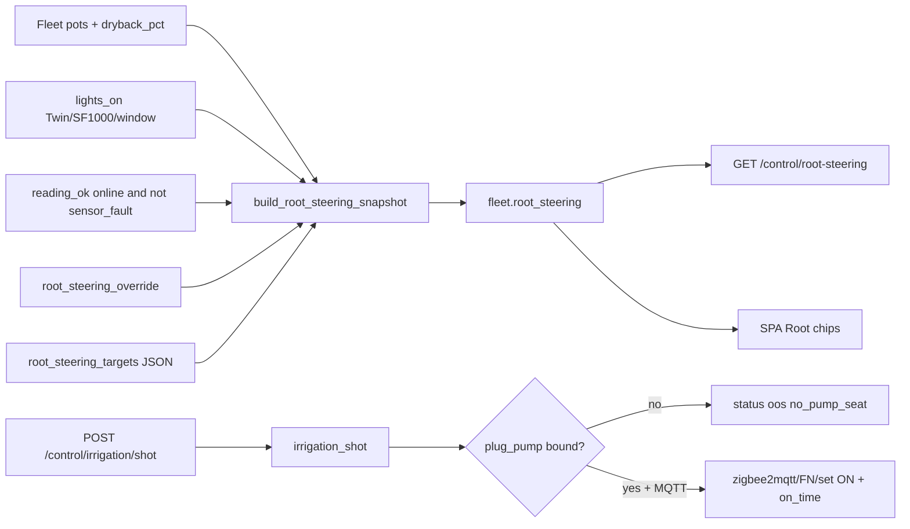

# Root steering (Bar 3) + IrrigAct

**In one line:** P0–P3 crop-steering phase is Brain SoT; irrigation shots go through Brain only — honest OOS when no pump seat.

**Tip:** `bce7ca9` · Modules `root_steering.py` · `irrigact.py` · SPA `rootSteering.ts` · Tests `test_root_steering.py` · `test_irrigact.py`

Design: [root-steering-irrigact](../superpowers/specs/2026-08-29-root-steering-irrigact-design.md) · Zigbee pump role: [ZIGBEE-ROLE-TASK.md](ZIGBEE-ROLE-TASK.md)

## Intent

| Phase | When | `act_allowed` |
|-------|------|---------------|
| `P0` | Lights off / overnight maintenance | `false` |
| `P1` | Lights on, dryback below `dryback_p1_max_pct` (default 10) | `true` |
| `P2` | Lights on, dryback in [p1, p2) (default below 25) | `true` |
| `P3` | Lights on, dryback at/above `dryback_p2_max_pct` (generative) | `true` |
| `null` | Probe not ok, override, or dryback unknown | `false` |

SPA Root (`PlantSeatPanel` + `phaseLabel`) must read `fleet.root_steering` — never invent phase client-side.

## Architecture



`fleet()` attaches the snapshot every request:

- `lights_on` from `light.dsc_hub_twin_sf1000`, `light.dsc_hub_sf1000_dimmer`, or `binary_sensor.dsc_hub_4x8_window_open` (plus hub value fallbacks).
- Per pot `reading_ok = online AND NOT sensor_fault`.

## Defaults (`root_steering_targets`)

| Key | Default |
|-----|---------|
| `dryback_p1_max_pct` | `10` |
| `dryback_p2_max_pct` | `25` |
| `dryback_p3_min_pct` | `25` (documented; phase branch uses p1/p2 thresholds) |
| `vwc_target_day_pct` | `55` |
| `vwc_target_night_pct` | `50` |
| `ec_target_ms` | `2.2` |

Override: `root_steering_override=true` → every pot `phase=null`, `reason=manual_override`, `act_allowed=false`.

## IrrigAct (shipped tip `bce7ca9`)

Brain-commanded irrigation shot. No SPA→relay shortcut.

| Step | Behavior |
|------|----------|
| Resolve seat | First enabled Zigbee binding with `role=plug_pump` + `friendly_name` |
| Duration | Clamp `duration_s` to **0.5–30** (default 2) |
| Publish | `zigbee2mqtt/{friendly_name}/set` → `{"state":"ON","on_time":N}` |
| Audit | `record_grow_log` — SHOT / OOS / FAIL |

Responses:

| `status` | `ok` | `reason` |
|----------|------|----------|
| `commanded` | true | — |
| `oos` | false | `no_pump_seat` or `mqtt_offline` |
| `error` | false | `mqtt_publish_failed` |

**Live kit:** act path proven; real pump hardware still pending (honest `no_pump_seat` without bind). z2m may log “Entity unknown” for QA-only friendly names — expected.

SPA does **not** yet expose a Root irrigate button; use API / scripts. `act_allowed` is display SoT for future gating — IrrigAct today does not re-check phase before publish.

## HTTP API (`:8787`)

| Method | Path | Body / notes |
|--------|------|----------------|
| `GET` | `/control/root-steering` | Same as `fleet.root_steering` |
| `POST` | `/control/root-steering/override` | `{ "enabled": true\|false }` — demo forbidden |
| `POST` | `/control/irrigation/shot` | `{ "pot_id"?: "", "duration_s"?: 2 }` — demo forbidden |

Example shot:

```http
POST /control/irrigation/shot
{"pot_id":"pot1","duration_s":3}
```

## Tests

```bash
cd brain && python -m pytest tests/test_root_steering.py tests/test_irrigact.py -q
```

## Pitfalls

| Symptom | Check |
|---------|--------|
| SPA invents P1–P3 | Must bind `fleet.root_steering` / `rootSteering.ts` |
| Faulted pot still generative | `reading_ok` must exclude `sensor_fault` |
| Lights-off still P3 | `lights_on=false` forces P0 |
| Shot always OOS | Bind Zigbee role `plug_pump` + friendly_name; MQTT client up |
| Fake green irrigate | Never invent pump seat — OOS is correct |
| Twin brightness theater | PWM module may be unwired — see [TWIN-SF1000.md](../ops/TWIN-SF1000.md) |
