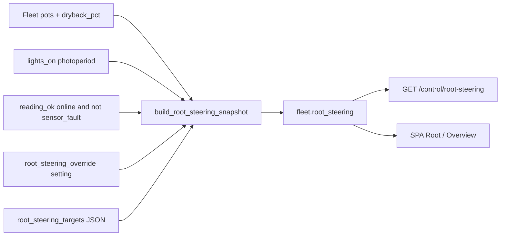

# Root steering (Bar 3 phase SoT)

**In one line:** P0–P3 crop-steering phase from probe trust + photoperiod; SPA must not invent phase.

**Tip:** feature tree with Zigbee Role/Task (`c224eba`) · Module `brain/dsc_brain/root_steering.py` · Tests `brain/tests/test_root_steering.py`

Vocabulary matches Growlink / HA-Irrigation-Strategy style. Closed-loop pump shots are a **separate** act path (see IrrigAct note below).

## Intent

| Phase | When | `act_allowed` |
|-------|------|---------------|
| `P0` | Lights off / overnight maintenance | `false` |
| `P1` | Lights on, dryback below `dryback_p1_max_pct` (default 10) | `true` |
| `P2` | Lights on, dryback in [p1, p2) (default below 25) | `true` |
| `P3` | Lights on, dryback at/above `dryback_p2_max_pct` (generative) | `true` |
| `null` | Probe not ok, override, or dryback unknown | `false` |

SPA and any future IrrigAct consumer must read this module or `fleet.root_steering` — never invent phase locally.

## Architecture



`fleet()` in `api.py` attaches the snapshot every request:

- `lights_on` from hub Twin/SF1000 / 4×8 window helpers (and matching `hass_states` when present).
- Per pot `reading_ok = online AND NOT sensor_fault` (aligns with Root honesty).

## Defaults (`root_steering_targets`)

| Key | Default |
|-----|---------|
| `dryback_p1_max_pct` | `10` |
| `dryback_p2_max_pct` | `25` |
| `dryback_p3_min_pct` | `25` (documented target; phase branch uses p1/p2 thresholds) |
| `vwc_target_day_pct` | `55` |
| `vwc_target_night_pct` | `50` |
| `ec_target_ms` | `2.2` |

Override: setting `root_steering_override` = `true` → every pot `phase=null`, `reason=manual_override`, `act_allowed=false`.

## HTTP API (`:8787`)

| Method | Path | Body / notes |
|--------|------|----------------|
| `GET` | `/control/root-steering` | Same object as `fleet.root_steering` |
| `POST` | `/control/root-steering/override` | `{ "enabled": true\|false }` — demo mode forbidden |
| `POST` | `/control/irrigation/shot` | `{ pot_id, duration_s? }` — **see IrrigAct note** |

Snapshot shape:

```json
{
  "override": false,
  "targets": { "dryback_p1_max_pct": 10.0, "...": "..." },
  "lights_on": true,
  "pots": {
    "pot1": {
      "phase": "P1",
      "reason": "shallow_dryback",
      "dryback_pct": 8.0,
      "lights_on": true,
      "override": false,
      "targets": {},
      "act_allowed": true
    }
  }
}
```

## IrrigAct note (tree honesty)

`POST /control/irrigation/shot` imports `dsc_brain.irrigact.irrigation_shot`. **That module is not present in the git tree on tip `e126f654`** — only the Zigbee role catalog entry `plug_pump` and the API stub exist. FOLLOWUPS claims a live Pi OOS `no_pump_seat` path; do not document shot MQTT payloads until `irrigact.py` lands in-repo. Phase SoT above is still valid for display / future act gating via `act_allowed`.

## Tests

```bash
cd brain && python -m pytest tests/test_root_steering.py -q
```

## Pitfalls

| Symptom | Check |
|---------|--------|
| Phase invents itself in SPA | Must bind `fleet.root_steering` / `/control/root-steering` |
| Faulted pot still shows P1–P3 | `reading_ok` must include `sensor_fault` (fleet builder already does) |
| Lights-off still generative | `lights_on=false` forces P0 |
| Irrigation shot 500 | Missing `irrigact` module in tree — see note above |
| Targets ignored | Setting `root_steering_targets` must be JSON object with known keys |
