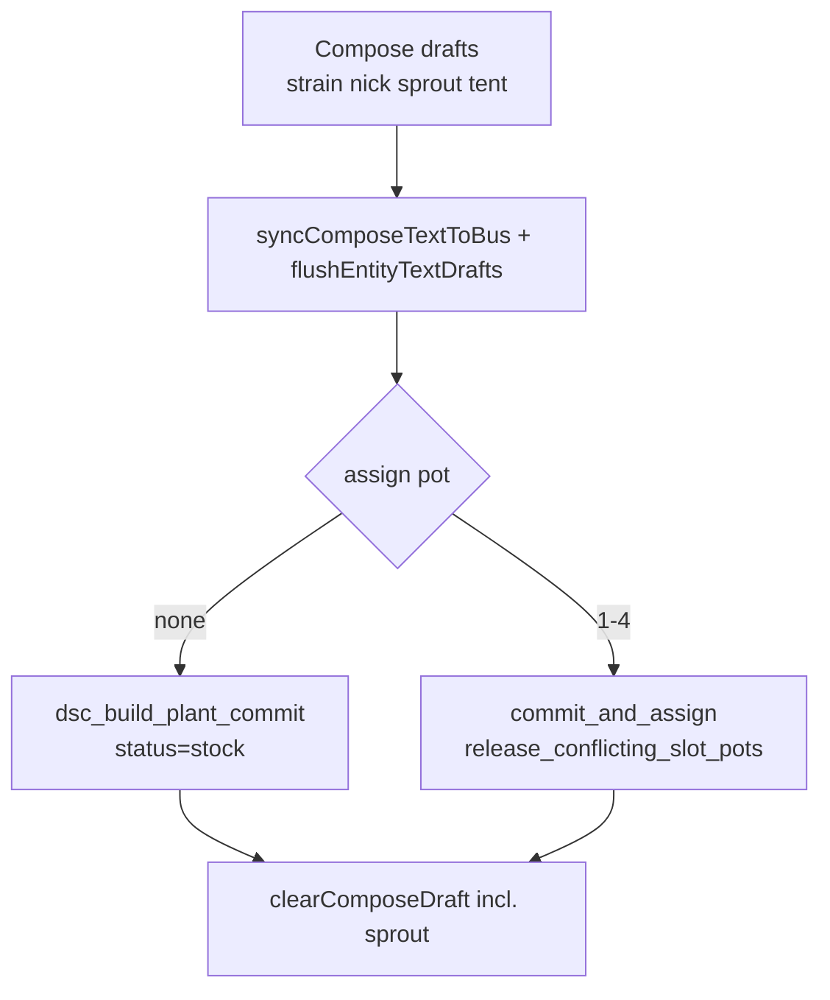
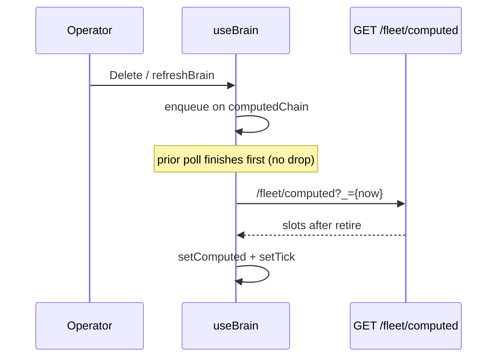

# Roster stock + 10-slot capacity

**In one line:** Compose can park plants on the roster **without a probe** (`status=stock`); the brain holds **10** roster slots; Delete is **slot-keyed**; assign releases stale probe claims so 10-plant Compose/Roster stress holds.

**Tip:** `149657d` · SPA bundle `index-DsUt6Y4m.js` (+ `calibrate-BBqbkhla.js` · `tune-fleet-BdNG_Y6Z.js`)  
**Prior capacity tip:** `15d7016` (10 slots · stock compose · slot retire)  
**Code:** `compose_store.ROSTER_SLOT_COUNT` · `compose_ops` · `plant_probe.release_conflicting_slot_pots` · `api.POST /roster/slots/{n}/retire` · SPA `PlantWizard` · `GrowPages` · `CropScheduler` · `useBrain.refreshComputed` · `fleetApi.get_fleet_computed` · `ui.flushEntityTextDrafts` · `composePlantLogic.clearComposeDraft`  
**Trail:** [`../FOLLOWUPS.md`](../FOLLOWUPS.md) § *2026-08-31 — 10-plant browser stress test* · `.audit/browser-compose-stock.py` · `.audit/stress-roster-hotpatch.ps1`  
**Notion:** [Catalogs and Build a Plant](https://app.notion.com/p/3b52b4cda37081a6b661f7e4697b39cf) · [Pi offline brain](https://app.notion.com/p/3b52b4cda370818e8b66f671689f7a57) · [Local webserver UI](https://app.notion.com/p/3b52b4cda37081c19048e794d4bdf819)

Related lifecycle (detach/assign/move): [PLANT-PROBE-LIFECYCLE.md](PLANT-PROBE-LIFECYCLE.md) · wizard steps: [PLANT-WIZARD.md](PLANT-WIZARD.md)

## Intent

Operators stage more plants than kit probes (Probe 1–2 live). Stock commits fill tent calendars and Keep recipes until a probe is free. Expanding 8 → **10** slots matched a browser stress pass that creates eight 4×8 stock plants plus two seated plants.

## Capacity + migration

| Constant | Value | File |
|----------|-------|------|
| `ROSTER_SLOT_COUNT` | **10** | `brain/dsc_brain/compose_store.py` |

`get_roster_slots()` pads saved JSON shorter than 10 with empty slots and **persists** the pad. Lists longer than 10 reset to defaults. Slot numbers remain `1…ROSTER_SLOT_COUNT`.


## Stock vs seated

| Assign pot | Commit script path | Slot `status` | Probe |
|------------|-------------------|---------------|-------|
| `none` | `script.dsc_build_plant_commit` only | `stock` | none |
| `1`–`4` | `commit_and_assign` (or commit + `dsc_plant_assign_to_pot`) | `active` | pot-keyed roster + `assigned_plant_id` |

SPA: Plant Wizard **Next** on the Plant step needs strain only (probe optional). Primary CTA: **Add to roster (stock)** vs **Add plant to Probe N**. Confirm modal must use the stock label when assign is none.



## Slot retire (Delete)

| Path | Effect |
|------|--------|
| `POST /roster/slots/{slot_n}/retire` | Empties that slot; if the slot owns pot `1`–`4`, clears pot row + helpers + `assigned_plant_id` |
| `script.dsc_plant_retire` with `slot` | Same via `handle_script` |
| Probe-only retire (legacy) | Still `retire_plant(pot)` when no `slot` in script data |

SPA Roster Delete always sets `retireSlot`; dialog copy distinguishes probe-owned vs stock/detached. Client: `retireRosterSlot(n)` in `fleetApi.ts`.

```bash
# Retire stock or detached slot 7 (no probe required)
curl -sS -X POST "http://dsc-brain.local:8787/roster/slots/7/retire"
```

Constraints: `slot_n` ∈ `1…10`; empty/unknown slots → HTTP 400.

## Assign conflict release

Before seating a plant on probe `P`, `release_conflicting_slot_pots(P, keep_slot)` walks other slots that still claim `pot=P` and sets `pot=none` (`status=detached` if they were `active`). Stops duplicate “two active on Probe 1” roster rows (ST-P0-1).

`assign_to_pot` / `assign_plant_to_probe` still **reject** a true incumbent on another slot (`already has a plant`) after release of stale claims only.

## Draft flush honesty

| Field | Flush rule |
|-------|------------|
| Strain / nickname | `syncComposeTextToBus` before Next (plant step) and before commit — catalog pick is async |
| Sprout `input_datetime.*` | `data-entity-id` on input; `flushEntityTextDrafts` → `input_datetime.set_datetime`; skip empty |
| Draft clear | `clearComposeDraft` clears strain, nickname, **sprout**, assign → `none` |

Without sprout clear, Review can show a stale day/stage from a prior plant (ST-P0-8).

## Crop scheduler stock lanes

`CropScheduler` overlays roster slots with `status` ∈ `{stock, detached}` onto the tent stage rail (Expected (stock) · “no probe”). Stock/detached with tent `4x8`/`2x4` no longer leave the rail saying **No plants in tent** when only stock exists (ST-P0-4).

Expected/calendar chips for stock are **not** live Got — Probe language stays for seated plants only.

## Fleet computed refresh (tip `149657d`)

Roster rows (and other computed-derived chrome) come from `GET /fleet/computed`, not only `/fleet` / WS snapshots. Tip `149657d` closed the ST-P0-7 hard-reload trap:

| Before | After |
|--------|-------|
| `refreshComputed` no-op’d while a poll was in flight | Promise **chain** serializes fetches (`computedChain`) |
| Cached `/fleet/computed` could serve a stale body | Query cache-bust `?_=${Date.now()}` |
| Successful computed apply did not bump React `tick` | `setTick` after each computed apply |



Poll interval remains **~5s**; WS `/ws/fleet` messages also enqueue `refreshComputed`. Residual (ST-P0-7 soft): the deleted row may linger until the next completed computed fetch (~one poll). Hard reload remains always correct. Delete confirm uses `.dsc-decision-panel` / **Delete plant**.

## Pitfalls

- **One-poll lag after slot retire** — row may sit until the next serialized computed apply (~5s). Do not double-delete; API returns “already empty” when the slot is gone (ST-P0-7 soft).
- **Light step** — footer shows **Skip light** when no fixture; Next without a pick marks light skipped (tip `149657d`). Inline Skip light still works.
- **Nickname DOM race** — `syncComposeTextToBus` prefers the live `input[data-entity-id=…]` value over the draft map so stock nicknames survive native setters / mid-blur.
- **Rapid catalog → commit** without bus sync can still commit the previous strain; wait for helpers if automating.
- **Kit probes remain 1–2** for operator assign options (`KIT_PROBE_NUMBERS`); pot 3/4 are inventory/Advanced only.
- Do **not** invent height/chem/PPFD/NPK or paste AP/Wi-Fi secrets into runbooks.

## Verify

```bash
# Capacity + conflict release
pytest brain/tests/test_plant_probe.py -q

# Spot-check constant + pad
python3 -c "from dsc_brain.compose_store import ROSTER_SLOT_COUNT; assert ROSTER_SLOT_COUNT==10"
```

Browser recipe (Compose stock): coordinate-click catalog hits; JS-click primary Next (Light footer may read **Skip light**); confirm modal **Add to Roster stock (no probe)**; after Delete, wait one computed poll (~5s) or call `refreshBrain` — hard-reload only if the row sticks. Script sketch: `.audit/browser-compose-stock.py`.
