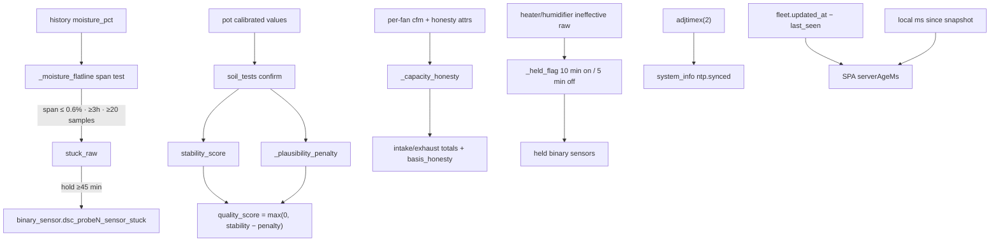

# Sensor & capacity honesty (batch 2)

**Tip SoT:** `94ff4d0`. Second honesty batch: flatline stuck detection, soil-test quality that penalises impossible readings, capacity totals that inherit component honesty, held ineffective latches, container-readable NTP, one-clock SPA ages, and smaller API honesty fixes.

Companion climate ingest (reject-not-clamp) remains tip `17aa6bd` — see [PLAUSIBILITY.md](PLAUSIBILITY.md) on docs PR #220 until merged.

## Intent

A reading that is **frozen, impossible, or mostly nameplate** must not look measured and fine. Stability is not correctness; unknown / mixed / null beats a confident-looking lie.

## Architecture



## Flatline stuck (`sensor_trust`)

### Why the old slope failed

The prior stuck test used first-minus-last slope over 6 h and needed endpoints within ~0.12 %. A dead Modbus probe that **republishes its last read** with a few tenths of jitter never agreed at the endpoints, so `probe1_sensor_stuck` stayed OFF for 24 h and only fired once values went null.

### Span test (current)

| Constant | Value | Role |
|---|---|---|
| `_FLAT_WINDOW_H` | 6.0 h | History window |
| `_FLAT_MIN_SAMPLES` | 20 | Sparse history → undecided |
| `_FLAT_MIN_HOURS` | 3.0 h | Must cover real time, not a burst |
| `_FLAT_SPAN_MAX_PCT` | 0.6 % | `max(y) − min(y)` |
| `_STUCK_ON_SEC` | 45 min | Raw flat must persist before binary ON |

`binary_sensor.dsc_probe{n}_sensor_stuck` attributes: `basis=flatline_span`, plus `span_pct` / `hours` / `samples` when decided. Probe **stations** are excluded from stuck/untrusted (idle park flats must not trip trust); they still get rate/dryback when moisture is live.

Moisture **rate** still uses the 6 h slope (`honesty: history_slope_6h`) — that channel is “how fast is it moving,” not “is it stuck.”

### Pitfall

Sparse history (`<20` samples or `<3` h coverage) returns undecided — the binary stays OFF with `reason: insufficient history`. Do not treat OFF as “proved healthy” without attributes.

## Soil-test quality (`soil_tests`)

```text
stability_score = clamp(100 − variance×10, 0..100)
quality_score   = max(0, stability_score − plausibility_penalty)
```

| Condition | Penalty | Reason string |
|---|---|---|
| Moisture on a rail (≤0 or ≥100) | +50 | `moisture on a rail` |
| EC ≤ 0 while moisture > 5 % | +50 | `EC 0 in wet media` |
| pH outside 3–9 | +30 | `pH outside 3-9` |
| N/P/K all null/0 while moisture > 5 % | +20 | `N/P/K all zero in wet media` |

A dead probe with zero variance used to score **100/100**. Confirmed rows also store `stability_score` and `quality_reasons`.

### Probe station PATCH

`patch_probe_station` validates:

- `tent` against known space ids (else HTTP **400**),
- idle home is a **pot seat**, not the station itself.

## Capacity honesty (`computed_ops`)

Per-fan CFM already carries `honesty` (`measured_curve` vs `capacity_proxy_nameplate`). Totals must not stamp `measured` when most of the sum is nameplate.

`_capacity_honesty(states, values, eids)` → `(label, nameplate_share_pct)`:

| Share | Label |
|---|---|
| 0 % | `measured_curve` |
| 100 % | `capacity_proxy_nameplate` |
| mixed | `mixed_{N}pct_nameplate_proxy` |

Net-pressure / capacity figures carry `basis_honesty` (e.g. `93pct_of_a_side_is_nameplate_proxy`). Incident: exhaust total looked measured while ~93 % was one fan's nameplate proxy.

## Held flags (10 / 5)

`heater_temp_oos_latch` and `*_ineffective_suspect` use `_held_flag`:

- **ON** only after raw true for **600 s**
- **OFF** only after raw false for **300 s**
- Flicker resets the pending timer

The old “latch” recomputed every tick (70 transitions / 48 h) and gated on **cumulative-today** heater runtime (permanently satisfied after a few minutes). Held condition implies continuous runtime — that cumulative gate is gone.

## NTP in the container (`system_info`)

`timedatectl` is absent in the brain container, so the old path always reported unknown — a 7-minute host skew went undetected.

Fallback: **`adjtimex(2)`** on the shared kernel clock (read-only, no `CAP_SYS_TIME`). Reports `synced`, `source: kernel adjtimex`, `max_error_s`. Host DNS / SoftAP NTP remaining open issues are separate from “can the brain see sync state.”

## Journal version stamps (`journal_snapshot`)

| Field | Meaning |
|---|---|
| `brain_version` | Package `__version__` (three-part SPA/brain) |
| `fleet_firmware` | Fleet / expected firmware train (four-part) |

Space and room snapshots get the same stamp (previously only plant/core, and `brain_version` wrongly held firmware).

## SPA one clock (`useHeldReading`)

Hub/panel offline age:

```text
serverAgeMs = (fleet.updated_at − last_seen) × 1000 + ms_since_snapshot_applied
```

Both stamps are brain-clock; only time-since-apply uses the browser. Differencing a server `last_seen` against `Date.now()` blanked healthy probes as PROBE DARK when the Pi ran slow.

Also on this tip: hub link vitals mapped in `entityFleetMap` (no em-dash over live bounces/RSSI); `LightEnergyPanel` null estimate → loading chip; `SystemCards` `useLoad` retries failed fetches with backoff; `update_available: boolean | null`.

## Smaller API honesty

| Surface | Behaviour |
|---|---|
| Kit update | `update_available` is `None` when GitHub check did not run (DNS fail ≠ green) |
| Automation rules | Uppercase ids **rejected** (no silent lowercasing) |
| Alert prefs | `null` value removes an override |
| Cameras | `DELETE` unknown → **404** |
| USB flash | Job history clearable via `DELETE` |
| ESPHome ingest | `soil_moisture_raw` → `moisture_pct_raw`; calibrated `moisture_pct` never shadowed; MAC from `device_info` |
| Canopy Zigbee | `canopy.zones` keeps 4×8 and 2×4; legacy single slot unchanged |
| Raw HASS states | `active_alert_count` no longer hardcoded `0` |
| CannaLib status | Cached 60 s ok / 15 min failed, 5 s timeout; explicit Test bypasses cache |

## Tests

- `brain/tests/test_sensor_trust_flatline.py`
- `brain/tests/test_honesty_batch2.py`
- `brain/tests/test_journal_snapshot.py` (version fields)

## Codepaths

`sensor_trust.py` · `soil_tests.py` · `computed_ops.py` · `system_info.py` · `journal_snapshot.py` · `kit_update.py` · `esphome_client.py` · `zigbee_mqtt.py` · `fleet_state.py` · `automation_rules.py` · `alert_prefs.py` · `usb_flash.py` · `integrations.py` · `network_apply.py` · SPA `useHeldReading.ts` · `entityFleetMap.ts` · `LightEnergyPanel.tsx` · `SystemCards.tsx`
