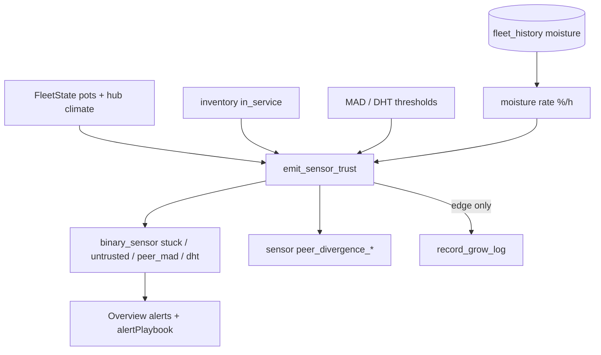

# Sensor trust (Pi-native)

**Intent:** Surface stuck soil probes, peer-MAD outliers, and Tent/Room/Clone DHT disagreement on the Pi SPA without inventing readings or auto-clearing mat votes by default. Verified against tip `86f8c2e` (`sensor_trust.py`, `dash_computed.emit_dash_entities`, `dsc_v4_sensor_trust.yaml`, SPA `alertPlaybook.ts`).

**HA lab package:** [`homeassistant/packages/dsc_v4_sensor_trust.yaml`](../../homeassistant/packages/dsc_v4_sensor_trust.yaml) — same entity IDs / thresholds for scaffold soak. Product path is the Pi module.

## Architecture



Called from `emit_dash_entities` → cold `/fleet/computed` path ([`COMPUTED-CACHE.md`](COMPUTED-CACHE.md)).

## Alerts

| Entity | Rule | Hysteresis |
|---|---|---|
| `binary_sensor.dsc_pot{N}_sensor_stuck` | In-service pot; moisture present; `\|rate\| < 0.02 %/h` over ~6 h history | **45 min** on (`_STUCK_ON_SEC`) |
| `binary_sensor.dsc_pot{N}_untrusted` | Mirrors **stuck only** (not peer MAD) | Same as stuck |
| `binary_sensor.dsc_peer_mad_alert` | Max \|value − median\| across ≥2 in-service online pots ≥ helper threshold (pH / EC / moisture) | **20 min** on |
| `sensor.dsc_peer_divergence_{ph,ec,moisture}` | Live max divergence (or absent until ≥2 pots) | — |
| `sensor.dsc_peer_divergence_summary` | Human Δ summary string | — |
| `binary_sensor.dsc_dht_disagreement` | Hub Tent/Room/Clone ΔT or ΔRH ≥ helpers | **15 min** on / **5 min** off |

Defaults (helpers / HA inputs):

| Helper | Default |
|---|---|
| `input_number.dsc_trust_mad_ph` | 0.6 |
| `input_number.dsc_trust_mad_ec` | 250 µS/cm |
| `input_number.dsc_trust_mad_moisture` | 12 % |
| `input_number.dsc_dht_delta_t_c` | 4 °C |
| `input_number.dsc_dht_delta_rh` | 15 % |

OOS pots (`inventory.in_service=false`) clear stuck/untrusted and are excluded from peer buckets.

## Constraints

- **Cue only for DHT** — attributes note that disagreement does **not** trip failsafe.
- **Peer MAD does not stamp every pot untrusted** — avoids wiping all mat votes (see YAML comment + Pi code).
- Grow-log lines fire on **rising edge** only (`_edge_log`).
- Do not invent moisture rates when history has &lt;2 points — stuck stays false.

## SPA / Calibrate

- Overview / Mission use `alertPlaybook` entries for stuck, peer MAD, and DHT.
- **Calibrate** owns soil peer-median vs lab-buffer and tank EC/pH bias; Learning banner points operators there — trust alerts do not auto-calibrate.

## Developer checks

```bash
pytest brain/tests/test_brain_pi.py -q -k 'sensor_trust or stuck or peer_mad or dht'
# Live: curl -s http://dsc-brain.local:8787/fleet/computed | jq '.hass_extras["binary_sensor.dsc_peer_mad_alert"]'
```

## Pitfalls

| Symptom | Likely cause |
|---|---|
| Stuck never lights | &lt;2 history points, pot OOS, or rate above 0.02 %/h |
| Peer MAD always “Need ≥2 pots” | Only one in-service online pot with readings |
| Grow log spam | Fixed in 7.1.2 — edges only; SPA also filters boot Stage/Clone noise (`growLogFilter.ts`) |
