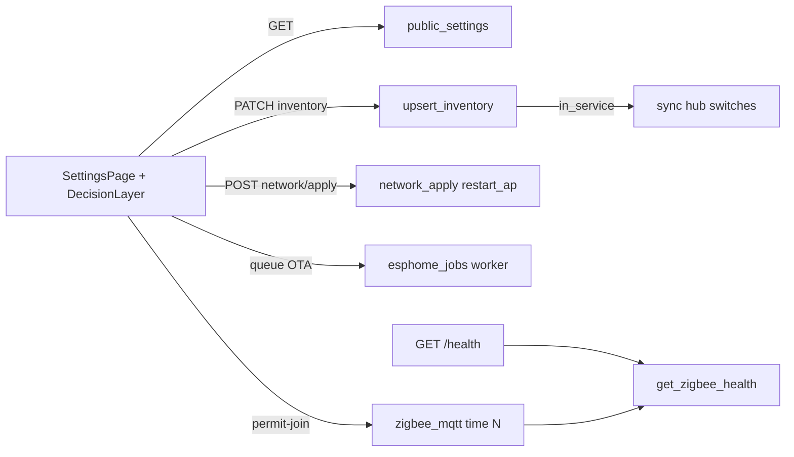

# Settings, Zigbee health, and write safety (7.1.2)

**Intent:** Operator Settings must not leak secrets, OTA jobs must reach a terminal state, Apply network must restart the AP with healed capacity, Zigbee must report radio honesty, and P0 writes must confirm. Verified against tip `65d4104`.

**UI:** `#/fleet/settings` (redirect from `#/settings`) · **Closure:** [`AUDIT-CLOSURE-7.1.2.md`](../qa/AUDIT-CLOSURE-7.1.2.md)

## Architecture



## PSK mask + settings honesty

| Endpoint | Behavior |
|---|---|
| `GET /settings` | Returns `public_settings()` — **`ap_psk` always `""`**, `ap_psk_set: true/false` |
| `PATCH /settings` | May set `ap_psk`; response is again masked |
| Stripped keys | `compose_helpers_json`, `plant_roster_slots_json` stay in sqlite only |

**Never** log or paste live AP PSKs into Wiki/PRs — Notion **API Keys & Credentials** only.

```bash
pytest brain/tests/test_brain_pi.py -q -k 'masks_ap_psk or public_settings'
```

## OTA worker

`api` lifespan starts `start_esphome_worker()` (`esphome_jobs.py`). Queued compile/OTA jobs wake the worker (`_worker_wake`) and run to **success/failed** via `docker exec dsc-hub-esphome …`. Settings shows job status; SPA wraps Queue OTA in DecisionLayer.

**Seat alias:** inventory `control` merges fleet status from `panel` (`api._FLEET_SEAT_ALIAS`).

## Apply network

`POST /settings/network/apply` → `apply_network_configs(restart_ap=True)`:

1. Render `hostapd.conf` / `dnsmasq.conf` / `hostapd.deny` under brain data
2. Copy to `/etc/dsc-hub/`
3. `systemctl restart dsc-hub-ap.service`

Healed hostapd fields: `max_num_sta=32`, `deny_mac_file=/etc/dsc-hub/hostapd.deny`, channels **1/6/11** only.

**Pitfall:** Apply drops fleet Wi-Fi briefly. Confirm via DecisionLayer; keep eth0 SSH if diagnosing.

## Zigbee health

| Surface | Fields |
|---|---|
| `GET /health` → `zigbee` | `mqtt_connected`, `device_count`, `devices_updated_at`, `canopy_updated_at`, `permit_join` |
| `GET /settings/zigbee/health` | Same payload |
| Permit join | `POST /settings/zigbee/permit-join` publishes z2m 2.x `{"time": N}` (1–254); timer clears `zigbee_permit_join` setting |

**Honesty:** `mqtt_connected=false` is “radio/MQTT down,” not “empty until paired.”

## Command safety gates

### SPA (DecisionLayer / `EntityToggle confirm`)

P0 writes require confirm: climate demand tiles, Full Auto / takeover, in-service toggles, Apply network, Queue OTA, permit-join, backup import, SF1000 / 2×4 lamp, inspector Turn on/off.

### Brain (`control_ops`)

| Gate | Behavior |
|---|---|
| Phantom relays | `ac` / `mister` — refuse `main_relay` writes (“use hub demand switch”) |
| OOS Sonoff | Refuse relay command when inventory `in_service` is false |
| Inventory toggle | `input_boolean.dsc_*_in_service` → `upsert_inventory` (hub mirror on Settings PATCH path) |

## Fallback / deploy defaults

Pi scripts default studio LAN to **`192.168.86.48`** (not `.30`). Prefer `dsc-brain.local`. AP seats stay `10.42.0.x`. See [`SONOFF-FLASH.md`](../ops/SONOFF-FLASH.md) · [`DSC-HUB-DOCKER.md`](../ops/DSC-HUB-DOCKER.md).

## Developer checks

```bash
pytest brain/tests/test_brain_pi.py -q -k 'permit_join or network_apply or create_extra_seat or masks_ap_psk'
curl -s http://dsc-brain.local:8787/health | jq '.zigbee'
curl -s http://dsc-brain.local:8787/settings | jq '.settings | {ap_psk, ap_psk_set}'
# Expect ap_psk "" and ap_psk_set boolean
```
