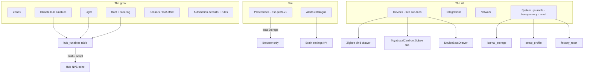

# Settings & preferences (S1–S5)

**In one line:** One gear surface grouped by the operator's question (You / The grow / The kit); every row states who owns the value and whether it is synced.

Verified against tip `0d3d7f0` (Hub **8.1.0**). Plan: [`docs/design/plan-settings-2026-09-07.md`](../design/plan-settings-2026-09-07.md). Evidence: `docs/FOLLOWUPS.md` §§ Settings Pass S1–S5. Cameras (S7 core): [`docs/cameras.md`](../cameras.md). Firmware toolchain: [`docs/ops/ESPHOME-TOOLCHAIN.md`](../ops/ESPHOME-TOOLCHAIN.md). Tuya Wi-Fi lane: [`docs/ops/TUYA-LOCAL-SETUP.md`](../ops/TUYA-LOCAL-SETUP.md) · [`TUYA-LOCAL.md`](TUYA-LOCAL.md). Upgrade / Kit Update: [`../../UPGRADE.md`](../../UPGRADE.md).

## Intent

Before S1 the SPA had an 1800-line Settings page, hub helpers reachable only via the entity inspector, and **zero** browser preferences. The model now:

1. **Provenance on every row** — scope badge `this browser` · `brain` · `hub` · `firmware`.
2. **Group by question**, not by process — twelve sections in three rail groups.
3. **Brain owns desired hub tunables**; hub NVS remains the offline fallback.
4. **Deep links** — `#/settings/<section>#<anchor>` via `paths.settings(section, anchor?)`.
5. **Devices are hash sub-tabs + drawers** (S5); **System cards expose time / failover / profile / reset** (S4).

## Architecture

| Layer | Storage | Examples |
|---|---|---|
| Browser prefs | `localStorage` key `dsc.prefs.v1` (diff from defaults) | Grid wash, motion, chart hours, landing desk, `cameraThumbRefreshS`, developer toggles |
| Brain desired | SQLite / settings KV | Hub tunables, stage rail, alert prefs, journal retention, automation defaults |
| Hub echo | ESP NVS (`restore_value`) | Targets, hysteresis, ladder waits, sunrise ramps |
| Firmware | Baked stage table when brain absent | `apply_stage` fallback |

## SPA routes

Canonical entry: `#/settings/preferences` (`SETTINGS_PATH`). Sections in `frontend/src/routes.ts` (`SETTINGS_SECTIONS` / `SETTINGS_GROUPS`):

`preferences` · `alerts` · `zones` · `climate` · `light` · `root` · `sensors` · `automation` · `devices` · `integrations` · `network` · `system`

Search index + anchors: `frontend/src/pages/settings/settingsIndex.ts`. Layout: `SettingsLayout.tsx`. Row primitives: `SettingRow.tsx`, `TextSettingRow.tsx`, `HubTunableRow`, `StageRailCard`, `CamerasCard`, `JournalsStorageCard`, `SystemCards.tsx`.

### Devices sub-tabs (S5)

One section route `#/settings/devices`; **sub-tab = URL hash** (`tabForAnchor` in `DevicesSettingsPage.tsx`) — not nested path segments.

| Sub-tab | URL | Anchors that land here |
|---|---|---|
| Inventory | `#/settings/devices` · `#inventory` | `add-seat` |
| Assignment | `#/settings/devices#assignment` | `probe-stations` |
| Zigbee | `#/settings/devices#zigbee` | `zigbee-catalog`, **`tuya`** |
| Cameras | `#/settings/devices#cameras` | — |
| Firmware | `#/settings/devices#firmware` | `toolchain`, `jobs`, `kit-update`, `firmware-advanced` |

Drawers use shared `SettingsDrawer` (dirty close → discard; Save disabled when `!dirty || saving`; Cancel is also disabled while `saving` — see `SettingsDrawer.tsx`):

- **Inventory row** → `DeviceSeatDrawer` → `PATCH /settings/inventory/{seat}`
- **Zigbee bind** → `ZigbeeBindDrawer` → `PUT /settings/zigbee/bindings` + `PUT /settings/zigbee/policies`
- **Cameras** bind UI uses `SlideDrawer` (no shared dirty-guard) — see [`cameras.md`](../cameras.md)
- **Tuya** card lives on the Zigbee sub-tab (`#tuya`) — see [`TUYA-LOCAL.md`](TUYA-LOCAL.md)

### System cards (S4)

Mounted on `#/settings/system` after Backup / Storage / Journals (`KitSectionPages.tsx` → `SystemCards.tsx`):

| Card | Anchor | Brain route |
|---|---|---|
| Time | `#time` | `GET /system/time` |
| Failover | `#failover` / `#failover-state` | `GET /system/failover` |
| About | `#about` / `#about-routes` / `#about-setup` | `GET /system/routes` + setup state |
| Developer | `#developer` · `#dev-tunables` · `#dev-changelog` | prefs + `/fleet` + tunables + journal |
| Setup profile | `#profile` | `GET /settings/profile` · `POST /settings/profile/import` |
| Reset | `#reset` | `GET/POST /settings/system/factory-reset` |

Honesty: missing/non-JSON responses surface **brain predates the system cards**; NTP may be `synced: null` (unknown on this host); hub clock may be unpublished until firmware exposes `hub_clock_epoch`.

### Legacy redirects

| Old | New |
|---|---|
| `#/settings` · `#/settings/general` | `#/settings/preferences` |
| `#/settings/brain` | `#/settings/sensors` |
| `#/settings/hub` | `#/settings/system#backup` |
| `#/settings/server` | `#/settings/devices#firmware` |
| `#/settings/device` · `#/fleet/settings` | `#/settings/devices` |
| `#/settings/api` | `#/settings/integrations` |

## Brain HTTP surface

| Route | Module | Role |
|---|---|---|
| `GET /settings/manifest` | `settings_manifest.py` | Tier / default / range / unit / consumers |
| `GET/PATCH /settings/hub-tunables` | `hub_tunables.py` | Desired values + sync state |
| `POST …/hub-tunables/{id}/adopt` · `/push` | same | Resolve `differs` |
| `GET/PATCH /settings/stage-rail` · `…/apply` · `…/reset` | `stage_rail.py` | Editable stage presets |
| `GET/PATCH /settings/root-steering-targets` | root steering KV | Dry-back / VWC / EC targets |
| `GET/PATCH /settings/alerts` | `alert_prefs.py` | Enable / severity / quiet hours (failsafe cannot disable) |
| `GET/PATCH /settings/automation-defaults` | `automation_defaults.py` | New-rule debounce / release / window |
| `GET/PATCH /settings/journals` · `/journals/export` · `/journals/archive` | `journal_storage.py` | Retention, sizes, grow-record archive |
| `GET /system/time` · `/failover` · `/routes` | `system_info.py` | Transparency cards (S4) |
| `GET /settings/profile` · `POST …/import` | `setup_profile.py` | Export / diff / apply (S4) |
| `GET/POST /settings/system/factory-reset` | `factory_reset.py` | Typed confirm wipe (S4) |
| (writes) core journal `tag=settings` | `settings_journal.py` | Logs › Settings changes |

Cameras are **not** settings modules — see [`docs/cameras.md`](../cameras.md) (`/cameras/*`, UI at `#/settings/devices#cameras`).

Tuya routes live under `/settings/tuya/*` — see [`TUYA-LOCAL.md`](TUYA-LOCAL.md).

## Hub tunable sync states

Wire tokens from `hub_tunables._state_for` (SPA shows the same lowercase labels):

| State | Meaning |
|---|---|
| `synced` | Echo matches desired |
| `pending` | Pushed; echo not yet seen |
| `held` | Hub offline; push queued |
| `differs` | Hub reports a value the brain did not write — **Adopt** or **Push**, never silent overwrite |
| `failed` | Last push error |
| `missing` | Entity absent while hub online (firmware older than the row) |
| `unadopted` | First-run / not yet claimed by the brain |

Reconnect respects failover: no pushes under `manual_takeover`; queued tunables push with demand re-assert on clear / TTL.

## Setup profile & factory reset (S4)

**Profile includes (brain):** `global_modifiers`, `stage_rail`, `root_steering_targets`, `alert_prefs`, `automation_defaults`, `journal_retention`, operator-set `hub_tunables`. SPA export also folds non-internal browser prefs.

**Profile excludes:** `network`, `inventory`, `zigbee`, `tuya`, `cameras`, `media`, `credentials`, `journals`. `ap_ssid` is exported as an ID only — never applied.

**Import:** `confirm=false` → diff only; `confirm=true` → apply through the same setters the pages use (journaled).

**Factory reset:** typed confirm = kit AP SSID (`GET …/factory-reset` returns `confirm_text`); writes backup zip + DB copy under `DSC_DATA/backups`; drops all non-`sqlite_%` tables in place + VACUUM + `init_settings_db`; optional brain restart. Does **not** flash hub/ESP firmware. Demo-forbidden.

## Preferences constraints (operator decisions)

- **Metric only** — no °F switch; conductivity / airflow scales remain.
- **No light theme** — appearance is wash / motion / depth / contrast / density.
- **One owner** — no people/roles/PIN; power-user = Show advanced rows.
- Browser prefs travel via setup-profile export (except internal keys like `lastDesk` / `lastZone`).

## Not yet (plan order)

| Pass | Gap |
|---|---|
| **S6** | Grow-journal action types + `journal_media` |
| **S7b** | Camera plant regions, drift → STALE, canopy area |

## Pitfalls

- Rows without a consumer are **not rendered** (no dead toggles). Add a `settingsIndex` entry when you add a row.
- Writing hub helpers straight through `/control/service` bypasses provenance — use `PATCH /settings/hub-tunables`.
- Do **not** document Devices as `/settings/devices/zigbee` path segments — use `#zigbee`.
- Split busy flags per async action on Devices / System (toolchain vs rollout vs join vs drawer `saving`); never one page-wide `busy`.
- Production SPA chunking: never statically import twin pages into the boot graph — see [`TWIN.md`](TWIN.md) / [`../ops/SPA-PROD-BUNDLE.md`](../ops/SPA-PROD-BUNDLE.md).

## Tests

- `brain/tests/test_settings_s4.py` — time / failover / routes / profile / factory reset
- Earlier S1–S3 coverage lives with hub_tunables / alerts / journals modules
