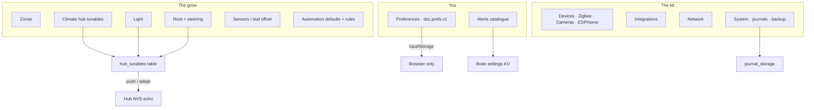

# Settings & preferences (S1–S3)

**In one line:** One gear surface grouped by the operator's question (You / The grow / The kit); every row states who owns the value and whether it is synced.

Plan: [`docs/design/plan-settings-2026-09-07.md`](../design/plan-settings-2026-09-07.md). Evidence: `docs/FOLLOWUPS.md` §§ Settings Pass S1–S3. Cameras (S7 core): [`docs/cameras.md`](../cameras.md).

## Intent

Before S1 the SPA had an 1800-line Settings page, hub helpers reachable only via the entity inspector, and **zero** browser preferences. The model now:

1. **Provenance on every row** — scope badge `this browser` · `brain` · `hub` · `firmware`.
2. **Group by question**, not by process — twelve sections in three rail groups.
3. **Brain owns desired hub tunables**; hub NVS remains the offline fallback.
4. **Deep links** — `#/settings/<section>#<anchor>` via `paths.settings(section, anchor?)`.

## Architecture

| Layer | Storage | Examples |
|---|---|---|
| Browser prefs | `localStorage` key `dsc.prefs.v1` (diff from defaults) | Grid wash, motion, chart hours, landing desk, `cameraThumbRefreshS` |
| Brain desired | SQLite / settings KV | Hub tunables, stage rail, alert prefs, journal retention, automation defaults |
| Hub echo | ESP NVS (`restore_value`) | Targets, hysteresis, ladder waits, sunrise ramps |
| Firmware | Baked stage table when brain absent | `apply_stage` fallback |

## SPA routes

Canonical entry: `#/settings/preferences` (`SETTINGS_PATH`). Sections in `frontend/src/routes.ts` (`SETTINGS_SECTIONS` / `SETTINGS_GROUPS`):

`preferences` · `alerts` · `zones` · `climate` · `light` · `root` · `sensors` · `automation` · `devices` · `integrations` · `network` · `system`

Search index + anchors: `frontend/src/pages/settings/settingsIndex.ts`. Layout: `SettingsLayout.tsx`. Row primitive: `SettingRow.tsx` (+ `HubTunableRow`, `StageRailCard`, `CamerasCard`, `JournalsStorageCard`).

### Legacy redirects

| Old | New |
|---|---|
| `#/settings` · `#/settings/general` | `#/settings/preferences` |
| `#/settings/brain` | `#/settings/sensors` |
| `#/settings/hub` | `#/settings/system#backup` |
| `#/settings/server` | `#/settings/devices#firmware` |
| `#/settings/device` · `#/fleet/settings` | `#/settings/devices` |
| `#/settings/api` | `#/settings/integrations` |

Devices stays **one page with anchors** (`#inventory`, `#zigbee`, `#cameras`, `#firmware`) — drawers are Pass S5.

## Brain HTTP surface

| Route | Module | Role |
|---|---|---|
| `GET /settings/manifest` | `settings_manifest.py` | Tier / default / range / unit / consumers |
| `GET/PATCH /settings/hub-tunables` | `hub_tunables.py` | Desired values + sync state |
| `POST …/hub-tunables/{id}/adopt` · `/push` | same | Resolve `differs` |
| `GET/PATCH /settings/stage-rail` · `…/apply` · `…/reset` | `stage_rail.py` | Editable stage presets |
| `GET/PATCH /settings/root-steering-targets` | root steering KV | Dry-back / VWC / EC targets |
| `GET/PATCH /settings/alerts` | `alert_prefs.py` | Enable / severity / quiet hours (failsafe cannot disable) |
| `GET/PATCH /settings/automation-defaults` | `automation_defaults.py` | New-rule debounce / release / window |
| `GET/PATCH /settings/journals` · export / archive | `journal_storage.py` | Retention, sizes, grow-record archive |
| (writes) core journal `tag=settings` | `settings_journal.py` | Logs › Settings changes |

Cameras are **not** settings modules — see [`docs/cameras.md`](../cameras.md) (`/cameras/*`, UI at `#/settings/devices#cameras`).

## Hub tunable sync states

Wire tokens from `hub_tunables._state_for` (SPA shows the same lowercase labels):

| State | Meaning |
|---|---|
| `synced` | Echo matches desired |
| `pending` | Pushed; echo not yet seen |
| `held` | Hub offline; push queued |
| `differs` | Hub reports a value the brain did not write — **Adopt** or **Push**, never silent overwrite |
| `failed` | Last push error |
| `missing` | Entity absent while hub online (firmware older than the row) |

Reconnect respects failover: no pushes under `manual_takeover`; queued tunables push with demand re-assert on clear / TTL.

## Preferences constraints (operator decisions)

- **Metric only** — no °F switch; conductivity / airflow scales remain.
- **No light theme** — appearance is wash / motion / depth / contrast / density.
- **One owner** — no people/roles/PIN; power-user = Show advanced rows.
- Browser prefs are **per browser** until S4 setup-profile export/import.

## Not yet (plan order)

| Pass | Gap |
|---|---|
| **S5** | `SettingsDrawer`, Devices sub-routes |
| **S4** | Time/NTP/drift card, developer/provenance, setup-profile export/import, typed factory reset |
| **S6** | Grow-journal action types + `journal_media` |
| **S7b** | Camera plant regions, drift → STALE, canopy area |

## Pitfalls

- Rows without a consumer are **not rendered** (no dead toggles). Add a `settingsIndex` entry when you add a row.
- Writing hub helpers straight through `/control/service` bypasses provenance — use `PATCH /settings/hub-tunables`.
- Production SPA chunking: never statically import twin pages into the boot graph — see [`TWIN.md`](TWIN.md) / [`../ops/SPA-PROD-BUNDLE.md`](../ops/SPA-PROD-BUNDLE.md).
