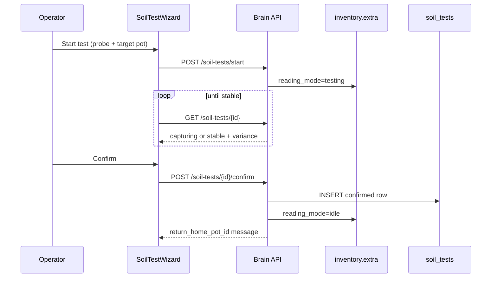

# Mobile soil probe workflow (7.2)

**In one line:** Designate pot seats as probe stations; run confirmed 7-channel soil tests with stability gating; idle “thereabouts” readings stay honest and out of peer-MAD trust.

**Code:** `brain/dsc_brain/soil_tests.py` · SPA `SoilTestWizard` · Calibrate page  
**Storage:** SQLite `soil_tests` table · inventory `extra.role=probe_station`

## Intent

Operators move a physical soil probe between plants. The brain must:

1. Know which seats are **probe stations** (defaults: **pot2** → 2×4, **pot4** → 4×8).
2. Show **thereabouts** while the probe sits in its idle home pot (not a confirmed plant reading).
3. Capture a **confirmed** snapshot only after moisture samples stabilize.
4. Exclude probe stations from stuck/peer-MAD trust so idle home pots do not poison fleet alerts.

## Architecture



## Probe station model

Inventory `extra` fields (set by `init_probe_station_defaults()` on brain startup once `probe_station_defaults_v1=applied`):

| Field | Meaning |
|-------|---------|
| `role` | Must be `probe_station` |
| `tent` | `2x4` or `4x8` (UI grouping) |
| `idle_home_pot_id` | Pot id whose live values are “thereabouts” while idle |
| `reading_mode` | `idle` \| `testing` |
| `probe_attached` | Hint for UI honesty |

**Thereabouts source:** `fleet.pots[idle_home_pot_id].values` (fallback: seat itself).

## Stability gate

Verified constants in `soil_tests.py`:

| Constant | Value | Role |
|----------|-------|------|
| `STABILITY_MIN_SAMPLES` | 3 | Minimum moisture samples |
| `STABILITY_VARIANCE_MAX` | 2.5 | Max moisture % population stddev |
| Window | last 10 samples | Poll appends one reading per GET |

Confirm fails with **409** / `ValueError` if not stable — session stays active.

**Channels captured:** `moisture_pct`, `soil_temp_c`, `ec_us`, `ph`, `nitrogen`, `phosphorus`, `potassium`.

**Timing notes:** `before_water` \| `after_water` \| `during_water` \| `outside_water` \| `adhoc`.

## API

```bash
# List stations (incl. thereabouts)
curl -s http://dsc-brain.local:8787/settings/probe-stations | jq .

# Retarget idle home
curl -s -X PATCH http://dsc-brain.local:8787/settings/probe-stations/pot2 \
  -H 'content-type: application/json' \
  -d '{"idle_home_pot_id":"pot2","tent":"2x4"}'

# Start → poll → confirm
curl -s -X POST http://dsc-brain.local:8787/soil-tests/start \
  -H 'content-type: application/json' \
  -d '{"probe_seat_id":"pot2","target_pot_id":"pot2","mode":"adhoc","timing_note":"adhoc","plant_label":"Demo"}'

curl -s http://dsc-brain.local:8787/soil-tests/<id>
curl -s -X POST http://dsc-brain.local:8787/soil-tests/<id>/confirm
curl -s -X POST http://dsc-brain.local:8787/soil-tests/<id>/cancel   # abort → idle
curl -s 'http://dsc-brain.local:8787/soil-tests?limit=20'
```

On confirm with `roster_seat_id`, roster `recipe.last_soil_test` is updated.

## SPA

- Lazy route chunk: `SoilTestWizard` (`routes.ts`).
- Entry: Fleet → **Calibrate** (soil probe section) — wizard drives start/poll/confirm.
- Settings can list/patch probe stations alongside inventory.

## Sensor trust interaction

`sensor_trust._is_probe_station` skips **stuck moisture** rate checks and **peer-MAD** contribution for probe-station pots. Untrusted ≠ probe-idle; idle home moisture is expected to be flat.

## Pitfalls

| Symptom | Cause | Fix |
|---------|-------|-----|
| `not a probe station` 400 | Seat missing `role=probe_station` | Ensure defaults applied or patch inventory extra |
| Confirm always 409 | Probe still moving / air | Wait for `status: stable`; keep probe buried |
| Active sessions lost on restart | In-memory `_active` only | Cancel/restart; confirmed rows survive in SQLite |
| Peer MAD false alerts on pot2/4 | Old brain without probe exclusion | Deploy 7.2+; verify `role` on pot2/pot4 |
| Confirmed NPK look invented | Channels may be null if firmware/ingest lacks them | Treat nulls as absent — do not invent chemistry |

## Tests

`test_soil_test_flow` in `brain/tests/test_brain_pi.py` (60 brain tests total on tip).
