# SPA module map (Settings · PlantWizard · Roster dialogs)

**In one line:** Post-mega **D** quality splits keep page shells thin — step UIs, Zigbee bind rows, and roster DecisionLayers live under `components/*` so operators can navigate the code without hunting 1k-line pages.

**Tip (v7.4.0 signed off):** `32836fe` · spa-dist `index-K2_ziUnM.js` (+ `calibrate-BqnIG9Rc.js` · `tune-fleet-C9fzhOX5.js` · `twin-three-BjdbWAdH.js`)
**Prior (Post-mega D-C-A-B):** `f029702` · `index-CXq-NptO.js`  
**Prior Mega Pass tip:** `a307dc7` · `index-DlMHgtYz.js`  
**Closure:** [`../qa/AUDIT-CLOSURE-2026-09-D-C-A-B.md`](../qa/AUDIT-CLOSURE-2026-09-D-C-A-B.md) · Gate 0 [`../qa/GATE0-SOAK-2026-09.md`](../qa/GATE0-SOAK-2026-09.md)  
**Kit chrome:** [KIT-SCOPE.md](KIT-SCOPE.md) · Zigbee chips: [ZIGBEE-POLICY-UI.md](ZIGBEE-POLICY-UI.md) · Wizard contract: [PLANT-WIZARD.md](PLANT-WIZARD.md)

## Intent

Mega Pass closed honesty (R3F wraps, Wet/Dry vs Problem, sprout/stage). Track **D** then extracted the three highest-churn SPA surfaces so behavior stays the same while file ownership is clear for hotpatch and review.

```mermaid
flowchart TB
  subgraph pages [pages/]
    settings["SettingsPage.tsx<br/>fetch / section routing"]
    wizard["PlantWizard.tsx<br/>drafts / canNext / commit"]
    grow["GrowPages.tsx<br/>vacantProbes / confirm*"]
  end
  subgraph settingsComp [components/settings/]
    zb["ZigbeeBindRow.tsx"]
    detail["DeviceDetailCard.tsx"]
    assign["DeviceAssignmentRow.tsx"]
    sc["settingsConstants.ts"]
    sh["settingsHelpers.ts"]
  end
  subgraph wizardComp [components/plantWizard/]
    steps["plantWizardSteps.ts"]
    plant["PlantWizardPlantStep"]
    soil["PlantWizardSoilStep"]
    feed["PlantWizardFeedStep"]
    light["PlantWizardLightStep"]
    review["PlantWizardReviewStep"]
  end
  subgraph rosterComp [components/roster/]
    dialogs["RosterLifecycleDialogs.tsx"]
  end
  settings --> zb
  settings --> detail
  settings --> assign
  settings --> sc
  settings --> sh
  wizard --> steps
  wizard --> plant
  wizard --> soil
  wizard --> feed
  wizard --> light
  wizard --> review
  grow --> dialogs
```



## Ownership

| Shell | Retains | Extracted |
|-------|---------|-----------|
| `pages/SettingsPage.tsx` | Section routing, inventory/Zigbee/network/integrations fetch+patch, DecisionLayer for in-service, Zigbee health table wiring | `ZigbeeBindRow`, `DeviceDetailCard`, `DeviceAssignmentRow`, `settingsConstants`, `settingsHelpers` |
| `components/PlantWizard.tsx` | Entity-bus + `assignDraft`, `canNext`, strain/nickname flush, `commitAssign`, step nav/footer | `plantWizardSteps.ts` + `PlantWizard*Step.tsx` |
| `pages/GrowPages.tsx` (`GrowRosterPage`) | State (`detachPot` / `assignSlot` / `retireSlot`), `vacantProbes` from `KIT_PROBE_NUMBERS`, confirm handlers | `RosterLifecycleDialogs` (Detach / Assign / Delete DecisionLayers) |

### Settings helpers (pitfalls)

- `inventoryGroup(seatId)`: `pot1`/`pot2` → **Kit probes**; `pot3`/`pot4` → **Advanced restore (Probe 3–4)** — do not move 3–4 into kit chrome.
- `IDLE_POT_OPTIONS` in `settingsConstants.ts` is kit-only (`"" | pot1 | pot2`).
- Task ids: `TANK_TASK_ID=tank_full_appliance`, `FLOOD_TASK_ID=floor_flood_alert` — Appliance UI hidden for flood ([ZIGBEE-POLICY-UI.md](ZIGBEE-POLICY-UI.md)).
- Capability classes (`climate` / `liquid` / `plug` / …) live in `fleetApi.ts`, not `settingsConstants` — roles/recipes come from brain APIs and are filtered client-side.

### Wizard steps

| File | Step |
|------|------|
| `PlantWizardPlantStep.tsx` | Strain, nickname, assign probe, sprout / expected stage |
| `PlantWizardSoilStep.tsx` | Vessel + soil presets / medium / custom blend |
| `PlantWizardFeedStep.tsx` | Optional nutrients + skip |
| `PlantWizardLightStep.tsx` | Optional fixture + skip |
| `PlantWizardReviewStep.tsx` | Summary, Add CTA, retire-draft dialog |

`STEPS` order is plant → soil → feed? → light? → review (`plantWizardSteps.ts`). Assign options still filter through `KIT_PROBE_NUMBERS`.

### Roster dialogs

`RosterLifecycleDialogs` is presentational only — parents pass vacant kit probes and confirm callbacks. Delete still closes the probe drawer via captured `retirePot` ([ROSTER-STOCK.md](ROSTER-STOCK.md)).

## Build / hotpatch

```bash
cd homeassistant/custom_components/dsc_hub/frontend
npm run build:spa
# verify spa-dist/index.html → assets/index-K2_ziUnM.js
```

Windows lab deploy: [`../ops/PI-HOTPATCH.md`](../ops/PI-HOTPATCH.md). Tip expects **`index-K2_ziUnM.js`**.

## Constraints

- Splits are **structure-only** — do not change Wet/Dry vs Problem semantics, kit probe sets, or entity-bus draft rules while refactoring.
- Prefer one more extract over growing `SettingsPage` / `PlantWizard` past reviewable size again.
- Do not invent height/chem/PPFD/NPK; do not paste secrets into docs or PR bodies.

## Related

- [WEBUI.md](WEBUI.md) · [KIT-SCOPE.md](KIT-SCOPE.md) · [PLANT-WIZARD.md](PLANT-WIZARD.md) · [ZIGBEE-POLICY-UI.md](ZIGBEE-POLICY-UI.md)
- Notion: [Local webserver UI](https://app.notion.com/p/3b52b4cda37081c19048e794d4bdf819)
