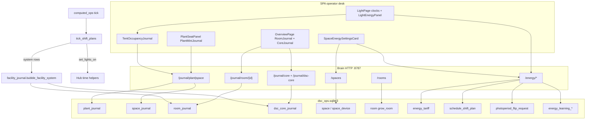

# Space energy, journals & approve-only schedule slides

**Intent:** Local estimates and plant→tent→room→Core journals without silent lighting changes. Space owns photoperiod equipment/window; plants carry identity + journal; schedule slides/flips need explicit operator confirm.

**Tip:** `5a7ada4` (spa-dist `index-C8GkS5XE.js` + `calibrate-DcOg5koY.js` · `tune-fleet-B5F45eEz.js`)  
**Status:** **SHIPPED + Pi-proven** — plant/tent/room/DSC-Core journals, energy + shift APIs, Overview room/Core UI, both-tent force-tick walk. Specs marked **implemented**. Live UX honesty Passes 1–3 **gate green** — see [`LIVE-UX-HONESTY.md`](LIVE-UX-HONESTY.md).

**Spec / plan / skill / walk:**  
[`../superpowers/specs/2026-09-01-space-energy-journal-design.md`](../superpowers/specs/2026-09-01-space-energy-journal-design.md) ·  
[`../superpowers/specs/2026-09-01-space-energy-pi-closure-design.md`](../superpowers/specs/2026-09-01-space-energy-pi-closure-design.md) ·  
[`../superpowers/plans/2026-09-01-space-energy-pi-closure.md`](../superpowers/plans/2026-09-01-space-energy-pi-closure.md) ·  
[`.cursor/skills/dsc-space-photoperiod-journal/SKILL.md`](../../.cursor/skills/dsc-space-photoperiod-journal/SKILL.md) ·  
[`../qa/SPACE-ENERGY-PI-WALK-2026-09.md`](../qa/SPACE-ENERGY-PI-WALK-2026-09.md)

## Architecture



| Layer | Owns | Tip status |
|-------|------|------------|
| **Plant** | Mini journal (follows `plant_id`) | **SHIPPED + live** |
| **Tent space** (`4x8` / `2x4`) | Devices + watts, space journal, energy estimate, shift/flip | **SHIPPED + live** |
| **Room** (`grow_room`) | Room-native journal + child tent rollup | **SHIPPED + live** |
| **DSC-Core** | Facility/system journal + rollup of all rooms | **SHIPPED + live** |
| **Firmware / light_loop** | Live HH:MM schedule actuation, ramps, dark safety | **SHIPPED** (prior) |

Kit seeds `grow_room` parenting both tents (`room_model.ensure_kit_rooms`). Live grow stays two tents; model allows more spaces/rooms later without renaming Core.

## Hard gates (verified in code)

1. `POST /energy/shift/plan` requires `confirm=true` — otherwise `400` (`confirm=true required — no silent schedule changes`).
2. Suggestions always carry `apply: false` (`/energy/suggestions`, Learning signals).
3. Flip resolve only marks approved/denied — **does not** write lights-on or want hours.
4. Conflict banners may `suggest_move`; never auto-move plants.
5. Plant card hosts **mini journal only** (no lights-on editors on `PlantMiniJournal`).
6. Estimates are W × hours × tariff bands — labeled local estimate, not a utility bill.
7. Schedule slide start/step/cancel bubbles to room + Core via `facility_journal.bubble_facility_system` (`source=system`, tag `facility`).

## HTTP surface

All routes in `brain/dsc_brain/api.py`. Persist in `DEFAULT_DB` (`dsc_ops.sqlite3`).

### Journals

| Method | Path | Notes |
|--------|------|-------|
| GET | `/journal/plant/{plant_id}?limit=` | Entries for that plant UUID |
| POST | `/journal/plant/{plant_id}` | Body: `{ note, occurred_at?, tags? }` → `source=operator` |
| GET | `/journal/space/{space_id}?limit=` | Space-native + **read-time** occupant plant rows (`provenance`) |
| POST | `/journal/space/{space_id}` | Space-native operator note |
| GET | `/journal/room/{room_id}?limit=` | Room-native + child tent journals (plant rollups included) |
| POST | `/journal/room/{room_id}` | Room-native operator note |
| GET | `/journal/core` · `/journal/dsc-core` | Core-native + all-room rollups |
| POST | `/journal/core` · `/journal/dsc-core` | Core-native operator note |

Occupants: `space_occupants.occupant_plant_ids_for_space` from roster slots whose tent matches `4x8`/`2x4`. Provenance chips: `plant` \| `space` \| `room` \| `core` — never squash layers into one blob.

### Rooms / spaces / devices

| Method | Path | Notes |
|--------|------|-------|
| GET | `/rooms` | `ensure_kit_rooms()` — kit `grow_room` + child space ids |
| GET/POST | `/spaces` | `ensure_kit_spaces()` + devices; spaces carry `room_id` |
| PUT | `/spaces/{space_id}/devices/{device_id}` | Patch label / watts / duty_source / enabled |

### Energy

| Method | Path | Notes |
|--------|------|-------|
| GET | `/energy/estimate?space_id=&lights_on=&want_hours=` | Per-device + space day cost |
| GET | `/energy/suggestions?...` | Slide candidates; each `apply: false` + optional Learning hint |
| GET/PUT | `/energy/tariff` | TOU bands (AU-style placeholders until Settings Update) |
| GET/PATCH | `/energy/learning` | enable, prefer_growth_outliers, outlier_days, norm_days |
| POST | `/energy/shift/plan` | `{ space_id, from_on, to_on, want_hours, policy, confirm }` |
| POST | `/energy/shift/{plan_id}/cancel` | Cancels + system journal (+ facility bubble) |
| GET | `/energy/shift/pending-flips` | Pending ratio-change requests |
| POST | `/energy/flip/request` | Banner-only request |
| POST | `/energy/flip/{req_id}/resolve` | `{ approve }` — status only |
| GET | `/energy/conflicts?space_id=` | Banners + pending flips; `auto_apply: false` |

**Policies:** `pause` (record only) · `flower_strict` (≤15 min/day) · `veg_style` (≤30 min/day). Active plans tick from `computed_ops` via `tick_shift_plans(set_lights_on=…)` → hub lights-on helpers. Ratio held (`want_hours` unchanged on slide).

### Example — approve a slide

```bash
# Preview only (never mutates schedule)
curl -s "http://dsc-brain.local:8787/energy/suggestions?space_id=4x8&lights_on=06:00&want_hours=12"

# Start gradual plan (fails without confirm)
curl -s -X POST http://dsc-brain.local:8787/energy/shift/plan \
  -H 'content-type: application/json' \
  -d '{"space_id":"4x8","from_on":"06:00","to_on":"22:00","want_hours":12,"policy":"flower_strict","confirm":true}'
```

### Example — room / Core hierarchy

```bash
curl -s http://dsc-brain.local:8787/rooms
curl -s "http://dsc-brain.local:8787/journal/room/grow_room?limit=20"
curl -s "http://dsc-brain.local:8787/journal/core?limit=20"
```

## Journal hierarchy

```text
Plant journal        →  follows plant_id          SHIPPED
       ↓ occupy
Tent space journal   →  4x8 / 2x4                 SHIPPED
       ↓ room_id
Room journal         →  grow_room + tent rollup   SHIPPED
       ↓
DSC-Core journal     →  facility + room rollup    SHIPPED
```

Collation stays **read-time**. System schedule events write plant/space journals and bubble to room + Core.

## SPA surfaces

| UI | Route / host | Code |
|----|--------------|------|
| Energy panel + ramp confirm | `#/live/light` | `LightEnergyPanel.tsx` |
| Tent occupancy journal | Light page (per tent) | `TentOccupancyJournal.tsx` |
| Plant mini journal | Plant seat / roster detail | `PlantMiniJournal.tsx` on `PlantSeatPanel` |
| Room journal | `#/live/overview` | `RoomJournal.tsx` (default `grow_room`) — provenance tones + Save enable hint (Live UX Task 8) |
| DSC-Core journal | `#/live/overview` | `CoreJournal.tsx` — provenance tones + Save enable hint (Live UX Task 8) |
| Spaces / tariff / Learning | Settings Brain | `SpaceEnergySettingsCard.tsx` |
| Client helpers | — | `fleetApi.ts` journal/energy/rooms section |

Do not confuse `#/tune/learning` (seat `learning_log` / `GET /learning`) with **energy** Learning (`/energy/learning`).

## Capacity honesty (same tip)

Retired **pot4** is treated as **planned OOS** with pot3 (`test_reduced_kit.py`) so Capacity offline does not treat pot4 as a live kit outage. Default inventory `in_service: False` + `pot4_retired_gate`. Live probes remain `KIT_PROBE_NUMBERS` = 1–2. Walk G1: SPA **KIT HONEST**.

## Ownership tension (still true)

`PlantSeatPanel.applyTent` / clone tent automation can still write 2×4 photoperiod from plant/seat flows. Design wants space-owned windows; energy/shift APIs are the approve-only path — do not add silent schedule mutators on plant cards.

## Ops / hotpatch pitfalls

- Hotpatch script: `.audit/space-energy-pi-closure.ps1` (+ `.sh`). Copy modules: `space_model`, `room_model`, `plant_journal`, `space_journal`, `room_journal`, `dsc_core_journal`, `facility_journal`, `energy_*`, `schedule_shift`, `photoperiod_conflict`, `space_occupants`, plus SPA `spa-dist`.
- Restart brain after module copy; verify `/rooms`, `/spaces`, `/energy/tariff`, `/journal/core` before SPA walk.
- Windows lab: PuTTY `pscp`/`plink` `-batch -hostkey` (not OpenSSH `scp`).
- Force-tick during prove is intentional; always Cancel + restore lights-on (walk restored 4x8=`06:00:00`, 2x4=`20:00:00`).
- Evidence: `.audit/space-energy-closure-evidence.json` · screenshots `docs/qa-screenshots-2026-09-01-space-energy/`.

## Verify

```bash
pytest brain/tests/test_space_model.py \
  brain/tests/test_room_model.py \
  brain/tests/test_plant_journal.py \
  brain/tests/test_space_journal.py \
  brain/tests/test_room_core_journal.py \
  brain/tests/test_journal_api.py \
  brain/tests/test_energy_model.py \
  brain/tests/test_energy_learning.py \
  brain/tests/test_schedule_shift.py \
  brain/tests/test_photoperiod_conflict.py \
  brain/tests/test_space_energy_stress.py \
  brain/tests/test_reduced_kit.py \
  brain/tests/test_live_ux_light_honesty.py \
  brain/tests/test_live_ux_climate_honesty.py \
  brain/tests/test_live_ux_overview_honesty.py -q
```

Live desk honesty contract + walks: [`LIVE-UX-HONESTY.md`](LIVE-UX-HONESTY.md).
