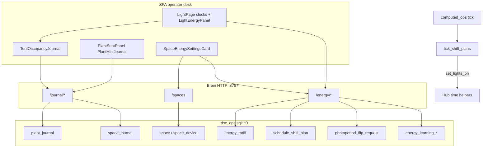

# Space energy, journals & approve-only schedule slides

**Intent:** Local estimates and plant→space journals without silent lighting changes. Space owns photoperiod equipment/window; plants carry identity + journal; schedule slides/flips need explicit operator confirm.

**Tip:** `a22050a` · spa-dist `index-DMMGdgxP.js` (+ `calibrate-BsD2unIH.js` · `tune-fleet-BLiBruAo.js`)  
**Status:** **SHIPPED in repo** (brain modules + SPA + pytest). Pi hotpatch + live walk still pending — see FOLLOWUPS 2026-09-01.

**Spec / plan / skill:**  
[`../superpowers/specs/2026-09-01-space-energy-journal-design.md`](../superpowers/specs/2026-09-01-space-energy-journal-design.md) ·  
[`../superpowers/plans/2026-09-01-space-energy-journal.md`](../superpowers/plans/2026-09-01-space-energy-journal.md) ·  
[`.cursor/skills/dsc-space-photoperiod-journal/SKILL.md`](../../.cursor/skills/dsc-space-photoperiod-journal/SKILL.md)

## Architecture



| Layer | Owns |
|-------|------|
| **Space** (`4x8` / `2x4`) | Devices + watts, space journal, energy estimate, shift/flip requests |
| **Plant** | Mini journal (follows `plant_id`), assignment |
| **Firmware / light_loop** | Live HH:MM schedule actuation, ramps, dark safety |

Kit seeds two spaces with default devices (e.g. SF1000 / fans watts). Model allows more spaces/devices; live grow stays two tents.

## Hard gates (verified in code)

1. `POST /energy/shift/plan` requires `confirm=true` — otherwise `400` (`confirm=true required — no silent schedule changes`).
2. Suggestions always carry `apply: false` (`/energy/suggestions`, Learning signals).
3. Flip resolve only marks approved/denied — **does not** write lights-on or want hours.
4. Conflict banners may `suggest_move`; never auto-move plants.
5. Plant card hosts **mini journal only** (no lights-on editors on `PlantMiniJournal`).
6. Estimates are W × hours × tariff bands — labeled local estimate, not a utility bill.

## HTTP surface

All routes in `brain/dsc_brain/api.py`. Persist in `DEFAULT_DB` (`dsc_ops.sqlite3`).

### Journals

| Method | Path | Notes |
|--------|------|-------|
| GET | `/journal/plant/{plant_id}?limit=` | Entries for that plant UUID |
| POST | `/journal/plant/{plant_id}` | Body: `{ note, occurred_at?, tags? }` → `source=operator` |
| GET | `/journal/space/{space_id}?limit=` | Space-native + **read-time** occupant plant rows (`provenance`) |
| POST | `/journal/space/{space_id}` | Space-native operator note |

Occupants: `space_occupants.occupant_plant_ids_for_space` from roster slots whose tent matches `4x8`/`2x4`.

### Spaces / devices

| Method | Path | Notes |
|--------|------|-------|
| GET/POST | `/spaces` | `ensure_kit_spaces()` + devices |
| PUT | `/spaces/{space_id}/devices/{device_id}` | Patch label / watts / duty_source / enabled |

### Energy

| Method | Path | Notes |
|--------|------|-------|
| GET | `/energy/estimate?space_id=&lights_on=&want_hours=` | Per-device + space day cost |
| GET | `/energy/suggestions?...` | Slide candidates; each `apply: false` + optional Learning hint |
| GET/PUT | `/energy/tariff` | TOU bands (AU-style placeholders until Settings Update) |
| GET/PATCH | `/energy/learning` | enable, prefer_growth_outliers, outlier_days, norm_days |
| POST | `/energy/shift/plan` | `{ space_id, from_on, to_on, want_hours, policy, confirm }` |
| POST | `/energy/shift/{plan_id}/cancel` | Cancels + system journal |
| GET | `/energy/shift/pending-flips` | Pending ratio-change requests |
| POST | `/energy/flip/request` | Banner-only request |
| POST | `/energy/flip/{req_id}/resolve` | `{ approve }` — status only |
| GET | `/energy/conflicts?space_id=` | Banners + pending flips; `auto_apply: false` |

**Policies:** `pause` (record only) · `flower_strict` (≤15 min/day) · `veg_style` (≤30 min/day). Active plans tick from `computed_ops` via `tick_shift_plans(set_lights_on=…)` → hub lights-on helpers. Ratio held (`want_hours` unchanged on slide).

### Example — approve a slide

```bash
# Preview only (never mutates schedule)
curl -s "http://dsc-brain.local:8787/energy/suggestions?space_id=4x8&lights_on=06:00&want_hours=12"

# Start gradual plan (fails without confirm)
curl -s -X POST http://dsc-brain.local:8787/energy/shift/plan \
  -H 'content-type: application/json' \
  -d '{"space_id":"4x8","from_on":"06:00","to_on":"22:00","want_hours":12,"policy":"flower_strict","confirm":true}'
```

## SPA surfaces

| UI | Route / host | Code |
|----|--------------|------|
| Energy panel + ramp confirm | `#/live/light` | `LightEnergyPanel.tsx` |
| Tent occupancy journal | Light page (per tent) | `TentOccupancyJournal.tsx` |
| Plant mini journal | Plant seat / roster detail | `PlantMiniJournal.tsx` on `PlantSeatPanel` |
| Spaces / tariff / Learning | Settings Brain | `SpaceEnergySettingsCard.tsx` |
| Client helpers | — | `fleetApi.ts` journal/energy section |

Do not confuse `#/tune/learning` (seat `learning_log` / `GET /learning`) with **energy** Learning (`/energy/learning`).

## Capacity honesty (same tip)

Retired **pot4** is treated as **planned OOS** with pot3 (`test_reduced_kit.py`) so Capacity offline does not treat pot4 as a live kit outage. Default inventory `in_service: False` + `pot4_retired_gate`. Live probes remain `KIT_PROBE_NUMBERS` = 1–2.

## Ownership tension (still true)

`PlantSeatPanel.applyTent` / clone tent automation can still write 2×4 photoperiod from plant/seat flows. Design wants space-owned windows; energy/shift APIs are the approve-only path — do not add silent schedule mutators on plant cards.

## Ops / hotpatch pitfalls

- Copy **new modules** onto Pi (`space_model`, `plant_journal`, `space_journal`, `energy_*`, `schedule_shift`, `photoperiod_conflict`, `space_occupants`) — avoid blind full `api.py` replace if the image lags.
- Restart brain after module copy; verify `/spaces` and `/energy/tariff` before SPA walk.
- Windows lab: PuTTY `pscp`/`plink` `-batch -hostkey` (not OpenSSH `scp`).
- Mark design **live-verified** only after Pi estimate + confirm-only ramp + flip banner evidence (FOLLOWUPS).

## Verify

```bash
pytest brain/tests/test_space_model.py \
  brain/tests/test_plant_journal.py \
  brain/tests/test_space_journal.py \
  brain/tests/test_journal_api.py \
  brain/tests/test_energy_model.py \
  brain/tests/test_energy_learning.py \
  brain/tests/test_schedule_shift.py \
  brain/tests/test_photoperiod_conflict.py \
  brain/tests/test_reduced_kit.py -q
```

## Related

- [`PHOTOPERIOD-TIMELINE.md`](PHOTOPERIOD-TIMELINE.md) — presentation clocks/timeline  
- [`WEBUI.md`](WEBUI.md) — SPA route index  
- Notion [Photoperiod & Lighting](https://app.notion.com/p/39c2b4cda3708194a606fa0b1e6098a2)
