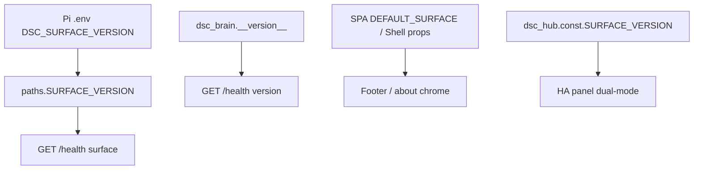

# Surface version — unified `7.4.0`

**In one line:** Brain package version, SPA chrome default, hub const, and Pi `DSC_SURFACE_VERSION` must move together; `/health` reports both `version` and `surface`.

**Tip (v7.4.0 signed off):** `32836fe` · tag `v7.4.0` · SPA `index-K2_ziUnM.js` · closure [`../qa/AUDIT-CLOSURE-7.4.md`](../qa/AUDIT-CLOSURE-7.4.md)

## Intent

Operators and tests treat “what am I running?” as one string. Split brain vs SPA surface strings caused false soak and hotpatch confusion in 7.1–7.3. 7.4.0 closed Phase 0 then bumped every default to the same value.

## Bump checklist (verified on tip)

| Location | Field / default |
|---|---|
| `brain/dsc_brain/__init__.py` | `__version__ = "7.4.0"` |
| `brain/dsc_brain/paths.py` | `SURFACE_VERSION` env default `"7.4.0"` |
| `brain/dsc_brain/fleet_state.py` | `surface` default `"7.4.0"` |
| `brain/dsc_brain/api.py` | FastAPI title comment + `/health` payload |
| `brain/tests/test_brain_pi.py` | asserts `__version__` / health `7.4.0` |
| `homeassistant/.../dsc_hub/const.py` | `SURFACE_VERSION = "7.4.0"` |
| `frontend/src/main.tsx` | `DEFAULT_SURFACE = "7.4.0"` |
| `frontend/src/App.tsx` | `Shell` / App defaults `"7.4.0"` |
| `services/dsc-hub/env.example` | `DSC_SURFACE_VERSION=7.4.0` |
| compose demo / seed JSON | surface strings aligned |
| spa-dist | rebuild → tip `index-K2_ziUnM.js` |
| Pi live | `.env` + hotpatch; `/health` both fields `7.4.0` |

## Ops after bump

1. `pytest brain/tests/test_brain_pi.py` (version assertions).
2. `npm run build:spa` → confirm `spa-dist/index.html` hashes.
3. Hotpatch via [`../ops/PI-HOTPATCH.md`](../ops/PI-HOTPATCH.md); set Pi `DSC_SURFACE_VERSION`.
4. Curl `/health` → `version` and `surface` match.
5. Update [`../qa/AUDIT-CLOSURE-*.md`](../qa/) + tag only after operator signoff.

## Constraints

- Do not bump SPA chrome alone and leave brain `__version__` stale (or the reverse).
- Firmware train remains **7.0.0.0** — surface ≠ ESP firmware.
- Never paste deploy passwords / API keys into closure docs.

## Related

- Phase 0 walk: [`../qa/PHASE0-WALK-2026-09.md`](../qa/PHASE0-WALK-2026-09.md)
- Plan Phase E: [`../qa/PLAN-7.4.md`](../qa/PLAN-7.4.md)
- Changelog: [`../../CHANGELOG.md`](../../CHANGELOG.md)
