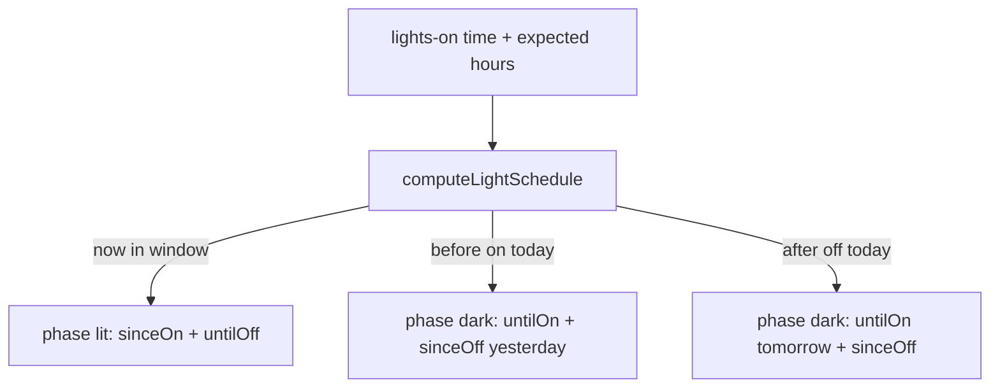

# Per-tent photoperiod clocks

**In one line:** Each tent shows On-for / Off-in (or Dark) countdowns from schedule entities; 2×4 Follow locks independent edits and mirrors 4×8 lights-on.

**Surfaces:** Light (`/live/light`) dual desks · Overview + Dash strips · Crop Scheduler · tent cockpits  
**Code:** `lightSchedule.ts` · `useTentLightSchedule.ts` · `TentLightClock.tsx` · `LightPage.tsx`

## Intent

Operators see remaining lit/dark time per tent without mental math. 4×8 and 2×4 are separate desks; Follow mode makes the relationship visible instead of silently editing the wrong schedule.

## Schedule math

| Tent | Lights-on entity | Expected hours | Live “lit” cue in clock |
|------|------------------|----------------|-------------------------|
| **main (4×8)** | `time.dsc_hub_lights_on_time` | `sensor.dsc_expected_light_hours` (fallback 12) | `binary_sensor.dsc_hub_4x8_window_open` |
| **clone (2×4)** | Follow → main time; Independent → `time.dsc_hub_clone_lights_on_time` | `sensor.dsc_clone_expected_light_hours` (fallback 18) | Window **or** `light.dsc_hub_sf1000_dimmer` on |

`tentPhotoperiodFollowsMain` is true when `select.dsc_hub_clone_photoperiod` ≠ `Independent` (default treat as Follow 4×8).

Missing / unknown lights-on → clock shows **No schedule** (valid=false). Hours ≤0 fall back to 12h for math only.

## Light page desks

| Desk | Honesty | Editable when |
|------|---------|---------------|
| **4×8** | Got tracks photoperiod window until a GPIO lamp exists | Always: lights-on, sunrise/sunset, min dark |
| **2×4** | SF1000 is the live lamp | Window source Independent → clone lights-on + hours; Follow → banner only (edit 4×8 or switch Independent) |

Follow banner copies main on-time and clone expected hours for display. Auto photoperiod / Manual hold / SF1000 toggles stay on the 2×4 card (confirm dialogs).

## Constraints

- Clocks are **presentation** of hub schedule entities — they do not drive PWM.
- Firmware still owns SNTP, ramps, and dark-period safety (see Notion Photoperiod & Lighting).
- 2×4 Got / deviation sensors remain SF1000-parented (REL-P0-3); do not document a fictional 2×4 GPIO lamp.
- Climate Follow (`select.dsc_hub_clone_mode` = Follow 4×8) is a **separate** lock on Want targets (`TentTargets`) — not the same entity as Window source.

## Related

- UI map: [`WEBUI.md`](WEBUI.md)
- Notion: [Photoperiod & Lighting](https://app.notion.com/p/39c2b4cda3708194a606fa0b1e6098a2)
