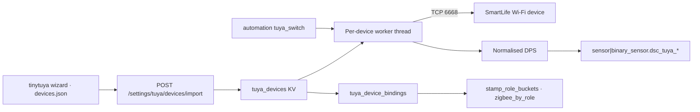

# Tuya local lane (Pass T1)

**In one line:** SmartLife Wi-Fi plugs and water testers join the kit over LAN (tinytuya TCP 6668) — same role/zone/task binding surface as Zigbee, without the Tuya cloud after keys are imported.

Operator guide: [`docs/ops/TUYA-LOCAL-SETUP.md`](../ops/TUYA-LOCAL-SETUP.md). Plan: [`docs/design/plan-tuya-local-2026-09-07.md`](../design/plan-tuya-local-2026-09-07.md). Evidence: `docs/FOLLOWUPS.md` § Tuya local lane Pass T1. Settings home: [`SETTINGS.md`](SETTINGS.md) (Devices › Zigbee › `#tuya`).

## Intent

Tuya **Zigbee** devices already ride zigbee2mqtt. Tuya **Wi-Fi** devices only spoke the cloud. Pass T1 adds a sibling local lane so operators can:

1. Export local keys once (`tinytuya wizard` → `devices.json`).
2. Import / probe / bind role·zone·task in Settings.
3. Drive plugs from automation (`tuya_switch`) and read tester datapoints as fleet entities.

The lane does **not** replace hub demand → Sonoff appliance failsafe. Use it for auxiliary `plug_*` / reservoir roles.

## Architecture

| Piece | Path | Role |
|---|---|---|
| Lane + workers | `brain/dsc_brain/tuya_local.py` | Import, probe, set, health, heartbeat |
| Archetypes | `brain/dsc_brain/tuya_catalog.py` | `smart_plug` · `smart_switch` · `water_tester` |
| Shared bindings | `brain/dsc_brain/device_bindings.py` | Role/zone normalize + cross-lane conflicts |
| Role merge | `zigbee_mqtt.register_role_provider` | Tuya rows appear in `zigbee_by_role` |
| Rule action | `automation_rules.py` → `tuya_switch` | ON while firing; restore on clear |
| SPA card | `frontend/src/components/settings/TuyaLocalCard.tsx` | Two-step import drawer + bind table |

**Worker:** one daemon thread per enabled device; persistent socket; heartbeat ~9 s; full `status()` ~30 s; backoff 5→60 s. Writes queue on that socket. Dependency: `tinytuya>=1.15` in `brain/requirements.txt` (optional import → health `available: false` / `TINYTUYA MISSING`).

## Public HTTP (`/settings/tuya/*`)

| Method | Route | Notes |
|---|---|---|
| `GET` | `/devices` | Devices + health; keys masked (`local_key_set` only) |
| `POST` | `/devices/import` | Wizard `devices.json` body; upsert; reports missing IPs |
| `PUT` | `/devices/{id}` | Name / IP / version / type / DPS map / scales / key rotate |
| `DELETE` | `/devices/{id}` | **409** if a rule targets it (rule names in detail) |
| `POST` | `/devices/{id}/probe` · `/probe` | One-shot `status()`; live worker returns cached DPS |
| `POST` | `/devices/{id}/set` | Manual toggle; **503** on write fail |
| `GET/PUT` | `/bindings` | Same shape as Zigbee bindings |
| `GET` | `/device-types` · `/health` | Catalog; lane health (also under `/health` as `tuya`) |

Lane-tagged actuatable list: `GET /settings/devices/actuatable` (`lane: "zigbee"|"tuya"`). Demo mode refuses writes. Role conflicts are row `status: conflict`, not HTTP 409.

## SPA placement

Settings › **Devices** › **Zigbee** sub-tab → card **Tuya / SmartLife (Wi-Fi, local)** (`#/settings/devices#tuya`).

Add drawer (What → Process → Expected):

1. **Get the keys** — paste `devices.json` → Import.
2. **Reach each device** — IP + protocol version → Probe → pick type → Save.

Health chips: `LIVE` / `STALE` / `OFFLINE` / `KEY CHANGED` (+ `TINYTUYA MISSING`). Write echo: `PENDING` / `SYNCED` / `DIFFERS` / `FAILED`.

## Entities & rules

Bound datapoints become:

- `sensor.dsc_tuya_<role>_<key>`
- `binary_sensor.dsc_tuya_<role>_<key>`

Automation action **`tuya_switch`** (`params.device_id`, `on_when_firing`) — separate from **`zigbee_switch`**. Not in `RELAY_TARGETS`. See [`AUTOMATION-RULES.md`](AUTOMATION-RULES.md).

## Constraints (source-verified)

- **Single local socket** — while the brain holds it, SmartLife app falls back to cloud (or fails if WAN blocked).
- **No hub cut-out** — device keeps last state if the brain dies; do not put heater / humidifier / dehumidifier / heat mat on this lane.
- **No UDP discovery in T1** — brain container is on the compose bridge network; every device needs a **DHCP reservation** (stable IP).
- **Cross-lane role uniqueness** — one role, one device, Zigbee or Tuya.
- Catalog suggests `plug_*` / `reservoir_*`; Show-all can widen — operator judgment still required.

## Not yet

From FOLLOWUPS / plan: **real-device Pi gate**; **T2** (hygrometer, power strip, energy history); **T3** (host-network discovery, socket-busy detection).

## Tests

`brain/tests/test_tuya_local.py` — import/mask, DPS scaling → entities, health transitions, probe hints, water_tester units, cross-lane conflict, delete-while-ruled **409**, `tuya_switch` fire/clear, route round-trip.
