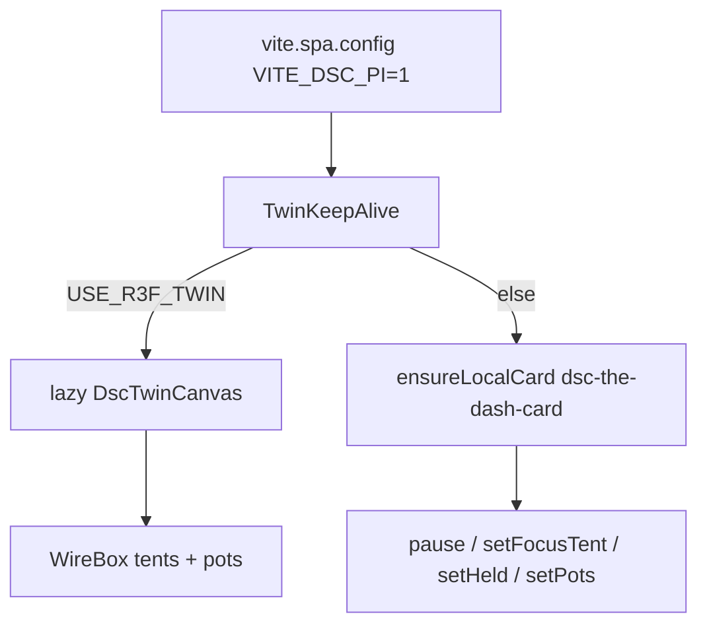

# Twin R3F on Pi SPA (7.3)

**In one line:** Pi SPA renders a React Three Fiber wireframe twin; the HA panel path keeps the legacy `dsc-the-dash-card` IIFE.

**Routes:** `/live/twin`, `/ops/dash` (visible canvas); tent cockpits keep pot data warm without showing the canvas.  
**Code:** `TwinKeepAlive.tsx` · `twin/DscTwinCanvas.tsx` · build flag `VITE_DSC_PI=1` in `vite.spa.config.ts`.

## Intent

Ship a Pi-native twin that does not depend on Lovelace resources or `/local/dsc-the-dash-card.js`, while preserving the Neon IIFE API contract for the HA custom panel until that path migrates.

## Engine selection

| Mode | When | Visible host | Data |
|------|------|--------------|------|
| **R3F** | `import.meta.env.VITE_DSC_PI === "1"` | Canvas mounts only when `pathname` is `/live/twin` or `/ops/dash` | Same `VesselLive[]` builder as IIFE |
| **IIFE** | HA panel / non-Pi build | Card element in keepalive host | Neon API soak — [`NEON-API-SOAK-7.3.md`](../qa/NEON-API-SOAK-7.3.md) |

`data-engine` on the keepalive root is `r3f` or `iife` for ops debugging.

## Vessel semantics (verified)

From entity bus + seat model:

- Pot color: cyan default; amber when `need === "water"`; grey when untrusted / out of service.
- Dashed wireframe when `!inService`, `untrusted`, or hub link held.
- Tent filter: path `/live/main|/live/4x8` → main only; `/live/clone|/live/2x4` → clone only; twin/dash → both.
- `held`: hub link binary off (or uptime missing) freezes `useFrame` rotation.

## Visibility / click safety

- Active routes only: twin + dash. Elsewhere the host is `visibility:hidden`, `pointer-events:none`, `inert`, fixed off-hit — cages the old SPACE/DESIGN P0 click-steal.
- R3F: `visible={twinVisible}` returns `null` when inactive (no rAF cost).
- IIFE: `pause(!twinDataActive || document.hidden)` on tent routes still updates pots without showing HUD (`setUiChrome({ hideHud })`).

## Constraints

- Wireframe scene is **not** cinematic Dash FX parity — intentional Pi MVP.
- Bundle splits THREE into `twin-three-*.js` (see `spa-dist`); first twin open may briefly show “Loading twin…”.
- Do not paste AP PSKs or Noise keys into twin docs or Wiki.

## Pitfalls

1. Building SPA **without** `VITE_DSC_PI=1` on the Pi image falls back to IIFE and then fails unless `dsc-the-dash-card.js` is present.
2. Expecting Twin on `/live/4x8` as a hero canvas — 7.3 keeps the canvas demoted; cockpits own the fold.
3. OOS pots look “broken” (dashed grey) by design — check Settings inventory `in_service`.

## Related

- Soak matrix: [`docs/qa/NEON-API-SOAK-7.3.md`](../qa/NEON-API-SOAK-7.3.md)
- Parity: [`docs/qa/LOVELACE-PARITY-7.3.md`](../qa/LOVELACE-PARITY-7.3.md)
- UI map: [`WEBUI.md`](WEBUI.md)
