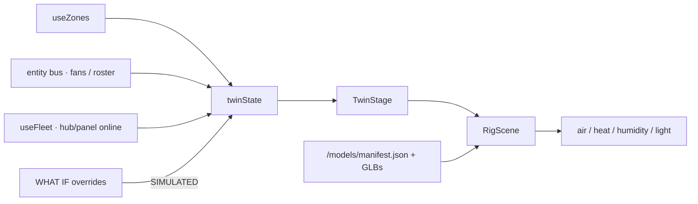

# Composed 3D twin

**In one line:** `#/twin` is a **desk that projects Zone state** into a Three.js room — never a control source, never written back to devices.

Spike (cost measure only): `#/twin-spike`. Plan: [`docs/design/plan-v2-dashboard-2026-09-06.md`](../design/plan-v2-dashboard-2026-09-06.md) § 3D twin. Models: `docs/design/models/BRIEFS*.md`.

## Routes

| Path | Role |
|---|---|
| `#/twin` | Desk (`DESKS` id `twin`) — composed live scene |
| `#/twin-spike` | Not a desk — GLB cost / fps bench (`?model=<slug>`) |
| `#/live/twin` | Legacy redirect → `#/twin` |

Phone / reduced-motion: honest still by default. Override with `?force3d=1` (forced reduced-motion still runs calm — no spin / glide).

## Architecture



| Piece | Path | Job |
|---|---|---|
| Draw object | `frontend/src/lib/twinState.ts` | Pure view from zones + bus + fleet |
| Hook | `hooks/useTwinState.ts` | Builds state; applies overrides last |
| Page | `pages/TwinPage.tsx` | Layers, camera presets, WHAT IF, roster, cost |
| Stage | `twin/TwinStage.tsx` | Canvas + FrameLoop + CameraRig |
| Scene | `twin/RigScene.tsx` | Room → tents by anchors → devices → plants → airflow |
| Anchors | `twin/anchors.ts` | World-space registry (microtask batched) |
| Wire palette | `twin/wire.ts` | Token restyle — scene never hard-codes colours |
| Manifest | `twin/manifest.ts` | Loads `/models/manifest.json` |

Placement comes from **manifest slugs + anchors**, not fleet topology. Hover / click open the same `EntityInspector` as cards.

### Honesty

- Twin is a **view of Zone state**, never a data source and never a third commander.
- WHAT IF panel sets `simulated: true` on touched fans/lamps/appliances. UI tag: `SIMULATED · n OVERRIDE(S) · NOT WRITTEN`.
- Unbound / grey when there is no reading — no invented climate.

## Models

```text
docs/design/models/src/pack/*.js
        │  node scripts/build-twin-models.mjs   (from frontend/)
        ▼
frontend/public/models/<slug>[--variant].glb
frontend/public/models/manifest.json   (version: 2)
```

Served as `/models/…`. ~134 GLBs on tip `6ddd7c8`. Anchor empties (e.g. `lamp_main`, `probe_1`, `duct_in`) must exist in the GLB JSON for placement.

## Production bundle rule

Static imports of twin pages put React into the `twin-three` chunk and created a `twin-three` ↔ `tune-fleet` cycle. Production boot failed with `createContext of undefined`; **Vite dev never chunks**, so browser verifies on `:5173` still passed.

**Fix (must keep):**

1. `App.tsx` — `lazy()` for `TwinPage` / `TwinSpikePage` (comment documents the 2026-09-07 failure).
2. `vite.config.ts` `manualChunks` — `vendor-react` for `node_modules/react*` + `scheduler`; `twin-three` for `/twin/` + `three`.

**Developer rule:** run `npm run build` then **`vite preview`** (or hotpatch the Pi) before claiming a twin/SPA change is green. Details: [`../ops/SPA-PROD-BUNDLE.md`](../ops/SPA-PROD-BUNDLE.md).
