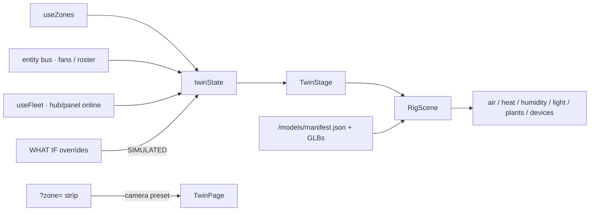

# Composed 3D twin

**In one line:** `#/twin` is a **desk that projects Zone state** into a Three.js room — never a control source, never written back to devices.

Spike (cost measure only): `#/twin-spike`. Plan: [`docs/design/plan-v2-dashboard-2026-09-06.md`](../design/plan-v2-dashboard-2026-09-06.md) § 3D twin. Models: `docs/design/models/BRIEFS*.md`. Pack 3 FOLLOWUPS: [`../FOLLOWUPS.md`](../FOLLOWUPS.md) (composed-twin section).

## Routes

| Path | Role |
|---|---|
| `#/twin` | Desk (`DESKS` id `twin`, accent `kit`, `zone: true`) — composed live scene |
| `#/twin-spike` | Not a desk — GLB cost / fps bench (`?model=<slug>`) |
| `#/live/twin` | Legacy redirect → `#/twin` (`LEGACY_REDIRECTS`) |

**Zone strip:** Twin owns `?zone=` like Climate / Root / Light. Flipping the strip re-aims the camera preset (`room` / `main` / `clone`) in `TwinPage` — a manual CAMERA segment click still wins after. Phone / reduced-motion: honest still by default; override with `?force3d=1` (forced reduced-motion stays calm — no spin / glide).

## Architecture



| Piece | Path | Job |
|---|---|---|
| Draw object | `frontend/src/lib/twinState.ts` | Pure view from zones + bus + fleet |
| Hook | `hooks/useTwinState.ts` | Builds state; applies overrides last |
| Page | `pages/TwinPage.tsx` | Layers, camera presets (zone-synced), WHAT IF, roster, cost |
| Stage | `twin/TwinStage.tsx` | Canvas + FrameLoop + CameraRig |
| Scene | `twin/RigScene.tsx` | Room → tents by anchors → devices → plants → airflow |
| Plants | `twin/PlantInstances.tsx` | Pack 3 vessel + plant-stage pair (or pack-1 fallback) |
| Anchors | `twin/anchors.ts` | World-space registry (microtask batched) |
| Wire palette | `twin/wire.ts` | Token restyle — scene never hard-codes colours |
| Manifest | `twin/manifest.ts` | Loads `/models/manifest.json` |

Placement comes from **manifest slugs + anchors**, not fleet topology. Hover / click open the same `EntityInspector` as cards.

### Maker PPFD fields (not wired on Twin yet)

`frontend/src/lib/ppfdField.ts` can dense-resample CannaLib layers and `superpose` fixture footprints for canopy grids (unit-tested). Tip `7017bfb` mounts that model on the **Light** desk 3D tab only. Twin must not draw maker PPFD as live Got until this library is explicitly integrated with estimated/gap labels — see [`PPFD-FIELD.md`](PPFD-FIELD.md).

### Honesty

- Twin is a **view of Zone state**, never a data source and never a third commander.
- WHAT IF panel sets `simulated: true` on touched fans/lamps/appliances. UI tag: `SIMULATED · n OVERRIDE(S) · NOT WRITTEN`.
- Unbound / grey when there is no reading — no invented climate. Fixed tent cameras stay grey until bound (`cam_status_led` dim).
- Do not project maker PPFD fields as measured canopy PAR.

## Pack 3 scene (tip `ae1eafc`)

Verified against `PlantInstances.tsx`, `RigScene.tsx`, and `frontend/scripts/build-twin-models.mjs`:

| Concern | Behavior |
|---|---|
| Plant / vessel split | Each roster plant: `vessel--<catalogue id>` + `plant-stage--<stageSlug>` snapped to the vessel's `plant_base`; canopy scale **0.85–1.15** by stage progression. Missing vessel → pack-1 baked `pot-fabric-3gal-plant-*` fallback. |
| Manifest kinds | Builder emits `kind` `plant` \| `vessel` \| `tent` \| `room` \| `sensor` \| `device`; plant-stage / plant-lod / plant-cutting get `origin: "soil"`. |
| 2×4 tent | Built slug replaces the old hand-authored row; `RigScene` snaps lamp, mat, humidifier, mister, dome tray, intake fan, and passive vent to rebuilt anchors. |
| Room kit props | Pi (`brain-rpi`), control panel (`panel-cyd-control`), canopy pucks, and a fixed `camera-ip-fixed` per tent. |
| Count | **134** GLBs in `frontend/public/models/` (`manifest.json` version **2**). |

Open residuals (do not invent as shipped): calibrated WHAT IF response model; phone PNG still; plant label collision; room shell placeholder until measured — see FOLLOWUPS.

## Models

```text
docs/design/models/src/pack/*.js
        │  node scripts/build-twin-models.mjs   (from frontend/)
        ▼
frontend/public/models/<slug>[--variant].glb
frontend/public/models/manifest.json   (version: 2)
```

Served as `/models/…`. Anchor empties (e.g. `lamp_main`, `probe_1`, `plant_base`, `duct_in`) must exist in the GLB JSON for placement. A built slug always wins over a surviving hand-authored row of the same name.

## Production bundle rule

Static imports of twin pages put React into the `twin-three` chunk and created a `twin-three` ↔ `tune-fleet` cycle. Production boot failed with `createContext of undefined`; **Vite dev never chunks**, so browser verifies on `:5173` still passed.

**Fix (must keep):**

1. `App.tsx` — `lazy()` for `TwinPage` / `TwinSpikePage` (comment documents the 2026-09-07 failure).
2. `vite.config.ts` `manualChunks` — `vendor-react` for `node_modules/react*` + `scheduler`; `twin-three` for `/twin/` + `three`.

**Developer rule:** run `npm run build` then **`vite preview`** (or hotpatch the Pi) before claiming a twin/SPA change is green. Details: [`../ops/SPA-PROD-BUNDLE.md`](../ops/SPA-PROD-BUNDLE.md).
