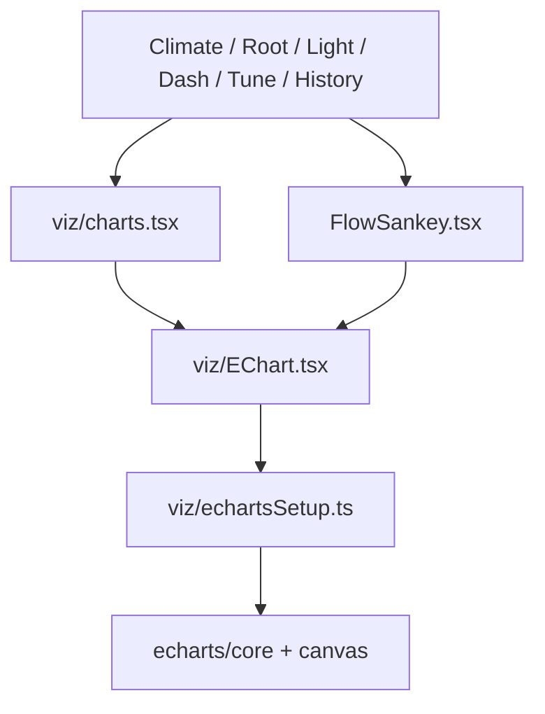
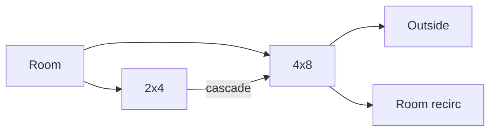

# SPA viz — Apache ECharts (tip `8f4c3e1`)

**In one line:** Live gauges, history lines, sparklines, and Climate FlowSankey render through a tree-shaken ECharts canvas wrapper — same honesty contracts as before (held/stale, no invented CFM).

## Intent

Replace hand-rolled SVG chart/gauge drawing with **Apache ECharts 6** so resize, tooltips, and Sankey layout are library-owned, while DSC keeps:

- Want→Got zone tones (`zoneTone`)
- Held / stale presentation
- CFM provenance labels (Allocated / Nameplate)
- Empty states that do **not** invent zeros as live data

## Architecture



| File | Job |
|------|-----|
| `frontend/src/viz/echartsSetup.ts` | Tree-shake register: `GaugeChart`, `LineChart`, `SankeyChart` + grid/tooltip/legend/visualMap/markLine/markArea + `CanvasRenderer` |
| `frontend/src/viz/EChart.tsx` | `echarts.init` · `setOption({ notMerge, lazyUpdate })` · `ResizeObserver` · dispose on unmount · `role="img"` |
| `frontend/src/viz/charts.tsx` | Product widgets: `MultiLineChart`, `ArcGauge`, `Sparkline`, `GotWantBars`, `stepHoldSeries`, `hexColor` |
| `frontend/src/components/FlowSankey.tsx` | Experimental air/heat/humidity Sankey over `CfmReading` + heat/humidity proxy sensors |
| `frontend/src/styles/dsc.css` | `.dsc-echart` / `.dsc-gauge-chart` sizing |

**Dependency:** `echarts` `^6.1.0` in `frontend/package.json`.

**SPA tip bundle (spa-dist):** `index-DLMlcKND.js` · `tune-fleet-V_5VfxFS.js` · `calibrate-BvTMD8cv.js`.

## Public widgets

### `EChart`

Thin host. Callers build an `EChartsCoreOption`; the wrapper owns lifecycle. Always canvas renderer.

### `MultiLineChart`

Time-series for Climate triad, History drawer, BandChartHost, EntityInspector, TuneFleet, PlantSeatPanel.

| Prop / behavior | Constraint |
|-----------------|------------|
| Empty series | Center graphic text (`emptyLabel`, default `thin recorder`) — no fake line |
| Dual axis | `NamedSeries.axis` `"left"` \| `"right"` |
| Bands | `visualMap` pieces from `band` → neon / amber / bad stroke |
| Targets | `markArea` / `markLine` for Want bands or single Want lines |
| Stale | `lastSyncAt` / last point age > **5 min** (`MAX_HOLD_TO_NOW_MS`) → `is-stale`, muted stroke, animation off |
| Ghost | dashed, no fill (prior-cycle compare) |
| CSS tokens | Pass `var(--dsc-*)`; `hexColor` maps to canvas hex (SVG/canvas cannot use CSS vars) |

### `ArcGauge`

Semi-gauge (`startAngle` 180 → `endAngle` 0) for Climate / Root / Light / Dash.

| State | Presentation |
|-------|----------------|
| No finite value | Detail `—`, title `no data`, grey track |
| Stale held | Title `HELD`, amber chrome, `aria-valuetext` includes `held` |
| In-band | Green progress + band highlight on axis |
| Want pointer | Extra gauge datum when `target` finite |
| Extrema | Optional min/max pointers from history |
| Click | Optional `dsc-gauge-hit` → History drawer (caller supplies `onClick`) |

`segments` remains on the type for call-site compatibility; **ECharts path does not draw rainbow bandGuide segments**.

Tone still comes from `zoneTone` + `defaultBandMargin` (same as GotWant bars).

### `Sparkline`

Compact line, no axes — Dash / Root chips.

### `GotWantBars`

**Not** ECharts — CSS/DOM bars with `useEased` animation. Same Want/Got honesty as gauges.

### `FlowSankey` (experimental)

Mounted under Climate **Air path** card **after** `AirPathMap` (tip `8f4c3e1`).

| Mode | Units | Sources |
|------|-------|---------|
| Air | CFM | `resolveCfm` allocated→nameplate readings (`cfmProvenance.ts`) |
| Heat | W | `sensor.dsc_heat_tent_w`, `sensor.dsc_heatmat_w` (0 if missing) |
| Humidity | g/h | `sensor.dsc_humidify_gh`, `sensor.dsc_dehumidify_gh` (0 if missing) |

Honesty behaviors verified in source:

- Chip row always shows **EXPERIMENTAL** + “Estimated flow proxies — informational only, not control inputs.”
- Links with non-finite or **≤ 0** value are **omitted**; empty → graphic “No measured flow…”
- Tooltip includes CFM kind label (Allocated / Nameplate / Mass-balance)
- Climate tip passes `massBalanceOk={null}` — **Mass balance OK/Imbalance chip is not shown** (no invented balance)



## Where widgets mount

| Surface | Widgets |
|---------|---------|
| `#/live/climate` | `ArcGauge` · `MultiLineChart` · `AirPathMap` · `FlowSankey` · `GotWantBars` |
| `#/live/root` | `ArcGauge` · `Sparkline` |
| `#/live/light` | `ArcGauge` |
| Overview / Dash sections | `ArcGauge` · `Sparkline` · `AirPathMap` |
| History drawer / inspector / BandChart / Tune | `MultiLineChart` |

Twin / R3F remains a **separate** stack (`TwinKeepAlive`, `VITE_DSC_PI`) — not ECharts.

## Developer usage

```tsx
import { ArcGauge, MultiLineChart } from "../viz/charts";
import { EChart } from "../viz/EChart"; // only for a new chart type

<ArcGauge
  label="4×8 T"
  value={held.value}
  min={15}
  max={35}
  unit="°C"
  target={wantTemp}
  band={{ min: wantTemp - 2, max: wantTemp + 2 }}
  stale={held.stale}
  onClick={() => openHistory("sensor.dsc_hub_tent_temperature")}
/>

<MultiLineChart
  unit="°C"
  lastSyncAt={fleetSyncMs}
  series={[{ id: "t", label: "4×8 T", series: points, color: "var(--dsc-blue)", band: { min: lo, max: hi } }]}
  targets={[{ min: lo, max: hi, color: "var(--dsc-blue-dim)" }]}
/>
```

Adding a **new** chart family:

1. Register the ECharts chart/component in `echartsSetup.ts` (keep tree-shake tight).
2. Build options in a product component; render via `EChart`.
3. Map any `var(--dsc-*)` through `hexColor`.
4. Prefer empty/held honesty over inventing zeros.

## Pitfalls

| Pitfall | Reality |
|---------|---------|
| CSS variables in ECharts options | Must go through `hexColor` / explicit hex |
| Dual glow / SVG filters from old ArcGauge | Canvas gauge + CSS label; do not reintroduce SVG `feGaussianBlur` theater |
| Sankey as control input | Never — EXPERIMENTAL proxy only; ladder/brain do not read it |
| `massBalanceOk` | Climate currently passes `null`; do not invent OK/Imbalance |
| `dsc-viz-honesty.mdc` “one CFM surface” | Tip remounts Sankey **beside** Air path; rule still prefers Air path as SoT CFM — re-verify on Pi before graduating EXPERIMENTAL |
| Bundle cache | After `npm run build:spa`, sync spa-dist hashes to Pi; stale JS keeps old SVG gauges |

## Related

- Honesty rule: [`.cursor/rules/dsc-viz-honesty.mdc`](../../.cursor/rules/dsc-viz-honesty.mdc)
- CFM provenance: `frontend/src/lib/cfmProvenance.ts`
- Zone tone: `frontend/src/lib/zoneTone.ts`
- UI index: [WEBUI.md](WEBUI.md)
- Follow-ups: Climate Sankey soak / honesty gate in [`../FOLLOWUPS.md`](../FOLLOWUPS.md)
