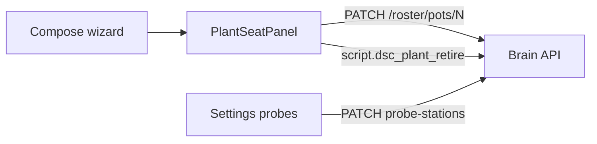

# Local webserver UI spec

**In one line:** Thin client of the brain API — presentation, advanced control, updates.

Notion: [Local webserver UI](https://app.notion.com/p/3b52b4cda37081c19048e794d4bdf819)

## Surfaces (7.3 / 7.4 WiP)

Default landing **`#/live/overview`**. Tip `174e14e` SPA bundle **`index-DL1EcjhX`** (+ `calibrate-D1D5CnxU` · `tune-fleet-IPnSFs3d`). Twin / Mission / Dash remain secondary tabs.

| Area | Routes (hash) | Job |
|------|---------------|-----|
| Live | `/live/overview`, tent cockpits, root, twin | Fleet vitals, Want/Got, seat drawers |
| Grow | `/grow/compose`, roster | Plant Wizard create · roster / seat edit |
| Tune / Fleet | calibrate, light clocks, demand | Soft/lab cal, photoperiod, modifiers |
| Settings | `/settings` | Inventory, probe stations, network, Zigbee, OTA |

> **HA wireframe (N-086):** Home Assistant `/dsc-hub` React panel remains optional lab dual-mode. Lovelace Pro YAML is archived (`docs/archive/lovelace-7.3/`).

## Plant + probe workflows

| Job | Where | Doc |
|-----|-------|-----|
| Create plant | Grow → Compose (`PlantWizard`) | [PLANT-WIZARD.md](PLANT-WIZARD.md) |
| Edit / delete plant; tent place | Shared `PlantSeatPanel` drawers | [PLANT-SEAT.md](PLANT-SEAT.md) |
| Probe home / demote role | Settings → Probe stations | [PLANT-SEAT.md](PLANT-SEAT.md) |
| Soft / lab wet cal | Fleet → Calibrate | [../ops/LAB-WET-CAL.md](../ops/LAB-WET-CAL.md) |

## API dependency

Reads/writes go through brain HTTP (`brain/dsc_brain/api.py`), including:

- `GET /health`, `/fleet`, `/fleet/computed`, `/ws/fleet`
- Catalogs, `/decision/*`, `/control/service`
- `PATCH /roster/pots/{n}` — plant identity after create
- `GET/PATCH /settings/probe-stations/{seat_id}` — idle home + `clear_role`
- `POST /admin/reload-catalogs`

## Non-goals

- Three.js cinematic Dash as primary landing
- Embedding fat strain dumps in the browser
- Requiring Home Assistant for product ops
- Inventing catalog height / chem / PPFD / NPK when packs lack them

## Host

Pi 4 4GB+ LAN (`http://dsc-brain.local:8787` or IP). Demo Compose may bind `:8788` when enabled — fail-closed on private hosts / live API keys.
