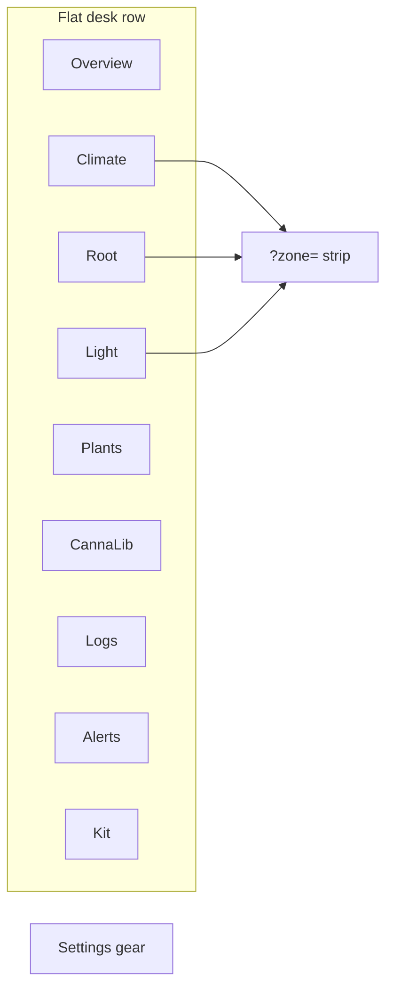

# Operator SPA — desks (Dashboard v2)

**In one line:** Thin client of the brain API on `:8787` — one flat row of **desks** (what you look at); **zone** is `?zone=` context, never a peer tab.

Notion: [Local webserver UI](https://app.notion.com/p/3b52b4cda37081c19048e794d4bdf819)  
Design plan: [`docs/design/plan-v2-dashboard-2026-09-06.md`](../design/plan-v2-dashboard-2026-09-06.md) (Passes A–I spike landed on master via PR #199).

## Host

Pi LAN: `http://dsc-brain.local:8787` (or Pi IP). Dev: `npm run dev` in `frontend/` proxies non-Vite paths to the live brain (`DSC_BRAIN_ORIGIN` overrides).

## Desks



| Desk | Path | Zone strip | Sub-surfaces |
|---|---|---|---|
| Overview | `#/overview` | — | — |
| Climate | `#/climate` | yes | Room · Tent (`#/climate/tent`) |
| Root | `#/root` | yes | — |
| Light | `#/light` | yes | — |
| Plants | `#/plants/roster` | — | Roster · Compose |
| CannaLib | `#/cannalib` | — | — |
| Logs | `#/logs` | — | Full journal browser |
| Alerts | `#/alerts` | — | Active / history / automation rules table |
| Kit | `#/kit` | — | Inventory · Learning · Calibrate |
| Settings | `#/settings/…` | — | Zones · Hub · Brain · Device · API · Network · Server · System · General |

Canonical table: `frontend/src/routes.ts` (`DESKS`, `SETTINGS_TABS`). Path helpers: `frontend/src/lib/paths.ts` — **do not hardcode desk strings** at call sites.

### Legacy redirects

Pre-v2 paths (`/live/*`, `/grow/*`, `/fleet*`, `/ops/*`, `/tune/analytics`, …) redirect via `LEGACY_REDIRECTS`. Examples:

| Old | New |
|---|---|
| `#/live/overview` | `#/overview` |
| `#/live/climate` | `#/climate` |
| `#/live/4x8` | `#/climate/tent?zone=main` |
| `#/live/2x4` | `#/climate/tent?zone=clone` |
| `#/live/mission` | `#/alerts` |
| `#/grow/logs` | `#/logs` |
| `#/fleet` | `#/kit` |

Mobile (&lt; 640 px): bottom bar `Overview · Climate · Plants · Alerts · More`.

## Operator chrome rules

- **Probe / Plant** language only (not Seat / POT) — identifier rename shipped with automation v2.
- Grey means no data; derived metrics carry provenance; invented slots stay `—` with a device hint.
- Split busy flags per async action; Abort stays enabled while its request is in flight.
- Entity-bus round-trip must not gate wizard Next — local drafts until flush.

## Twin spike (not a desk)

`#/twin-spike` measures the first authored tent GLB (`grow-tent-120x60x210`) before desks bind to it. Phone half: `?force3d=1`. Rules: lazy `twin-three` chunk, in-view mount, 30 fps cap, pause when hidden; twin is a **view of zone state**, never a data source. Models: `frontend/public/models/` + `docs/design/models/BRIEFS.md`.

## Icon set v5

Operator set under `docs/design/icons/dsc-hub-icons-v5/` → generated into `frontend/src/iconSet.ts` by `scripts/gen-dsc-hub-icons.py`. `--on` = tone class; `--oos` = dashed strokes (no second file).

## History API (charts)

```http
GET /history?entity_id=sensor.dsc_…&hours=24&max_points=720
```

- Empty `entity_id` → honest empty `{ points: [], tracked: false }` (not 422).
- Unmapped entity → `tracked: false` + empty points (debug log only).
- Points use **whole-window bucketing** (`list_history_bucketed`) so a 7 d chart still spans 7 d inside `max_points`.
- Brain-owned computed entities (`sensor.dsc_*` / `binary_sensor.dsc_*`) are recorded on a 60 s loop (`computed_history`) so charts do not depend on a browser polling.

## Related brain docs

| Doc | Topic |
|---|---|
| [ZONE-MODEL.md](ZONE-MODEL.md) | `GET/PATCH /zones`, role flip honesty |
| [AUTOMATION-RULES.md](AUTOMATION-RULES.md) | Rule engine v2 + allow-lists |
| [../ops/RELAY-HONESTY.md](../ops/RELAY-HONESTY.md) | Sonoff observed vs commanded vs demand |
| [DECISION_LOOP.md](DECISION_LOOP.md) | Want → Got → Need → propose |
| [../DSC-BRAIN.md](../DSC-BRAIN.md) | Layers + hub-demand shadow mode |

## Non-goals

- Browser owning catalogs or Want math
- Fake CO₂ / measured PPFD / cure-vessel numbers without hardware
- Requiring Home Assistant (lab only; product path is Pi brain)
