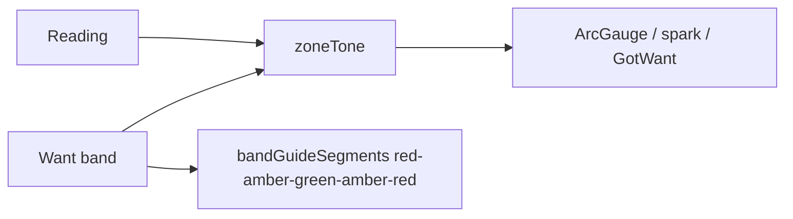

# Local webserver UI spec

**In one line:** Thin client of the brain API — presentation, advanced control, updates.

Notion: [Local webserver UI](https://app.notion.com/p/3b52b4cda37081c19048e794d4bdf819)

**Ship (tip `ab49dd8` / 7.1.2):** Bundle **`index-DwSYxFmR`**; default landing **Operational Overview**; HA Dash theme on `:root` + `.dsc-root`; unified gauge semantics; Compose tent + sprout-derived stage. Firmware train **7.0.0.0**. Acceptance: [`docs/qa/LIVE-ACCEPTANCE-7.1.md`](../qa/LIVE-ACCEPTANCE-7.1.md) · ingest: [`FLEET-INGEST.md`](FLEET-INGEST.md) · design: [`DESIGN-AUDIT-7.1.md`](../qa/DESIGN-AUDIT-7.1.md).

## Surfaces (7.1 SPA)

| Route | Job |
|---|---|
| `/live/overview` | Default ops landing (vitals / ladder summary / gauges) |
| `/live/mission` | Mission retained |
| `/ops/home` | Dash Home (band charts, grow log) |
| `/live/climate` · `/live/root` · `/live/light` | Zone pages sharing gauge tone |
| `/fleet/calibrate` | Fan CFM + light PAR/LUX wizards → `/settings/calibration/{id}` |
| `/settings` | Inventory cards, assignment, Zigbee, integrations |
| `/plant` / compose | Build a Plant + roster — tent + sprout stage ([`COMPOSE-STAGE.md`](COMPOSE-STAGE.md)) |

Hash router under Pi `:8787` (and HA panel dual-mode). Hard-refresh after deploy.

## Gauge color semantics

One severity scale everywhere (`gaugeTheme.ts` ↔ `zoneTone.ts`). Margin = **12% of band span** (min 0.05, or **1 °C** for temperature).

| Color | Meaning |
|---|---|
| green (`#66bb6a` / `--dsc-neon`) | in band (± one grace margin) |
| amber (`#ffb74d`) | drifting (out of band up to 3 margins) **or** held/stale |
| red (`#ef5350`) | out of band beyond 3 margins (alert) |
| grey (`#8b95a8`) | no data / empty seat |
| teal | live reading with **no** band configured (progress counters) |

**Empty gauges:** grey track only, `—` / `no data`, no ticks, no orphaned slider handle (`stroke-linecap="butt"`). Temp appliance deadband guides use target ±2 °C. Moisture guides default dry/wet 30–75. Got/Want light hours are teal progress (not a false-red band).

Code: `viz/gaugeTheme.ts`, `lib/zoneTone.ts`, `viz/charts.tsx`. Screens: [`screens-7.1.2/ux-pass2-*.png`](../qa/screens-7.1.2/).

## Theme scoping pitfall (7.1.2)

Tokens must be declared on `:root, :host, .dsc-root`. The HA panel mounts `.dsc-root` inside shadow DOM; the standalone SPA must wrap the tree in `.dsc-root` (`main.tsx`) or `var(--dsc-*)` resolves to nothing (unstyled serif/black-on-white). After deploy, `deploy-brain-remote.sh` `docker cp`s SPA static so BuildKit cache cannot serve a stale bundle hash.

## API dependency

Reads/writes go through brain HTTP API (`brain/dsc_brain/api.py`):

- `GET /health` · `GET /fleet` · `GET /fleet/computed` · `WS /ws/fleet`
- `POST /control/service` · `POST /control/demand`
- `GET /history` · `GET /grow-log` · `GET /roster`
- `GET|PATCH /settings*` · `GET|POST /settings/calibration/{device_id}`
- Catalog / Want / decision endpoints as before

## Non-goals

- Three.js cinematic Dash parity as product SoT
- Embedding fat strain dumps in the browser
- Requiring Home Assistant on Pi island
- Reintroducing ETH01 bridge UI as the Sonoff path
- Inventing height/chem/PPFD/NPK in the UI

## Host

Pi 4 4GB+ (`http://10.42.0.1:8787` or eth0 / `dsc-brain.local`). Ops: [`docs/ops/DSC-HUB-DOCKER.md`](../ops/DSC-HUB-DOCKER.md). Sonoff flash: [`docs/ops/SONOFF-FLASH.md`](../ops/SONOFF-FLASH.md).
