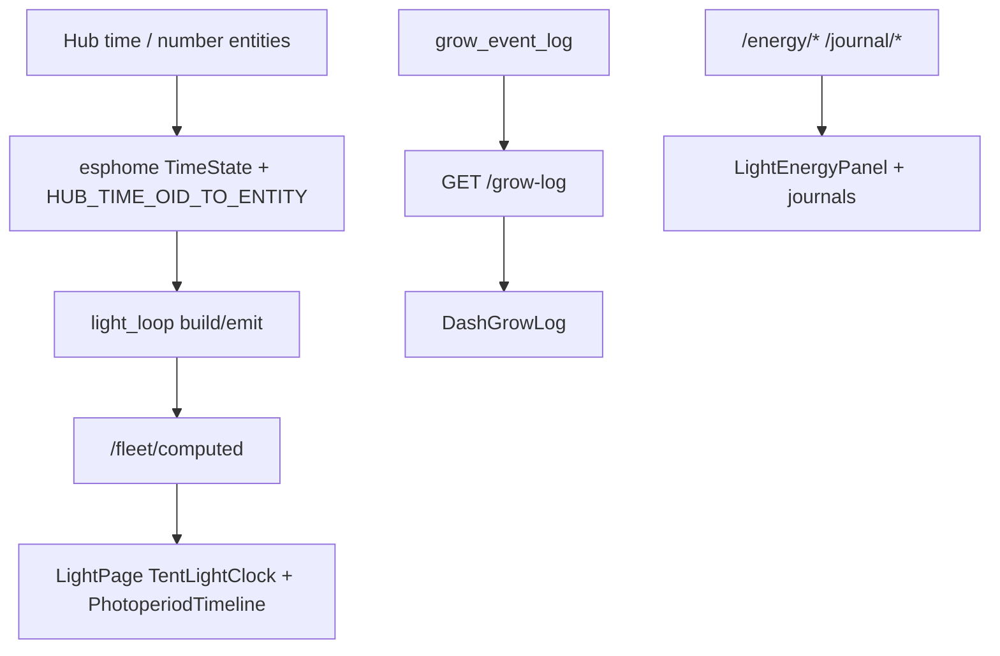

# Local webserver UI spec

**In one line:** Thin client of the brain API — presentation, advanced control, updates. Live SPA on Pi `:8787`.

Notion: [Local webserver UI](https://app.notion.com/p/3b52b4cda37081c19048e794d4bdf819)

**Tip:** `a22050a` — space/energy/journals **SHIPPED in repo** · spa-dist `index-DMMGdgxP.js` (+ `calibrate-BsD2unIH.js` · `tune-fleet-BLiBruAo.js` · `twin-three-BjdbWAdH.js`)  
Pi hotpatch of new brain modules + live walk still pending (FOLLOWUPS). Prior surface body: v7.4.0 `32836fe` / `index-K2_ziUnM.js`.

## Surfaces (product SPA)

| Route | Job |
|---|---|
| `#/ops/home` | Ops overview (vitals, honesty, grow-log consumer) |
| `#/live/light` | Per-tent clocks + PhotoperiodTimeline + LightEnergyPanel + TentOccupancyJournal + SF / Twin |
| `#/live/climate` | Climate — airflow + Zigbee Wet/Dry · Problem/Clear |
| `#/live/twin` | Twin 3D |
| `#/grow/roster` | Plant roster — detach / assign / slot Delete; plant seat hosts PlantMiniJournal |
| `#/grow/compose` | Plant Wizard — stock or seated create |
| `#/fleet/calibrate` | SoftCal / soil cal |
| `#/tune/learning` | Seat `learning_log` UI — **not** energy Learning |
| `#/settings` | Inventory + Zigbee + Brain SpaceEnergySettingsCard (spaces/tariff/Learning) |

> **HA wireframe:** optional lab panel only. Product SoT is the Pi SPA + brain HTTP ([`docs/HA-SCAFFOLD.md`](../HA-SCAFFOLD.md)).

## Light + grow-log (SHIPPED)

| Piece | Cite |
|-------|------|
| Schedule math | `frontend/src/lib/lightSchedule.ts` |
| Clocks / timeline | `TentLightClock.tsx`, `PhotoperiodTimeline.tsx` — [`PHOTOPERIOD-TIMELINE.md`](PHOTOPERIOD-TIMELINE.md) |
| Brain photoperiod SoT | `brain/dsc_brain/light_loop.py` |
| Grow log API | `GET /grow-log` → `event_log.list_grow_log` / table `grow_event_log` |
| Live Light audit | [`../qa/LIGHT-AUDIT-7.4-live.md`](../qa/LIGHT-AUDIT-7.4-live.md) |

## Space / energy / journals (SHIPPED in repo — tip `a22050a`)

Runbook: [`SPACE-ENERGY-JOURNAL.md`](SPACE-ENERGY-JOURNAL.md)

| Piece | Cite |
|-------|------|
| Brain modules | `space_model`, `plant_journal`, `space_journal`, `energy_model`, `energy_learning`, `schedule_shift`, `photoperiod_conflict` |
| HTTP | `/journal/*`, `/spaces`, `/energy/*` — shift plan requires `confirm=true` |
| SPA | `LightEnergyPanel`, `PlantMiniJournal`, `TentOccupancyJournal`, `SpaceEnergySettingsCard` |
| Client | `fleetApi.ts` journal/energy helpers |
| Skill | `.cursor/skills/dsc-space-photoperiod-journal/SKILL.md` |

**Not live until Pi hotpatch:** treat estimates/journals as code-complete; do not claim operator-proven on kit until FOLLOWUPS live evidence.

**Ownership tension:** `apply_clone_tent_automation` / `PlantSeatPanel.applyTent` can still write 2×4 photoperiod from plant/seat flows — approve-only slides go through `/energy/shift/plan`.

**Distinct from:** seat Learning (`GET /learning`, `#/tune/learning`).

## API dependency (core)

Reads/writes go through brain HTTP (`brain/dsc_brain/api.py`):

- `GET /health` · `GET /fleet` · `GET /fleet/computed` · `GET /ws/fleet`
- `GET /grow-log` · `GET /learning` (seat events — not energy Learning)
- `GET/POST /journal/plant/{id}` · `GET/POST /journal/space/{id}`
- `GET/POST /spaces` · `PUT /spaces/{id}/devices/{device_id}`
- `GET /energy/estimate` · `/suggestions` · `/tariff` · `/learning` · `/shift/*` · `/flip/*` · `/conflicts`
- `POST /control/service` (compose helpers + `script.dsc_*`)
- `POST /roster/detach/{pot}` · `POST /roster/assign` · `POST /roster/move`
- `POST /roster/slots/{n}/retire`
- `GET /v1/catalogs/{kind}` · `GET /want/{strain_id}`

Capacity: `ROSTER_SLOT_COUNT = 10`. Kit probes: `KIT_PROBE_NUMBERS` = 1–2. Pot4 retired → planned OOS (Capacity honesty).

### Client refresh contract

`BrainProvider` (`useBrain.tsx`) serializes `/fleet/computed` fetches, cache-busts GETs, and bumps React `tick` after mutations so roster/Light stay honest without hard reload.

### Deploy / hotpatch

Windows lab: PuTTY `pscp`/`plink` with `-batch -hostkey` (not OpenSSH `scp` — password hang). Copy new energy/journal modules explicitly; verify served `index.html` hash matches spa-dist (`index-DMMGdgxP.js` on tip).

## Non-goals

- Claiming Pi live evidence before hotpatch walk
- Auto-applying Learning or silent lights-on mutates
- Inventing Got / Need / catalog chem when producers are missing
- Inferring Zigbee **Problem** from Wet alone
- Requiring Home Assistant for product ops

## Host

Pi 4 4GB+ LAN (`http://dsc-brain.local:8787` or IP). Deploy spa-dist with brain image / hot-patch.

## Related

- [`SPACE-ENERGY-JOURNAL.md`](SPACE-ENERGY-JOURNAL.md) · [`PHOTOPERIOD-TIMELINE.md`](PHOTOPERIOD-TIMELINE.md) · [`DECISION_LOOP.md`](DECISION_LOOP.md)
- Architecture: [`../DSC-BRAIN.md`](../DSC-BRAIN.md)
- Closure: [`../qa/AUDIT-CLOSURE-7.4.md`](../qa/AUDIT-CLOSURE-7.4.md)
- Verify: `pytest brain/tests/test_journal_api.py brain/tests/test_schedule_shift.py brain/tests/test_light_loop.py -q`
