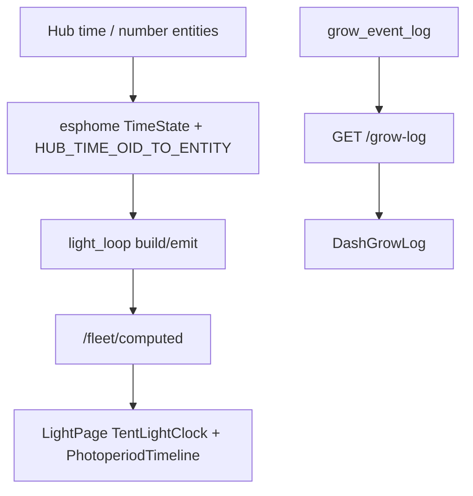

# Local webserver UI spec

**In one line:** Thin client of the brain API — presentation, advanced control, updates. Live SPA on Pi `:8787`.

Notion: [Local webserver UI](https://app.notion.com/p/3b52b4cda37081c19048e794d4bdf819)

**Tip (v7.4.0 + space/energy design approved):** `39233ae` · spa-dist `index-K2_ziUnM.js` (+ `calibrate-BqnIG9Rc.js` · `tune-fleet-C9fzhOX5.js` · `twin-three-BjdbWAdH.js`)  
**Prior tip body:** v7.4.0 signed-off `32836fe` (same spa hashes). Richer module-map docs may land via open tip-SoT PR `#156` (`332e`) — this file stays tip-accurate without requiring those paths.

## Surfaces (product SPA)

| Route | Job |
|---|---|
| `#/ops/home` | Ops overview (vitals, honesty, grow-log consumer) |
| `#/live/light` | Per-tent clocks + PhotoperiodTimeline + SF / Twin SF1000 controls |
| `#/live/climate` | Climate — airflow + Zigbee Wet/Dry · Problem/Clear |
| `#/live/twin` | Twin 3D |
| `#/grow/roster` | Plant roster — detach / assign / slot Delete |
| `#/grow/compose` | Plant Wizard — stock or seated create |
| `#/fleet/calibrate` | SoftCal / soil cal |
| `#/tune/learning` | Seat `learning_log` UI — **not** design energy Learning |
| `#/settings` | Inventory + Zigbee bind/policy, advanced |

> **HA wireframe:** optional lab panel only. Product SoT is the Pi SPA + brain HTTP ([`docs/HA-SCAFFOLD.md`](../HA-SCAFFOLD.md)).

## Light + grow-log (SHIPPED)

| Piece | Cite |
|-------|------|
| Schedule math | `frontend/src/lib/lightSchedule.ts` |
| Clocks / timeline | `TentLightClock.tsx`, `PhotoperiodTimeline.tsx` — runbook [`PHOTOPERIOD-TIMELINE.md`](PHOTOPERIOD-TIMELINE.md) |
| Brain photoperiod SoT | `brain/dsc_brain/light_loop.py` |
| Grow log API | `GET /grow-log` → `event_log.list_grow_log` / table `grow_event_log` |
| Live Light audit | [`../qa/LIGHT-AUDIT-7.4-live.md`](../qa/LIGHT-AUDIT-7.4-live.md) |

## Space / energy / journals (DESIGN ONLY — approved)

Approved design + plan on tip — **modules and routes not shipped**:

- Spec (appendix = SHIPPED vs DESIGN ONLY): [`../superpowers/specs/2026-09-01-space-energy-journal-design.md`](../superpowers/specs/2026-09-01-space-energy-journal-design.md)
- Plan (Tasks 1–10 unchecked): [`../superpowers/plans/2026-09-01-space-energy-journal.md`](../superpowers/plans/2026-09-01-space-energy-journal.md)

**Absent today:** `plant_journal` / `space_journal` / `energy_tariff` / `schedule_shift_plan` tables; `/journal/*` and `/energy/*` APIs; SPA Energy panel / plant mini-journal. Catalog `wattage_w` is display-only. Do not invent tariff math or approve-only ramps in operator copy until Task 9 lands.

**Ownership tension:** `apply_clone_tent_automation` and `PlantSeatPanel.applyTent` can still write 2×4 photoperiod from plant/seat flows — design requires space-owned windows with explicit approve.

## API dependency (core)

Reads/writes go through brain HTTP (`brain/dsc_brain/api.py`):

- `GET /health` · `GET /fleet` · `GET /fleet/computed` · `GET /ws/fleet`
- `GET /grow-log` · `GET /learning` (seat events — not energy Learning)
- `POST /control/service` (compose helpers + `script.dsc_*`)
- `POST /roster/detach/{pot}` · `POST /roster/assign` · `POST /roster/move`
- `POST /roster/slots/{n}/retire`
- `GET /v1/catalogs/{kind}` · `GET /want/{strain_id}`

Capacity: `ROSTER_SLOT_COUNT = 10`. Kit probes: `KIT_PROBE_NUMBERS` = 1–2.

### Client refresh contract (tip `149657d`+)

`BrainProvider` (`useBrain.tsx`) serializes `/fleet/computed` fetches, cache-busts GETs, and bumps React `tick` after mutations so roster/Light stay honest without hard reload.

### Deploy / hotpatch

Windows lab: PuTTY `pscp`/`plink` with `-batch -hostkey` (not OpenSSH `scp` — password hang). Verify served `index.html` hash matches spa-dist (`index-K2_ziUnM.js` on tip). Broader hotpatch SoT may live on tip-SoT doc branches when merged.

## Non-goals

- Claiming plant/space journals, TOU calculator, or schedule shift plans as live
- Inventing Got / Need / catalog chem when producers are missing
- Inferring Zigbee **Problem** from Wet alone
- Requiring Home Assistant for product ops

## Host

Pi 4 4GB+ LAN (`http://dsc-brain.local:8787` or IP). Deploy spa-dist with brain image / hot-patch.

## Related

- [`PHOTOPERIOD-TIMELINE.md`](PHOTOPERIOD-TIMELINE.md) · [`DECISION_LOOP.md`](DECISION_LOOP.md)
- Architecture: [`../DSC-BRAIN.md`](../DSC-BRAIN.md)
- Closure: [`../qa/AUDIT-CLOSURE-7.4.md`](../qa/AUDIT-CLOSURE-7.4.md)
- Verify Light path: `pytest brain/tests/test_light_loop.py -q` · `pytest brain/tests/test_hub_time_ingest.py -q`
