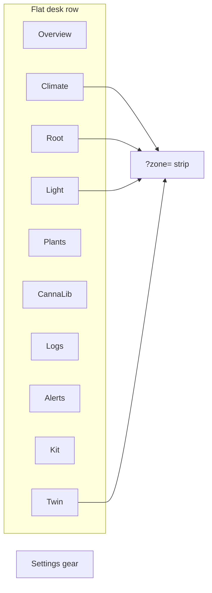

# Operator SPA — desks (Dashboard v2)

**In one line:** Thin client of the brain API on `:8787` — one flat row of **desks** (what you look at); **zone** is `?zone=` context, never a peer tab.

Notion: [Local webserver UI](https://app.notion.com/p/3b52b4cda37081c19048e794d4bdf819)  
Design plans: [`plan-v2-dashboard-2026-09-06.md`](../design/plan-v2-dashboard-2026-09-06.md) · [`plan-settings-2026-09-07.md`](../design/plan-settings-2026-09-07.md)

## Host

Pi LAN: `http://dsc-brain.local:8787` (or Pi IP). Dev: `npm run dev` in `frontend/` proxies non-Vite paths to the live brain (`DSC_BRAIN_ORIGIN` overrides). Cameras proxy: `DSC_ZONES_ORIGIN` can point `/zones` + `/cameras` at a scratch brain.

## Desks



| Desk | Path | Zone strip | Sub-surfaces |
|---|---|---|---|
| Overview | `#/overview` | — | Zone cards carry camera thumbs when bound |
| Climate | `#/climate` | yes | Room · Tent (`#/climate/tent`) |
| Root | `#/root` | yes | — |
| Light | `#/light` | yes | — |
| Plants | `#/plants/roster` | — | Roster · Compose |
| CannaLib | `#/cannalib` | — | — |
| Logs | `#/logs` | — | Full journal browser (+ Settings changes filter) |
| Alerts | `#/alerts` | — | Active / history / automation rules table |
| Kit | `#/kit` | — | Inventory · Learning · Calibrate |
| Twin | `#/twin` | yes | Composed 3D view of Zone state |
| Settings | `#/settings/…` | — | Gear — not a desk (see below) |

Canonical table: `frontend/src/routes.ts` (`DESKS`, `SETTINGS_SECTIONS`). Path helpers: `frontend/src/lib/paths.ts` — **do not hardcode desk strings** at call sites.

### Settings (gear)

Grouped rail **You / The grow / The kit** — sections: Preferences · Alerts · Zones · Climate · Light · Root · Sensors · Automation · Devices · Integrations · Network · System. Search + anchors in `settingsIndex.ts`. Developer SoT: [`SETTINGS.md`](SETTINGS.md) (S1–S5). Devices hash sub-tabs: Inventory · Assignment · Zigbee (Tuya card `#tuya`) · Cameras · Firmware. Cameras UI: `#/settings/devices#cameras` ([`docs/cameras.md`](../cameras.md)). Tuya lane: [`TUYA-LOCAL.md`](TUYA-LOCAL.md).

### Legacy redirects

Pre-v2 paths (`/live/*`, `/grow/*`, `/fleet*`, `/ops/*`, `/tune/analytics`, …) redirect via `LEGACY_REDIRECTS`. Examples:

| Old | New |
|---|---|
| `#/live/overview` | `#/overview` |
| `#/live/climate` | `#/climate` |
| `#/live/4x8` | `#/climate/tent?zone=main` |
| `#/live/2x4` | `#/climate/tent?zone=clone` |
| `#/live/twin` | `#/twin` |
| `#/live/mission` | `#/alerts` |
| `#/grow/logs` | `#/logs` |
| `#/fleet` | `#/kit` |
| `#/settings/hub` | `#/settings/system#backup` |
| `#/settings/brain` | `#/settings/sensors` |
| `#/settings/device` | `#/settings/devices` |

Mobile (&lt; 640 px): bottom bar `Overview · Climate · Plants · Alerts · More` (desk order/visibility is a preference).

## Operator chrome rules

- **Probe / Plant** language only (not Seat / POT).
- Grey means no data; derived metrics carry provenance; invented slots stay `—` with a device hint.
- Split busy flags per async action; Abort stays enabled while its request is in flight.
- Entity-bus round-trip must not gate wizard Next — local drafts until flush.
- Twin WHAT IF overrides are `SIMULATED · NOT WRITTEN` — see [`TWIN.md`](TWIN.md).

## Light desk

`#/light` — two tent clocks + fixtures + maker PPFD cards (tip `7017bfb`):

- Fixtures panel from `GET /spaces`: nameplate watts, duty source, and **CannaLib binding** (`cannalib · {id}` or `no catalog record`).
- One `PpfdMapCard` per **enabled** fixture with a catalog id (kit SF1000 seeds `extra.catalog_id`). Tabs: Map · **3D** (isometric hang-height surface) · Spectrum · Bands.
- Maker maps are **not** live PAR / Got PPFD. Operator calibration curve + DLI stay on the calibration slot.
- Field math + honesty rules: [`PPFD-FIELD.md`](PPFD-FIELD.md).

## Twin

- **Desk** `#/twin` — composed room/tents from GLBs + live Zone/fleet state; zone strip re-aims the camera (`TwinPage` + `useZoneFocus`).
- Pack 3: vessel + plant-stage pairs, rebuilt 2×4 anchors, Pi/panel/puck/fixed cameras; **134** GLBs — see [`TWIN.md`](TWIN.md).
- **Spike** `#/twin-spike` — cost/fps measure only (not a desk). Phone: `?force3d=1`.
- Models under `frontend/public/models/`; build via `frontend/scripts/build-twin-models.mjs`.
- **Always** verify with `vite preview` (or the Pi) before hotpatch — see [`../ops/SPA-PROD-BUNDLE.md`](../ops/SPA-PROD-BUNDLE.md).
- Maker PPFD `superpose` is library-ready for twin placement but **not mounted** on this desk yet — see [`PPFD-FIELD.md`](PPFD-FIELD.md).

## Icon set v5

Operator set under `docs/design/icons/dsc-hub-icons-v5/` → generated into `frontend/src/iconSet.ts` by `scripts/gen-dsc-hub-icons.py`. `--on` = tone class; `--oos` = dashed strokes (no second file).

## History API (charts)

```http
GET /history?entity_id=sensor.dsc_…&hours=24&max_points=720
```

- Empty `entity_id` → honest empty `{ points: [], tracked: false }` (not 422).
- Unmapped entity → `tracked: false` + empty points (debug log only).
- Points use **whole-window bucketing** (`list_history_bucketed`) so a 7 d chart still spans 7 d inside `max_points`.
- Brain-owned computed entities (`sensor.dsc_*` / `binary_sensor.dsc_*`) are recorded on a 60 s loop (`computed_history`) so charts do not depend on a browser polling.
- Default chart range / bands / hold gaps are **browser preferences** (`dsc.prefs.v1`).

## Related brain docs

| Doc | Topic |
|---|---|
| [SETTINGS.md](SETTINGS.md) | Settings S1–S5, hub tunables, Devices drawers, System cards |
| [TUYA-LOCAL.md](TUYA-LOCAL.md) | Tuya Wi-Fi local lane (Pass T1) |
| [TWIN.md](TWIN.md) | Composed twin + model build |
| [PPFD-FIELD.md](PPFD-FIELD.md) | Maker PPFD 3D surface + catalog binding |
| [ZONE-MODEL.md](ZONE-MODEL.md) | `GET/PATCH /zones`, role flip honesty |
| [AUTOMATION-RULES.md](AUTOMATION-RULES.md) | Rule engine v2 + allow-lists |
| [../cameras.md](../cameras.md) | Zone cameras / timelapse |
| [../ops/RELAY-HONESTY.md](../ops/RELAY-HONESTY.md) | Sonoff observed vs commanded vs demand |
| [../ops/SPA-PROD-BUNDLE.md](../ops/SPA-PROD-BUNDLE.md) | Production chunk graph |
| [DECISION_LOOP.md](DECISION_LOOP.md) | Want → Got → Need → propose |
| [../DSC-BRAIN.md](../DSC-BRAIN.md) | Layers + hub-demand shadow mode |

## Non-goals

- Browser owning catalogs or Want math
- Fake CO₂ / measured PPFD / cure-vessel numbers without hardware
- Twin writing actuators or owning Want/Need
- Requiring Home Assistant (lab only; product path is Pi brain)
