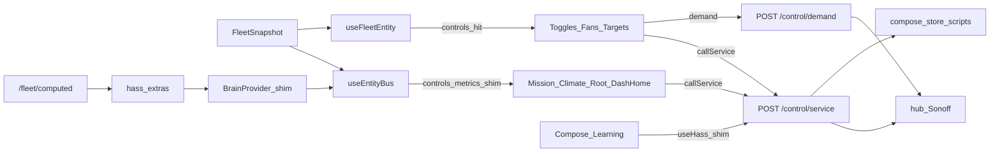

# Local webserver UI spec

**In one line:** Thin client of the brain API — presentation, advanced control, updates.

Notion: [Local webserver UI](https://app.notion.com/p/3b52b4cda37081c19048e794d4bdf819)

**Pi tip (`f10ad40`):** SPA reads **FleetSnapshot** (`GET /fleet` / `WS /ws/fleet`) including **`hub.values.controls`** (fans / modes / SF1000 via ESPHome 2026 dual-slug ingest), room/clone metrics (Pi-side VPD), fire/cooldown sensors, **`hub.values.binaries`**, and text **`firmware_version`**. **Phase E:** dash helpers (`hass_extras`) come from **`GET /fleet/computed`** (not the `/fleet` hot path). Writes via **`POST /control/service`** and **`POST /control/demand`**. Charts via **`GET /history`**; grow log via **`GET /grow-log`**. Ops pages + **Dash Home** (`#/ops/home`) use **`useEntityBus`** + **`BandChartHost`**; control widgets use **`useFleetEntity`**. Bundle: `index-BJFHGKyp`. Ops: [`docs/qa/PI-APPLIANCE-7.0.md`](../qa/PI-APPLIANCE-7.0.md) · Audit: [`docs/AUDIT-2026-08-26.md`](../AUDIT-2026-08-26.md) · Soak: [`docs/ops/SOAK-2026-08-26.md`](../ops/SOAK-2026-08-26.md).

## Surfaces (MVP)

| Route | Job |
|---|---|
| `/` / `#/…` hash routes | Ops overview via FleetSnapshot + entity bus |
| `#/ops/home` | **Dash Home** — HA Home layout parity (bands + sparklines, ESP links, grow log) |
| `/plant` / `#/grow/*` | Build a Plant + roster + catalog browse (research) |

> **HA wireframe (N-086):** Home Assistant `/dsc-hub-pro/catalog` remains a lab research browser. Pi Catalog search uses `/v1/catalogs`; Compose helpers/scripts are Pi-native as of `bfd6495` ([`docs/HA-SCAFFOLD.md`](../HA-SCAFFOLD.md)).
| `/advanced` / `#/tune/*` | Profiles, cal, overrides (API / helper proxy) |
| `/updates` / `#/fleet/settings` | Brain version, catalog reload, firmware flash checklist |

## Dual-mode data path

| Mode | Reads | Writes | Charts / log |
|---|---|---|---|
| **Pi** (`VITE_DSC_PI=1` / `source="pi"`) | FleetSnapshot (`/fleet`) + computed helpers (`/fleet/computed`) → `useEntityBus` / `useFleetEntity` | `POST /control/service`, `POST /control/demand` | `GET /history`, `GET /grow-log` |
| **HA panel** (`source="ha"`) | `fleetFromHass(hass)` / HA entity state | `hass.callService` | HA history WS / logbook |

Frontend SoT: `hooks/useFleet.tsx`, `hooks/useEntityBus.ts`, `hooks/useFleetEntity.ts`, `hooks/useBrain.tsx`, `lib/entityFleetMap.ts`, `lib/fleetControlMap.ts`, `lib/fleetFromHass.ts`, `lib/fleetModel.ts`, `lib/fleetApi.ts`, `pages/DashHomePage.tsx`, `components/DashHomeSections.tsx`, `components/BandChartHost.tsx`, `viz/gaugeTheme.ts`.

### Hook split (do not conflate)

| Hook | Prefer when |
|---|---|
| `useEntityBus()` | Page / strip needs many entity reads (Mission, Climate, Root, Live, Grow, Light, Tune, **Dash Home**) |
| `useFleetEntity(id)` | Single control widget with attributes (`percentage`, `brightness`, `options`) |
| `useHass()` | Compose / Learning / Vessel / Tank — on Pi this is BrainProvider shim (`fleetToHassCompat` + **`/fleet/computed` hass_extras**) |

### Compose / Learning on Pi (tip `bfd6495`+)

| Works on Pi | Notes |
|---|---|
| Catalog **search** via `GET /v1/catalogs` | Unchanged |
| Compose helpers + build/assign/mix/climate scripts | `compose_store` + `compose_ops.handle_script` |
| Learning cal scripts | Same script handler |
| Dash Home bands / grow log | `/history` sparklines + `/grow-log` + `BandChartHost` |
| Fans / ladder chips truthful | Tip `53ecec7` dual-slug ingest — silent zero is a regression |
| Native vs computed | Tip `f4299f6` Phase E — do not expect `hass_extras` on `/fleet` |

Do **not** invent height/chem/PPFD/NPK. Prefer brain `/roster` + `/want` when redesigning Build-a-Plant off helper-shaped APIs.

**Red-flag:** hub switch writes may `NameError` on `_HUB_SWITCH_ENTITY_TO_OID` until aliased — see runbook. Heatmat appliance driver still keys only legacy `growmat_demand`.

## API dependency

All Pi reads/writes go through brain HTTP API (`brain/dsc_brain/api.py`):

- `GET /health`
- `GET /fleet` (native FleetSnapshot; optional `?include_computed=true` / `?include_hass=true`)
- `GET /fleet/computed` (Phase E helpers / `hass_extras`)
- `WS /ws/fleet`
- `POST /control/service`
- `POST /control/demand`
- `GET /history?entity_id=&hours=`
- `GET /grow-log?hours=&limit=`
- `GET /catalogs/strains?q=` / `GET /v1/catalogs/{kind}`
- `GET /want/{strain_id}`
- `GET/PATCH /roster/...`
- `GET /learning`
- `POST /decision/tick`
- `POST /admin/reload-catalogs`
- Settings / inventory / network / esphome / backup / zigbee routes (see runbook)
- Static `/assets` + `/vendor` (dash-fx / three)

## Non-goals (v1)

- Requiring Home Assistant on the product path
- Embedding fat strain dumps in the browser
- Inventing catalog fields (height/chem/PPFD/NPK)

## Host

Pi 4 4GB LAN (`http://dsc-brain.local:8787` or `http://10.42.0.1:8787`). Static UI ships via `npm run build:spa` → `brain/static` → `Dockerfile.prebuilt`.
