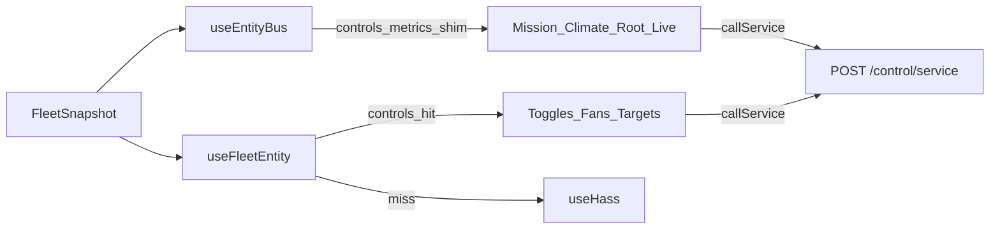

# Local webserver UI spec

**In one line:** Thin client of the brain API — presentation, advanced control, updates.

Notion: [Local webserver UI](https://app.notion.com/p/3b52b4cda37081c19048e794d4bdf819)

**Pi tip (`4aa67c5`):** SPA reads **FleetSnapshot** (`GET /fleet` / `WS /ws/fleet`) including **`hub.values.controls`**, room/clone metrics, and **`hub.values.binaries`**. Writes via **`POST /control/service`**; charts via **`GET /history`**. Operational pages use **`useEntityBus`**; control widgets use **`useFleetEntity`**. Bundle: `index-DdObn-6b`. Ops: [`docs/qa/PI-APPLIANCE-7.0.md`](../qa/PI-APPLIANCE-7.0.md).

## Surfaces (MVP)

| Route | Job |
|---|---|
| `/` / `#/…` hash routes | Ops overview (vitals, ladder summary, alerts) via FleetSnapshot + entity bus |
| `/plant` | Build a Plant + roster + catalog browse (research) |

> **HA wireframe (N-086):** Home Assistant `/dsc-hub-pro/catalog` is the interim
> research browser over `/local/dsc-catalog/*.json`. The durable web `/plant`
> browse mode will call brain catalog APIs — reuse section jobs/labels, not HA
> helper coupling ([`docs/HA-SCAFFOLD.md`](../HA-SCAFFOLD.md)).
| `/advanced` | Profiles, cal, overrides (API calls only) |
| `/updates` | Brain version, catalog reload, firmware flash checklist |

## Dual-mode data path

| Mode | Reads | Writes | Charts |
|---|---|---|---|
| **Pi** (`VITE_DSC_PI=1` / `source="pi"`) | FleetSnapshot → `useEntityBus` / `useFleetEntity` (+ `fleetToHassCompat` shim) | `POST /control/service` | `GET /history` |
| **HA panel** (`source="ha"`) | `fleetFromHass(hass)` / HA entity state | `hass.callService` | HA history WS |

Frontend SoT: `hooks/useFleet.tsx`, `hooks/useEntityBus.ts`, `hooks/useFleetEntity.ts`, `lib/entityFleetMap.ts`, `lib/fleetControlMap.ts`, `lib/fleetFromHass.ts`, `lib/fleetModel.ts`, `lib/fleetApi.ts`, `hooks/useFleetActions.ts`, `hooks/useHistory.ts`.

### Hook split (do not conflate)

| Hook | Prefer when |
|---|---|
| `useEntityBus()` | Page / strip needs many entity reads (Mission, Climate body, Root, Live, Grow, Light, Tune) |
| `useFleetEntity(id)` | Single control widget with attributes (`percentage`, `brightness`, `options`) |
| `useHass()` | Catalog / Compose / Learning / Vessel / Tank (still HA-helper coupled) |

### HA-coupled residual (Pi honesty)

| Works on Pi | Does **not** (yet) |
|---|---|
| Catalog **search** via `GET /v1/catalogs` when `VITE_DSC_PI=1` | Compose commit/assign/mix (`input_text` / `script.*`) |
| Ops pages on FleetSnapshot | Learning cal scripts + learn helpers |
| Charts via `GET /history` | Vessel / Tank helper reads/writes |

`POST /control/service` allow-list is hub/Sonoff/in-service only — see [`docs/qa/PI-APPLIANCE-7.0.md`](../qa/PI-APPLIANCE-7.0.md) § HA-coupled SPA surfaces. Prefer brain `/roster`, `/want`, `/v1/catalogs` when migrating Build-a-Plant off HA.

## API dependency

All Pi reads/writes go through brain HTTP API (`brain/dsc_brain/api.py`):

- `GET /health`
- `GET /fleet` (+ optional `?include_hass=true`)
- `WS /ws/fleet`
- `POST /control/service`
- `GET /history?entity_id=&hours=`
- `GET /catalogs/strains?q=`
- `GET /want/{strain_id}`
- `GET/PATCH /roster/...`
- `GET /decision/last` (dry-run proposals)
- `POST /admin/reload-catalogs`
- Settings / inventory / network / esphome / backup / zigbee routes (see runbook)

## Non-goals (v1)

- Three.js cinematic Dash parity on the Pi image
- Embedding fat strain dumps in the browser
- Requiring Home Assistant on the product path

## Host

Pi 4 4GB LAN (`http://dsc-brain.local:8787` or `http://10.42.0.1:8787`). Static UI ships via `npm run build:spa` → `brain/static` → `Dockerfile.prebuilt`.
