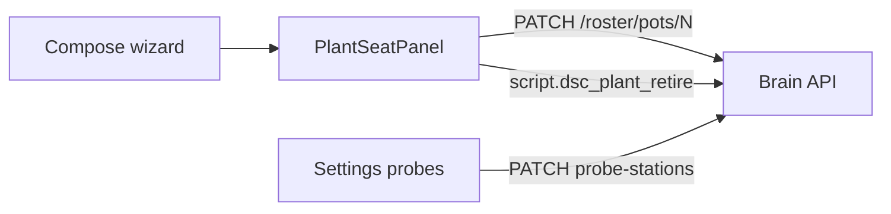

# Local webserver UI (Pi SPA)

**In one line:** Thin client of the brain API — presentation, advanced control, updates. Brain remains truth.

Notion: [Local webserver UI](https://app.notion.com/p/3b52b4cda37081c19048e794d4bdf819)

## Tip (`8208461` — 7.4 WiP)

| | |
|---|---|
| Surface | Still **7.3.0** until Phase E `7.4.0` |
| SPA bundle (spa-dist) | `index-DL1EcjhX` (+ `tune-fleet-IPnSFs3d` · `calibrate-D1D5CnxU`) — **source** tip has HelpTip / Age format / Overview tips; **rebuild spa-dist** before operators see it |
| Default landing | `#/live/overview` |
| Demo | Same routes; banner when `GET /health` → `mode=demo` — [`DEMO-MODE.md`](DEMO-MODE.md) |
| Public demo | `brain-demo.plausible-deniability.net` (iframe CSP for PD) |

## Primary sections

| Section | Default path | Job |
|---------|--------------|-----|
| Live | `/live/overview` | Fleet vitals, climate, tents, root, light; Twin / Mission / Dash demoted |
| Grow | `/grow/roster` | Compose (Plant Wizard), research, roster / seat edit |
| Tune | `/tune/learning` | Learning + analytics |
| Fleet | `/fleet` | Overview, calibrate, settings |

## Plant + probe workflows

| Job | Where | Doc |
|-----|-------|-----|
| Create plant | Grow → Compose (`PlantWizard`) | [PLANT-WIZARD.md](PLANT-WIZARD.md) |
| Edit / delete plant; tent place | Shared `PlantSeatPanel` drawers | [PLANT-SEAT.md](PLANT-SEAT.md) |
| Probe home / demote role | Settings → Probe stations | [PLANT-SEAT.md](PLANT-SEAT.md) |
| Soft / lab wet cal | Fleet → Calibrate | [../ops/LAB-WET-CAL.md](../ops/LAB-WET-CAL.md) |

## 7.4 SPA surfaces (software)

| Surface | Notes |
|---------|-------|
| Soft calibrate | Calibrate Soil — tap-water → HA Got offsets — [`LAB-WET-CAL.md`](../ops/LAB-WET-CAL.md) |
| Photoperiod timeline | Light page 24h strips — [`PHOTOPERIOD-TIMELINE.md`](PHOTOPERIOD-TIMELINE.md) |
| Airflow particle viz | Climate “Air path” lazy R3F scaffold — [`AIRFLOW-VIZ-7.4.md`](../qa/AIRFLOW-VIZ-7.4.md); SVG `AirPathMap` + FlowSankey still present |
| Demo banner | `DemoBanner` polls `/health` when `mode=demo` |
| Hub link Age + `?` tip | `HubLinkLine` + `HelpTip` — human durations, DA-P1-1 — [`HELP-TIP.md`](HELP-TIP.md) |
| Overview Want/Got + Colour `?` tips | Direct `HelpTip` on Overview status strip; hub `Up` via `fmtUptimeSeconds` — tip `8208461` |
| Conditional hooks | `usePanelOfflineMs` always calls `useOfflineMs`; held-reading / hassRef sync in effects — [`HELP-TIP.md`](HELP-TIP.md) § pitfalls |
| Rehome checklist / DLI / grow-log filter | UX polish on tip; no separate runbook yet |

## Hub link + Overview chrome (Age / HelpTip)

`HubLinkLine` mounts on Dash, Mission, and Fleet/Tune. **Age** and **Beat** prefer HA age entities when present, else fleet uptime/heartbeat **seconds**, always through `fmtUptimeSeconds` — never raw floats. Overview uses the same formatter for hub uptime and mounts Want · Got · Need + Colour honesty tips. Inline `?` uses native `
` (no help JS). Full contract + rebuild note: [`HELP-TIP.md`](HELP-TIP.md).

## API dependency (canonical)

Reads/writes go through brain HTTP (`brain/dsc_brain/api.py`):

- `GET /health` · `GET /fleet` · `GET /fleet/computed` · `WS /ws/fleet`
- `POST /control/service` · `POST /control/demand`
- `PATCH /roster/pots/{n}` — plant identity after create
- `GET/PATCH /settings/probe-stations/{seat_id}` — idle home + `clear_role`
- Settings, catalogs, history, grow-log, decision tick

In demo mode, hardware/network apply endpoints return **403** — see [`DEMO-MODE.md`](DEMO-MODE.md). Soft calibrate writes go through `input_number.set_value` on the HA-backed Got stack (same control service path).

## Host

- Live Pi: `http://dsc-brain.local:8787` or `10.42.0.1:8787` / studio `.48`
- Public demo compose: host **8788** → container 8787 · public hostname above

## Non-goals

- Browser owning catalog DB or Want/Need math as SoT
- Three.js cinematic Dash as primary landing
- Reviving Lovelace YAML as product UI ([archive](../archive/lovelace-7.3/))
- Inventing catalog height / chem / PPFD / NPK when packs lack them

## Related

- [`DEMO-MODE.md`](DEMO-MODE.md) · [`PLANT-SEAT.md`](PLANT-SEAT.md) · [`PLANT-WIZARD.md`](PLANT-WIZARD.md) · [`HELP-TIP.md`](HELP-TIP.md) · [`DECISION_LOOP.md`](DECISION_LOOP.md) · [`../DSC-BRAIN.md`](../DSC-BRAIN.md)
- Deploy / hash sync: [`../ops/DSC-HUB-DOCKER.md`](../ops/DSC-HUB-DOCKER.md)
