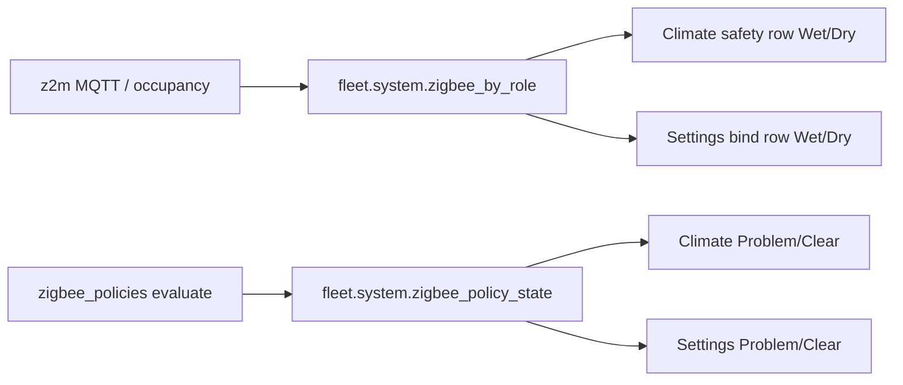

# Zigbee policy honesty UI (Wet/Dry · Problem/Clear)

**In one line:** Climate and Settings show **raw Wet/Dry** from role telemetry and **Problem/Clear** only from bound `policy_state` — the SPA never infers problem from wet alone.

**Tip (Post-mega D-C-A-B):** `f029702` · SPA `index-CXq-NptO.js` · MP-043 + MP-040 verify  
**Prior Mega Pass:** `a307dc7` · `index-DlMHgtYz.js`  
**Code:** `ClimatePage.tsx` · `components/settings/ZigbeeBindRow.tsx` (+ `settingsConstants` / `settingsHelpers`) · fleet `system.zigbee_by_role` / `zigbee_policy_state`  
**Module map:** [SPA-MODULE-MAP.md](SPA-MODULE-MAP.md)  
**Specs:** [`../superpowers/specs/2026-08-31-zigbee-policy-honesty-floor-flood-design.md`](../superpowers/specs/2026-08-31-zigbee-policy-honesty-floor-flood-design.md) · Role/Task [`../superpowers/specs/2026-08-30-zigbee-role-vs-task-operator-design.md`](../superpowers/specs/2026-08-30-zigbee-role-vs-task-operator-design.md)  
**Ops recovery:** [`../ops/ZIGBEE-RECOVERY.md`](../ops/ZIGBEE-RECOVERY.md)  
**Live verify (lab):** `leak_floor_4x8` bound — [`../qa/AUDIT-CLOSURE-2026-09-D-C-A-B.md`](../qa/AUDIT-CLOSURE-2026-09-D-C-A-B.md)

## Intent

Liquid / leak sensors often expose wet as `occupancy` (liquid present), not PIR motion. Operators need two independent chips:

| Chip | Source | When shown |
|------|--------|------------|
| **Wet / Dry** | `zigbee_by_role[role].wet` (or `.active` fallback) | Role has telemetry |
| **Problem / Clear** | `zigbee_policy_state[ieee].problem` | Task bound (`recipe_id !== "none"`) **and** policy boolean present |

`floor_flood_alert` is banner-only (never OOS). `tank_full_appliance` may OOS — policy engine owns that; UI only reflects state.

## Surfaces



| Surface | Behavior |
|---------|----------|
| `#/live/climate` | Safety card copy: “Wet/Dry is the raw sensor. Problem/Clear appears only when a Task is bound.” |
| `#/settings` (Zigbee bind table) | Bound rows show Wet/Dry + Problem/Clear chips beside BOUND/CONFLICT — UI owned by `ZigbeeBindRow.tsx` |

## Constraints

- Do **not** treat occupancy as motion for liquid SKUs.
- Do **not** derive Problem from Wet in the SPA.
- Unbound / `recipe_id=none` → no Problem chip (Wet/Dry may still show).
- Multi-sensor `*_b` roles and `leak_floor_2x4` remain deferred — add **one** device type at a time. MP-040 `leak_floor_4x8` closed on tip `f029702` lab evidence.

## Pytest flake note (MP-044)

`test_zigbee_save_bindings_reroutes_cached_state` isolates ieee (`0xreroute`), clears fleet zigbee maps before ingest, and monkeypatches temp/RH offsets so parallel suite state cannot clobber assertions. Tip `a307dc7`+: 161 brain tests green (Gate 0).

## Verify

| Check | Expected |
|-------|----------|
| Climate bound floor flood, dry | Dry + Clear (no OOS) |
| Climate bound floor flood, wet | Wet + Problem + banner; **no** appliance OOS |
| Settings bind row, task bound | Wet/Dry + Problem/Clear chips live |
| Settings unbound | BOUND/UNBOUND only — no Problem chip |

```bash
pytest brain/tests/test_brain_pi.py -k zigbee_save_bindings_reroutes -q
```

## Related

- [SPA-MODULE-MAP.md](SPA-MODULE-MAP.md) · [WEBUI.md](WEBUI.md)
- Post-mega closure [`../qa/AUDIT-CLOSURE-2026-09-D-C-A-B.md`](../qa/AUDIT-CLOSURE-2026-09-D-C-A-B.md) · Mega Pass register [`../qa/MEGA-PASS-2026-09-ISSUE-REGISTER.md`](../qa/MEGA-PASS-2026-09-ISSUE-REGISTER.md)
