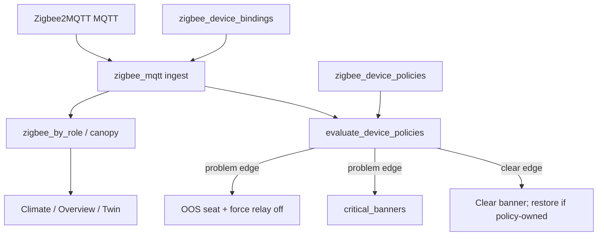

# Zigbee Role vs Task

**In one line:** Role places a sensor in the fleet; Task is optional action. No task = datapoint only.

**Tip:** `e126f654` (AGENTS memory) · feature `c224eba` · **SPA:** Settings → Zigbee (`ZigbeeBindRow`) · Bundle `index-nLu-U8CF.js`

Design: [role-vs-task operator](../superpowers/specs/2026-08-30-zigbee-role-vs-task-operator-design.md) · [device tasks](../superpowers/specs/2026-08-30-zigbee-device-tasks-design.md)  
Radio recovery: [ZIGBEE-RECOVERY.md](../ops/ZIGBEE-RECOVERY.md) · Operator memory: [`AGENTS.md`](../../AGENTS.md)

## Intent

Operators bind every Zigbee end device on one Settings path:

1. **Role + Zone** — where the reading lives (`zigbee_by_role`, canopy, safety wet display).
2. **Task** — optional curated recipe (OOS seat, force relay, critical banner). Leave **No task** for climate sensors.

Role alone never runs actuators. Unbound devices never steal canopy or drive relays. Introduce **one recipe / device class at a time** — not a free-form IFTTT catalog.

## Kit fact — occupancy ≠ motion

Some kit leak/liquid sensors (SNZB-03-fingerprinted tanks) publish wet/dry on MQTT key **`occupancy`** (true = liquid present). That is **not** PIR motion.

- Ingest still classifies bare occupancy as `motion` until the operator binds a safety leak role (sticky `capability_override: liquid`) or sets override explicitly.
- Policy evaluate reads `occupancy` **last** (after `water_leak` / `leak` / `moisture`) and only when a Task recipe is attached — bare occupancy stays inert.
- Do not treat those SKUs as motion sensors in Climate/Twin.

## Architecture



| Layer | Setting key | Module | Effect |
|-------|-------------|--------|--------|
| Binding | `zigbee_device_bindings` | `zigbee_mqtt.py` | ieee → role / zone / optional `capability_override` |
| Policy | `zigbee_device_policies` | `zigbee_policies.py` | ieee → `recipe_id` + params; no-op when `none` |
| Owned OOS | `zigbee_policy_owned_oos` | `zigbee_policies.py` | seat → ieee so clear only restores own OOS |

ESPHome fleet polls must call `apply_zigbee_cache_to_state` so canopy and policy keys (`critical_banners`, `zigbee_policy_state`) are not clobbered mid-poll.

## Capability class + filtered selects

Server infers `capability_class` from z2m `definition.exposes` and recent state keys (`infer_capability_class`). Binding may set `capability_override` (e.g. occupancy-fingerprinted liquid → `liquid`).

| Class | Signals | Roles offered | Tasks offered |
|-------|---------|---------------|---------------|
| `climate` | temperature, humidity | climate kinds (canopy / intake / exhaust / room / clone dome) + Unbound | **No task** only |
| `liquid` | water_leak, leak, moisture | safety (`leak_tank`, `leak_floor`) + Unbound | No task + Liquid level → appliance OOS |
| `motion` | occupancy alone | Unbound (+ **Show all**) | No task (+ Show all) |
| `other` / `plug` | residual | Unbound (+ Show all for other) | No task (+ Show all) |

**Show all** on the Settings row reveals the full role/recipe catalogs (mis-fingerprint escape). Picking a safety leak role while class is `motion`/`other` can sticky-set `capability_override: liquid`.

## Liquid Task (`tank_full_appliance`)

Recipe id stays `tank_full_appliance` for migration; UI label is **Liquid level → appliance OOS**.

| Param | Values | Default |
|-------|--------|---------|
| `seat_id` | `dehumidifier` \| `humidifier` | `dehumidifier` |
| `problem_when` | `active` (wet = problem) \| `inactive` (dry = problem) | `active` |
| `force_relay` | `off` | `off` |
| `banner` | string | from `banner_template(seat, polarity)` |
| `banner_tone` | `critical` | `critical` |

Evaluate (`evaluate_device_policies`):

1. `raw = normalize_binary_active(payload)` — prefers `water_leak` / `leak` / `moisture`; `occupancy` last (kit liquid SKUs).
2. `problem = raw if problem_when == active else not raw`.
3. Problem edge → OOS seat, force relay off, upsert banner, grow-log.
4. Clear edge → clear banner; restore seat only if this ieee owns OOS.
5. Fleet `system.zigbee_policy_state[ieee]` stores both `active` (raw) and `problem`.

**UI honesty residual:** Live/Climate still show raw wet; Overview critical strip uses banners. Surfacing `problem` vs raw wet in Live/Climate is **next-plan** (`docs/FOLLOWUPS.md`).

## Operator walkthroughs

**A — Temp/RH datapoint (multi-height)**  
Permit join → climate-filtered Role (e.g. Intake or Canopy 4×8) · Zone · Task **No task** → Save. Feeds `zigbee_by_role`; no OOS.

**B — Humidifier empty**  
Liquid (or Show all) → Role `leak_tank` · Task Liquid level → Appliance **humidifier** · Problem when **Dry/inactive** · banner editable → Save.

**C — Dehumidifier full (existing kit)**  
Same Task · Appliance **dehumidifier** · Problem when **Wet/active**. Existing ieee with empty params migrates to these defaults on save — no re-pair. Kit occupancy-as-wet sensors need Task + usually `capability_override=liquid`.

## HTTP API (`:8787`)

| Method | Path | Notes |
|--------|------|-------|
| `POST` | `/settings/zigbee/permit-join` | `{enabled, duration_s?}` |
| `GET` | `/settings/zigbee/devices` | includes `capability_class`, binding, status |
| `GET` | `/settings/zigbee/roles` | full role catalog |
| `GET`/`PUT` | `/settings/zigbee/bindings` | ieee-keyed; Save re-routes cached MQTT immediately |
| `GET` | `/settings/zigbee/recipes` | catalog + param schema / `device_classes` |
| `GET`/`PUT` | `/settings/zigbee/policies` | ieee → recipe + params |
| `GET` | `/settings/zigbee/health` | radio / permit / end_device_count |

SPA Save writes bindings then policies (`SettingsPage`).

## Honesty / constraints

- Banner text must match polarity (no FULL copy when `problem_when=inactive`).
- Overview critical strip reads `fleet.system.critical_banners` only.
- Two devices on the same consume role → **CONFLICT** status; operator must unbind one.
- Unbound → no canopy consume, no Task evaluate for actuators.
- Do not invent free-form height-cm fields — use distinct Roles for heights.
- Prefer `timeout … docker restart` / stop+start for z2m — bare kill can wedge the Pi ([recovery](../ops/ZIGBEE-RECOVERY.md)).

## Tests

```bash
cd brain && python -m pytest tests/test_zigbee_policies.py tests/test_zigbee_capability.py -q
```

## Pitfalls

| Symptom | Check |
|---------|--------|
| Temp sensor offered liquid Task | Filtered list broken, or Show all left on |
| Occupancy liquid never OOS | Need Task + often `capability_override=liquid`; bare occupancy without recipe stays inert |
| Treating kit tank as motion | Occupancy key is wet/dry for those SKUs — bind liquid Role/Task |
| Canopy flickers after ESP poll | Missing `apply_zigbee_cache_to_state` on poll writeback |
| Banner clears but seat stays OOS | Another owner; only policy-owned seats restore |
| RADIO DOWN / empty devices | [ZIGBEE-RECOVERY.md](../ops/ZIGBEE-RECOVERY.md) |
