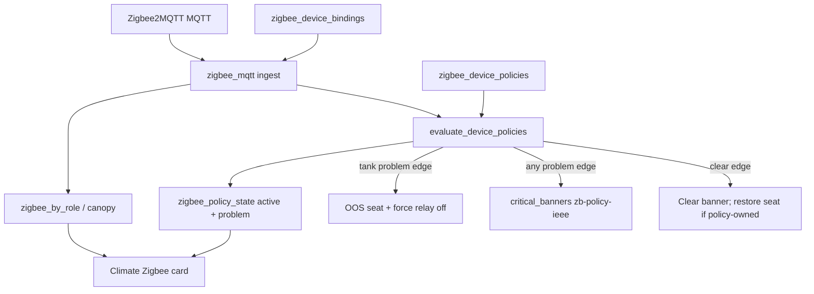
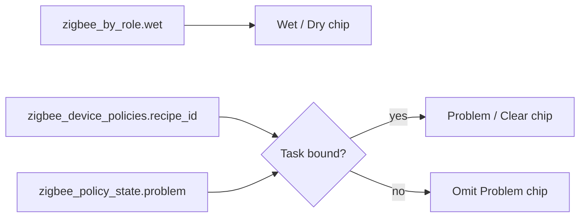

# Zigbee Role vs Task

**In one line:** Role places a sensor in the fleet; Task is optional action. No task = datapoint only.

**Tip:** `f7b4e80` (Climate policy honesty + `floor_flood_alert`) · prior Role/Task `c224eba` / one-pass `bce7ca9` · **SPA:** Settings → Zigbee (`ZigbeeBindRow`) · Climate Zigbee card · Bundle `index-Cj_Rsb-d.js`

Design: [policy honesty + floor flood](../superpowers/specs/2026-08-31-zigbee-policy-honesty-floor-flood-design.md) · [role-vs-task operator](../superpowers/specs/2026-08-30-zigbee-role-vs-task-operator-design.md) · [device tasks](../superpowers/specs/2026-08-30-zigbee-device-tasks-design.md)  
Radio recovery: [ZIGBEE-RECOVERY.md](../ops/ZIGBEE-RECOVERY.md) · Operator memory: [`AGENTS.md`](../../AGENTS.md)

## Intent

Operators bind every Zigbee end device on one Settings path:

1. **Role + Zone** — where the reading lives (`zigbee_by_role`, canopy, safety wet display).
2. **Task** — optional curated recipe (OOS seat, force relay, and/or critical banner). Leave **No task** for climate sensors.

Role alone never runs actuators. Unbound devices never steal canopy or drive relays. Introduce **one recipe / device class at a time** — not a free-form IFTTT catalog.

## Kit fact — occupancy ≠ motion

Some kit leak/liquid sensors (SNZB-03-fingerprinted tanks) publish wet/dry on MQTT key **`occupancy`** (true = liquid present). That is **not** PIR motion.

- Ingest still classifies bare occupancy as `motion` until the operator binds a safety leak role (sticky `capability_override: liquid`) or sets override explicitly.
- Policy evaluate reads `occupancy` **last** (after `water_leak` / `leak` / `moisture`) and only when a Task recipe is attached — bare occupancy stays inert.
- Do not treat those SKUs as motion sensors in Climate/Twin.

## Architecture



| Layer | Setting key | Module | Effect |
|-------|-------------|--------|--------|
| Binding | `zigbee_device_bindings` | `zigbee_mqtt.py` | ieee → role / zone / optional `capability_override` |
| Policy | `zigbee_device_policies` | `zigbee_policies.py` | ieee → `recipe_id` + params; no-op when `none` |
| Policy state | `fleet.system.zigbee_policy_state` | `zigbee_policies.py` | ieee → raw `active`, `problem`, `problem_when` |
| Owned OOS | `zigbee_policy_owned_oos` | `zigbee_policies.py` | seat → ieee so clear only restores own OOS |

ESPHome fleet polls must call `apply_zigbee_cache_to_state` so canopy and policy keys (`critical_banners`, `zigbee_policy_state`, `zigbee_device_policies`) are not clobbered mid-poll.

## Capability class + filtered selects

Server infers `capability_class` from z2m `definition.exposes` and recent state keys (`infer_capability_class`). Binding may set `capability_override` (e.g. occupancy-fingerprinted liquid → `liquid`).

| Class | Signals | Roles offered | Tasks offered |
|-------|---------|---------------|---------------|
| `climate` | temperature, humidity | climate kinds (canopy / intake / exhaust / room / clone dome) + Unbound | **No task** only |
| `liquid` | water_leak, leak, moisture | safety (`leak_tank`, `leak_floor*`) + Unbound | No task + Liquid level → appliance OOS + Floor flood → alert |
| `motion` | occupancy alone | Unbound (+ **Show all**) | No task (+ Show all) |
| `other` / `plug` | residual | Unbound (+ Show all for other) | No task (+ Show all) |

**Show all** on the Settings row reveals the full role/recipe catalogs (mis-fingerprint escape). Picking a safety leak role while class is `motion`/`other` can sticky-set `capability_override: liquid`.

SPA helper `isZigbeeSafetyLeakRole` treats `leak_tank`, `leak_floor`, and any `leak_floor_*` id as safety rows.

## Floor roles (one ieee per role id)

`zigbee_by_role` is keyed by role id (last writer wins). Two floor sensors in different spaces need **distinct** roles:

| id | Label | Intended zone | Status |
|----|-------|---------------|--------|
| `leak_floor_room` | Water leak (floor · room) | `room` | Live evidence (desk) |
| `leak_floor_4x8` | Water leak (floor · 4×8) | `4x8` | Live evidence (desk) |
| `leak_floor_2x4` | Water leak (floor · 2×4) | `2x4` | Catalog only until hardware |
| `leak_floor` | Water leak (floor) | any | Generic / Show-all escape |

**Later (FOLLOWUPS):** multi-sensor per space via indexed `*_b` slots (or list-valued safety `by_role`) — not implemented on tip `f7b4e80`.

## Recipes

### `tank_full_appliance` — Liquid level → appliance OOS

| Param | Values | Default |
|-------|--------|---------|
| `seat_id` | `dehumidifier` \| `humidifier` | `dehumidifier` |
| `problem_when` | `active` (wet = problem) \| `inactive` (dry = problem) | `active` |
| `force_relay` | `off` | `off` |
| `banner` | string | from `banner_template(seat, polarity)` |
| `banner_tone` | `critical` | `critical` |

Problem edge → OOS seat, force relay off, upsert `zb-policy-{ieee}` banner, grow-log.  
Clear edge → clear banner; restore seat **only** if this ieee owns OOS.

### `floor_flood_alert` — Floor flood → alert

| Param | Values | Default |
|-------|--------|---------|
| `problem_when` | `active` \| `inactive` | `active` |
| `banner` | string | `flood_banner_template(polarity)` → `Floor water detected` / `Floor dry alarm — check sensor` |
| `banner_tone` | `critical` | `critical` |

**Never** sets `seat_id`, inventory OOS, or `force_relay`. Problem edge → banner + grow-log only; clear edge removes that banner. Suggested roles: `leak_floor_room` / `_4x8` / `_2x4` / `leak_floor`.

Settings shares one task-params block for tank + flood; **Appliance** select is tank-only.

### Shared evaluate path

`evaluate_device_policies` (both recipes):

1. `raw = normalize_binary_active(payload)` — prefers `water_leak` / `leak` / `moisture`; `occupancy` last (kit liquid SKUs).
2. `problem = raw if problem_when == active else not raw`.
3. Always write `zigbee_policy_state[ieee] = {active, problem, problem_when, …}`.
4. On problem edge change → recipe actions (`_apply_active` / `_apply_clear`). Empty `seat_id` skips OOS/relay.

## Climate honesty (tip `f7b4e80`)

Climate **Zigbee by role** card:

1. Climate rows — temp/RH for non-safety roles (unchanged).
2. Safety subsection — bound `leak_*` roles from `zigbee_by_role`:
   - **Wet / Dry** from `by_role[role].wet` (raw sensor).
   - **Problem / Clear** only when ieee has Task ≠ `none` **and** `zigbee_policy_state[ieee].problem` is a boolean.
   - SPA must **not** re-derive Problem from Wet alone (inverted polarity would lie).

Overview critical strip still reads `fleet.system.critical_banners` only — do not invent a second wet collage.



## Operator walkthroughs

**A — Temp/RH datapoint (multi-height)**  
Permit join → climate-filtered Role (e.g. Intake or Canopy 4×8) · Zone · Task **No task** → Save. Feeds `zigbee_by_role`; no OOS.

**B — Humidifier empty**  
Liquid (or Show all) → Role `leak_tank` · Task Liquid level → Appliance **humidifier** · Problem when **Dry/inactive** · banner editable → Save.

**C — Dehumidifier full (existing kit)**  
Same Task · Appliance **dehumidifier** · Problem when **Wet/active**. Existing ieee with empty params migrates to these defaults on save — no re-pair. Kit occupancy-as-wet sensors need Task + usually `capability_override=liquid`.

**D — Floor flood (room + 4×8)**  
Two desk liquid sensors → Roles `leak_floor_room` / `leak_floor_4x8` · Zones `room` / `4x8` · Task **Floor flood → alert** · Problem when **Wet/active** → Save. Wet → independent `zb-policy-{ieee}` banners; dry clears that banner; dehumidifier/humidifier seats unchanged. Climate shows Wet + Problem for each role.

## HTTP API (`:8787`)

| Method | Path | Notes |
|--------|------|-------|
| `POST` | `/settings/zigbee/permit-join` | `{enabled, duration_s?}` |
| `GET` | `/settings/zigbee/devices` | includes `capability_class`, binding, status |
| `GET` | `/settings/zigbee/roles` | full role catalog (includes floor space roles) |
| `GET`/`PUT` | `/settings/zigbee/bindings` | ieee-keyed; Save re-routes cached MQTT immediately |
| `GET` | `/settings/zigbee/recipes` | catalog + param schema / `device_classes` |
| `GET`/`PUT` | `/settings/zigbee/policies` | ieee → recipe + params |
| `GET` | `/settings/zigbee/health` | radio / permit / end_device_count |

SPA Save writes bindings then policies (`SettingsPage`). Fleet snapshot exposes `zigbee_by_role`, `zigbee_device_bindings`, `zigbee_device_policies`, `zigbee_policy_state`, `critical_banners`.

## Honesty / constraints

- Banner text must match polarity (no FULL / flood-wet copy when `problem_when=inactive`).
- Wet/Dry ≠ Problem/Clear — polarity can invert them.
- Overview critical strip reads `fleet.system.critical_banners` only.
- Two devices on the same role id → last writer wins on Climate honesty row; use distinct floor roles.
- Unbound → no canopy consume, no Task evaluate for actuators.
- Do not invent free-form height-cm fields — use distinct Roles for heights.
- Prefer timed `docker stop`/`start` for z2m — bare kill / un-timed restart can wedge the Pi ([recovery](../ops/ZIGBEE-RECOVERY.md)). Never commit sudo passwords into recovery snippets.

## Tests

```bash
cd brain && python -m pytest tests/test_zigbee_policies.py tests/test_zigbee_capability.py -q
```

Covered on tip: `floor_flood_*` wet→banner no OOS, dry→clear, inactive polarity, `flood_banner_template`, tank regressions, floor role filter.

## Pitfalls

| Symptom | Check |
|---------|--------|
| Temp sensor offered liquid Task | Filtered list broken, or Show all left on |
| Occupancy liquid never OOS/banner | Need Task + often `capability_override=liquid`; bare occupancy without recipe stays inert |
| Treating kit tank as motion | Occupancy key is wet/dry for those SKUs — bind liquid Role/Task |
| Climate shows Wet but no Problem | Task is `none`, or no `zigbee_policy_state` yet (wait for MQTT edge) |
| Two floor sensors, one Climate row | Both bound to same role id — use `leak_floor_room` vs `_4x8` / `_2x4` |
| Flood banner but dehum OOS | Wrong recipe (`tank_full_appliance`) or leftover owned OOS from tank Task |
| Canopy flickers after ESP poll | Missing `apply_zigbee_cache_to_state` on poll writeback |
| Banner clears but seat stays OOS | Another owner; only policy-owned seats restore |
| RADIO DOWN / empty devices | [ZIGBEE-RECOVERY.md](../ops/ZIGBEE-RECOVERY.md) |
