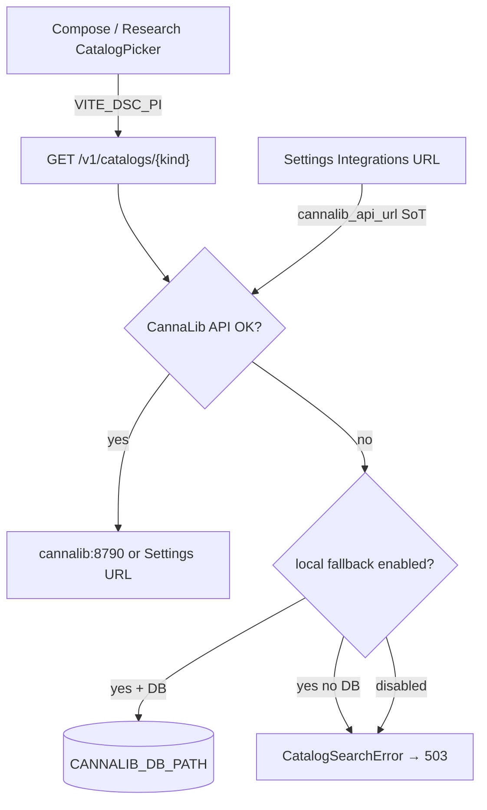

# Cannalib catalog API — moved to CannaLib

The live API, corpus, and scrape pipeline are no longer part of DSC-HUB.

| | |
|---|---|
| Repo | `Y:\Digital Stealth Care\Projects\CannaLib` |
| Ops | `CannaLib/docs/ops/CANNALIB-API.md` |
| Public | https://cannalib.plausible-deniability.net |
| LAN gateway | http://192.168.86.2:8790 |
| Pi stack (sidecar) | http://cannalib:8790 inside `dsc-hub` compose |

Hub still owns the **client**:

- `homeassistant/packages/dsc_v4_cannalib_api.yaml`
- `dsc-build-plant-card.js` / `dsc-catalog-browse-card.js`
- curated Want YAML
- capped `www/dsc-catalog/` indexes (built by CannaLib from sqlite, synced here)

## Pi brain (7.x) wiring



Verified tip `86f8c2e` (`integrations.py`, `paths.resolve_cannalib_db`, compose `CANNALIB_*`).

| Knob | Role |
|---|---|
| **Settings → Integrations → CannaLib API URL** | SoT for Pi SPA catalog proxy (`cannalib_api_url`) |
| Compose `CANNALIB_API_URL` | Default `http://cannalib:8790` when setting empty |
| `cannalib_use_local_fallback` (default true) | Allow on-Pi sqlite when remote fails |
| `CANNALIB_DB_PATH` | Default `/cannalib/dsc_brain.sqlite3` (volume shared with sidecar) |

**Honesty:** when remote fails and no DB is mounted, `/v1/catalogs/*` returns **503** with an explicit message — no silent empty results. Slim Want YAML remains the last tier only where the proxy already falls through without inventing rows.

Status: `GET /settings/catalog/status` → `catalog_status()` (`remote_api` \| `local_sqlite` \| `slim_want`).

Pull capped offline indexes (from this repo):

```text
python scripts/build_catalog_search_indexes.py
```

Runs the CannaLib builder, then copies `CannaLib/publish/dsc-catalog/*.json` into `homeassistant/www/dsc-catalog/` and `dist/dsc-catalog/`. CannaLib never writes into this tree.

**Unraid:** Recreate stack `cannalib` so mounts pick up CannaLib paths (see `services/cannalib/docker-compose.yml` trampoline). Then point Compose Manager at `.../Projects/CannaLib/services/cannalib`.

## Pitfalls

| Symptom | Fix |
|---|---|
| 503 on Research typeahead | Mount `${DSC_DATA}/cannalib` → `/cannalib`, or fix Settings URL / sidecar health |
| Empty results with no error | Should not happen on Pi after 7.1.2 — check you are on tip brain; confirm SPA hits `/v1/catalogs` |
| Gateway URL on Pi compose | Prefer sidecar `http://cannalib:8790`; Unraid/LAN gateway is for studio HA lab |
| Secrets | Store API keys in Notion **API Keys & Credentials** — never Wiki/PR bodies |
