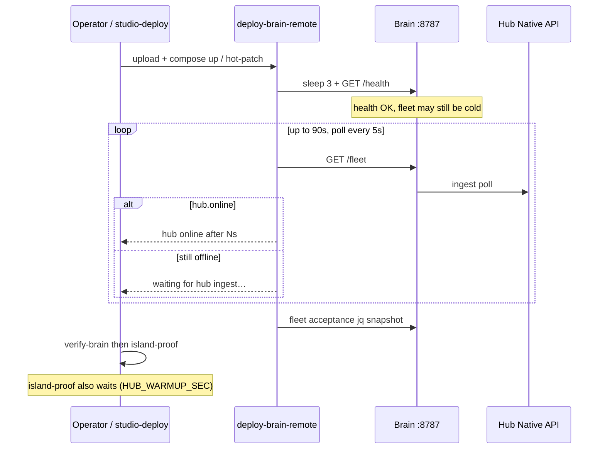

# Deploy proof — hub ingest warmup

**Intent:** After a brain container restart, `/health` can be green while Native API fleet ingest still has `hub.online=false`. Tip `931a687` waits for hub online before treat-as-fail so deploy/island-proof no longer false-fail during warmup.

**Scripts:**  
[`deploy-brain-remote.sh`](../../services/dsc-hub/pi/deploy-brain-remote.sh) · [`island-proof.sh`](../../services/dsc-hub/pi/island-proof.sh) · [`verify-brain.sh`](../../services/dsc-hub/pi/verify-brain.sh)

## Why it matters

Brain recreate drops SoftAP briefly; hub and fleet rejoin over ~tens of seconds (often ~45s on live soak; see [`AUDIT-CLOSURE-7.1.2.md`](../qa/AUDIT-CLOSURE-7.1.2.md)). Immediate `hub.online` checks were failing green deploys.



## Behavior (verified against source)

| Script | Warmup | On timeout |
|--------|--------|------------|
| **`deploy-brain-remote.sh`** | Fixed **90s**, poll **5s**, after `/health` | Continues to fleet acceptance jq (may still show `hub_online: false`) |
| **`island-proof.sh`** | **`HUB_WARMUP_SEC`** default **90**, **`HUB_POLL_SEC`** default **5** | After wait, still fails if `hub.online` is false |
| **`verify-brain.sh`** | No wait | **WARN** only: `hub not online yet (ingest may still be warming up)` |

`island-proof` still asserts firmware train `7.0.0*`, inventory snapshot, optional critical ingest audit, and SPA bundle hash. Operator still confirms Nest/HA climate automations off for a true island.

## Run

From studio LAN (defaults `.48` / `dsc-brain.local`):

```powershell
.\studio-deploy.ps1
# or stepwise:
.\deploy-brain.ps1
.\verify-brain.ps1
.\island-proof.ps1
```

On the Pi (or via wrapper), override island-proof wait:

```bash
HUB_WARMUP_SEC=120 HUB_POLL_SEC=5 bash island-proof.sh http://127.0.0.1:8787
```

## Pass signals

| Check | Pass |
|-------|------|
| `/health` | HTTP 200 before/during warmup |
| Hub ingest | `hub.online` true within warmup window |
| Firmware | hub firmware starts with `7.0.0` (`island-proof`) |
| SPA | `assets/index-*.js` in container `/app/static/index.html` |
| pot3 | WARN if still `in_service` (F-003) — not a hard fail |

## Common pitfalls

| Pitfall | Fix |
|---------|-----|
| Instant FAIL on `hub.online` right after deploy | Tip `931a687` — let deploy-remote / island-proof finish the 90s wait; do not abort on first WARN from `verify-brain` |
| Warmup expires, hub still offline | Check SoftAP/`DSC-Brain`, hub STA, Noise keys, `docker logs dsc-hub-brain`; not a script bug |
| Expecting `verify-brain` to block | It only WARNs — island-proof is the hard gate |
| SPA lazy route noise | Unused `SoilTestWizard` / `SankeyFlowPrototype` exports removed from `routes.ts` (components stay imported where used) |

## Related

- Compose honesty (AP drop on recreate): [`DSC-HUB-DOCKER.md`](DSC-HUB-DOCKER.md)
- Studio one-shot (draft until #109 merges): `studio-deploy.ps1` in `services/dsc-hub/pi/`
- Live acceptance: [`LIVE-ACCEPTANCE-7.1.md`](../qa/LIVE-ACCEPTANCE-7.1.md)
- 7.2 closure: [`AUDIT-CLOSURE-7.2.md`](../qa/AUDIT-CLOSURE-7.2.md)
