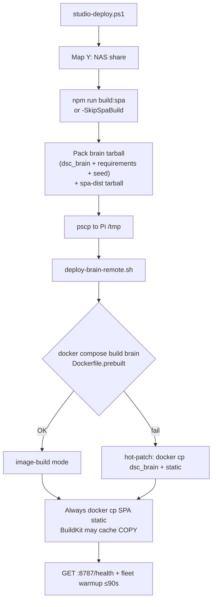

# DSC-HUB Pi appliance — operations

**Release:** DSC-HUB 7.0.0 — The Pi Release · tip **`07bf25f`** / **`8b70d5f`** (professional SPA Pass A–C + NPK/dryback producers in repo; Pi redeploy **blocked** mid-restart — recover then ship SPA `index-CNKKWCfT.js` + brain `sensor_trust.py`). Prior tip **`05e8471`**: Climate Mode / probe rename ops closed; surface **7.3.0**, 7.4 WiP.

## Network

- **AP:** `DSC-Brain` 2.4 GHz, locked channel (1/6/11), WPA2.
- **Subnet:** `10.42.0.0/24`, Pi AP `10.42.0.1`.
- **eth0:** House uplink (optional). Climate runs island; Ollama + remote CannaLib need uplink.
- **Avahi:** `dsc-brain.local`

Fleet DHCP reservations live in `/etc/dsc-hub/dnsmasq.conf` (bootstrap template). After flash, add device MACs from Settings inventory.

## ESPHome compile / OTA

Brain queues `docker exec dsc-hub-esphome esphome compile|run`. Container DNS is **pinned** (`192.168.86.1` + `8.8.8.8`) so PlatformIO can reach GitHub — see [`ESPHOME-OTA-PI.md`](ESPHOME-OTA-PI.md). Recreate `dsc-hub-esphome` after compose pull. Control YAML must be the ESPHome **2025.12** path before panel OTA.

## Brain env — API key casing

Compose maps **uppercase** `DSC_POTN_API_KEY` (and hub/control/appliance keys). Brain lookup is `DSC_{SEAT}_API_KEY` via `esphome_client` / `control_ops`. Lowercase `dsc_potN_API_KEY` in compose silently emptied encrypt keys after recreate (`19b5c4b`) — pot1/2 dropped offline. Restore values from Notion **API Keys & Credentials**; never paste into Wiki/PRs.

## Software-only demo (not the Pi fleet)

Isolated Compose — **no** ESPHome / MQTT / Zigbee / LAN keys. Host port **8788**.

```bash
docker compose -f services/dsc-hub/docker-compose.demo.yml up -d --build
curl -s http://localhost:8788/health   # mode=demo
```

Never point demo inventory at private hosts or set live `DSC_*_API_KEY`. Soft calibrate / lab wet: [`SOFT-CAL.md`](SOFT-CAL.md) · [`LAB-WET-CAL.md`](LAB-WET-CAL.md).

Demo seed file **must** be present for `Dockerfile.prebuilt` builds: [`brain/data/demo-fleet-seed.json`](../../brain/data/demo-fleet-seed.json). Tip `4817c47` packs it into the brain deploy tarball.

## Deploy path (studio → Pi)

One-shot from studio LAN: [`studio-deploy.ps1`](../../services/dsc-hub/pi/studio-deploy.ps1) → `deploy-brain.ps1` → `verify-brain.ps1` → `island-proof.ps1`.



| Script | Role |
|--------|------|
| `studio-deploy.ps1` | Maps `Y:` → NAS, runs deploy → verify → island-proof |
| `deploy-brain.ps1` | Builds/reuses spa-dist, packs uploads, plinks remote apply |
| `deploy-brain-remote.sh` | Extracts under `/opt/dsc-hub-repo`, compose build **or** hot-patch |
| `verify-brain.ps1` / `island-proof.ps1` | Acceptance after deploy |

**NAS tree is SoT for packs.** `deploy-brain.ps1` reads the NAS `Y:` tree. Studio `C:` clones are **not** packed unless synced onto `Y:`.

### Soil metrics + SPA (tip `07bf25f` / gate `8b70d5f`)

After NPK/dryback/rate producers land in repo, Pi needs **both**:

1. SPA bundle with map keys `nitrogen|phosphorus|potassium` + `/fleet/computed` merge (`index-CNKKWCfT.js` on tip).
2. Brain container with updated `sensor_trust.py` (producers).

Hot-patch SPA alone is not enough for dryback/rate. Tip `8b70d5f`: SSH/HTTP to `.48` timed out mid-restart — redeploy when host recovers. Runbook: [`FLEET-SOIL-METRICS.md`](FLEET-SOIL-METRICS.md) · kit SPA: [`../brain/KIT-SOT-SPA.md`](../brain/KIT-SOT-SPA.md).

### Seed pack (required for image-build)

`Dockerfile.prebuilt` copies `brain/data/demo-fleet-seed.json`. Tip **`4817c47`** — `deploy-brain.ps1` packs the seed into the brain tarball and fails closed if missing on the NAS tree. Before that tip, missing seed → COPY fail → silent **hot-patch** fallback. Prefer `deploy mode: image-build` in the remote log.

## Cutover checklist

1. Bootstrap Pi (`pi-bootstrap.sh`), compose up, `/health` green.
2. Move SkyConnect from Unraid; z2m sees coordinator.
3. Build firmware **7.0.0.0** (`wifi-pi` stubs); rotate Noise API keys → `.env` + Notion (**uppercase** compose env names).
4. Flash order: hub → pot2 canary → pot1 → Sonoffs → panel. **Skip pot3/pot4** (retired from kit / planned OOS).
5. Disable HA demand-follower automations and HA ESPHome integrations (do not delete packages until soak).
6. Hub ESP-NOW parked on Pi path; brain polls hub demand switches and drives Sonoff relays (45s stale OFF).
7. **Island proof:** Nest + HA off; tent on Pi AP; fleet chip `7.0.0.0`.
8. With eth0 up: Settings → Test Ollama + Test CannaLib green.
9. With eth0 down: integrations HELD; catalog uses local fallback if present.
10. Stamp git tag `v7.0.0` only after soak.

## Acceptance tests

```bash
# Brain unit tests
pip install -r brain/requirements.txt pytest
pytest brain/tests -q

# Firmware config (on host with esphome)
esphome config firmware/v4/dsc-hub.yaml
esphome config firmware/v4/dsc-control.yaml

# SPA build (bundled into brain image)
cd homeassistant/custom_components/dsc_hub/frontend
npm install && npm run build:spa
```

## Monitoring

- Uptime Kuma: `GET http://dsc-brain.local:8787/health`
- Fleet WS: `ws://dsc-brain.local:8787/ws/fleet`

## Honesty boundaries

- Pi power-off → AP dies; Sonoffs failsafe OFF.
- Brain container restart (deploy/`compose up`) briefly drops the hub AP; hub and fleet devices rejoin within ~2 min. Expect a short fleet-offline window on every deploy — not a fault.
- LLM prose is not catalog SoT.
- Zigbee plugs are additive; climate legs stay on Sonoffs.

## HA lab note

HA custom panel may still show surface **7.2.0** in lab. Product appliance is **7.0.0** on Pi (surface **7.3.0**).

## Related

- [`ESPHOME-OTA-PI.md`](ESPHOME-OTA-PI.md) · [`SOFT-CAL.md`](SOFT-CAL.md) · [`../brain/CLIMATE-MODE-POLICY.md`](../brain/CLIMATE-MODE-POLICY.md)
- [`../brain/PROBE-PLANT-MODEL.md`](../brain/PROBE-PLANT-MODEL.md) · [`ZIGBEE-RECOVERY.md`](ZIGBEE-RECOVERY.md)
