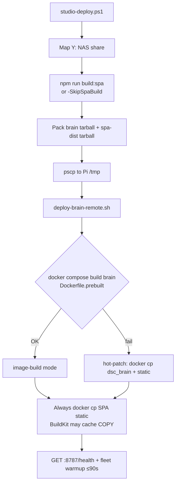

# DSC-HUB Pi appliance — operations

**Release:** DSC-HUB 7.0.0 — The Pi Release · tip **`7fa85b5`** (7.4 software WiP; surface still **7.3.0**).

## Network

- **AP:** `DSC-Brain` 2.4 GHz, locked channel (1/6/11), WPA2.
- **Subnet:** `10.42.0.0/24`, Pi AP `10.42.0.1`.
- **eth0:** House uplink (optional). Climate runs island; Ollama + remote CannaLib need uplink.
- **Avahi:** `dsc-brain.local`

Fleet DHCP reservations live in `/etc/dsc-hub/dnsmasq.conf` (bootstrap template). After flash, add device MACs from Settings inventory.

## Software-only demo (not the Pi fleet)

Isolated Compose — **no** ESPHome / MQTT / Zigbee / LAN keys. Host port **8788**. Public hostname: `brain-demo.plausible-deniability.net` (Cloudflare tunnel → `:8788`).

```bash
docker compose -f services/dsc-hub/docker-compose.demo.yml up -d --build
# or on NAS: services/dsc-hub/pi/deploy-brain-demo-remote.sh
curl -s http://localhost:8788/health   # mode=demo
```

Runbook: [`docs/brain/DEMO-MODE.md`](../brain/DEMO-MODE.md). Never point demo inventory at private hosts or set `DSC_*_API_KEY`. Soft calibrate / lab wet: [`LAB-WET-CAL.md`](LAB-WET-CAL.md). Plant seat / probe layers: [`../brain/PLANT-SEAT.md`](../brain/PLANT-SEAT.md).

Demo seed file **must** be present for `Dockerfile.prebuilt` builds: [`brain/data/demo-fleet-seed.json`](../../brain/data/demo-fleet-seed.json) (see pitfall below).

## Deploy path (studio → Pi)

One-shot from studio LAN: [`studio-deploy.ps1`](../../services/dsc-hub/pi/studio-deploy.ps1) → `deploy-brain.ps1` → `verify-brain.ps1` → `island-proof.ps1`.



| Script | Role |
|--------|------|
| `studio-deploy.ps1` | Maps `Y:` → NAS, runs deploy → verify → island-proof |
| `deploy-brain.ps1` | Builds/reuses spa-dist, packs uploads, plinks remote apply |
| `deploy-brain-remote.sh` | Extracts under `/opt/dsc-hub-repo`, compose build **or** hot-patch |
| `verify-brain.ps1` / `island-proof.ps1` | Acceptance after deploy |

**NAS tree is SoT for packs.** `deploy-brain.ps1` reads `Y:\Digital Stealth Care\Projects\DSC-HUB\...`. Studio `C:` clones are **not** what the script packs unless synced onto `Y:`. Tip `7fa85b5`: polish SPA landed after **C:→Y: spa-dist sync**, then hot-patch to `.48:8787` (`index-Ciw7XTuZ.js`).

## Deploy modes: `image-build` vs `hot-patch`

Verified in [`deploy-brain-remote.sh`](../../services/dsc-hub/pi/deploy-brain-remote.sh):

| Mode | When | What lands |
|------|------|------------|
| `image-build` | `docker compose build brain` succeeds | New image from `Dockerfile.prebuilt`; container recreated |
| `hot-patch` | Compose build **fails** | Existing container force-recreated; `docker cp` of `dsc_brain/` (+ static if present) |

Regardless of mode, the remote script **always** `docker cp`s `brain/static/` into the running container afterward (BuildKit can cache a stale `COPY brain/static`).

### Pitfall: `demo-fleet-seed.json` missing from pack

`Dockerfile.prebuilt` does:

```dockerfile
COPY brain/data/demo-fleet-seed.json ./brain/data/demo-fleet-seed.json
COPY brain/static ./static
```

But `deploy-brain.ps1` currently packs only:

```powershell
tar -czf $TarPath dsc_brain requirements.txt
```

So the Pi build context under `/opt/dsc-hub-repo` often **lacks** `brain/data/demo-fleet-seed.json` → compose build fails → deploy falls into **hot-patch**. Tip `7fa85b5` recorded this as **noted**; seed was synced onto `Y:` so a future image-build can succeed. Until the packer includes `brain/data/demo-fleet-seed.json`, treat hot-patch + always-SPA-sync as the reliable chrome path.

**Do not paste** `.env` / API keys into docs. Restore `services/dsc-hub/.env` from Notion credentials DB when missing (gitignored).

## Deploy: SkipSpaBuild

`services/dsc-hub/pi/deploy-brain.ps1 -SkipSpaBuild` reuses the existing `spa-dist/` tree (NAS-safe when `npm run build:spa` already ran or committed hashes are current). Default path still builds SPA then packs static into the brain image / hot-patch.

After any SPA change that must land on Pi: sync hashes onto **Y:**, build (or omit `-SkipSpaBuild`), commit matching `spa-dist` hashes when the tree tracks them, hard-refresh `:8787`.

Current tip spa-dist entry: `index-Ciw7XTuZ.js` (+ `calibrate-CzxOXAJy` · `tune-fleet-KoWKiPmD` · CSS `index-FUwb4k_E`) — tip `a50d402` rebuilt; tip `7fa85b5` confirms live Pi hot-patch after C:→Y: sync.

**Pitfall:** `-SkipSpaBuild` after SPA source edits leaves Pi on stale hashes. Tip `a50d402` closed the prior HelpTip source-only gap (HubLinkLine/`dsc-help-tip` in `tune-fleet-KoWKiPmD`; OOS + ESP/Modbus cues in `index-Ciw7XTuZ`). After the next chrome change, rebuild + sync to Y: + commit matching hashes or omit `-SkipSpaBuild`. See [`../brain/HELP-TIP.md`](../brain/HELP-TIP.md).

## Cutover checklist

1. Bootstrap Pi (`pi-bootstrap.sh`), compose up, `/health` green.
2. Move SkyConnect from Unraid; z2m sees coordinator.
3. Build firmware **7.0.0.0** (`wifi-pi` stubs); rotate Noise API keys → `.env` + Notion.
4. Flash order: hub → pot2 canary → remaining pots → Sonoffs → panel.
5. Disable HA demand-follower automations and HA ESPHome integrations (do not delete packages until soak).
6. Hub ESP-NOW parked on Pi path; brain polls hub demand switches and drives Sonoff relays (45s stale OFF).
7. **Island proof:** Nest + HA off; tent on Pi AP; fleet chip `7.0.0.0`.
8. With eth0 up: Settings → Test Ollama + Test CannaLib green.
9. With eth0 down: integrations HELD; catalog uses local fallback if present.
10. Stamp git tag `v7.0.0` only after soak.

## Acceptance tests

```bash
# Brain unit tests
pip install -r brain/requirements.txt pytest
pytest brain/tests -q

# Firmware config (on host with esphome)
esphome config firmware/v4/dsc-hub.yaml
esphome config firmware/v4/dsc-control.yaml

# SPA build (bundled into brain image)
cd homeassistant/custom_components/dsc_hub/frontend
npm install && npm run build:spa
```

## Monitoring

- Uptime Kuma: `GET http://dsc-brain.local:8787/health`
- Fleet WS: `ws://dsc-brain.local:8787/ws/fleet`

## Honesty boundaries

- Pi power-off → AP dies; Sonoffs failsafe OFF.
- Brain container restart (deploy/`compose up`) briefly drops the hub AP; hub and fleet devices rejoin within ~2 min. Expect a short fleet-offline window on every deploy — not a fault.
- LLM prose is not catalog SoT.
- Zigbee plugs are additive; climate legs stay on Sonoffs.

## HA lab note

HA custom panel may lag Pi surface. Product appliance SPA on Pi is SoT (`:8787`). Lovelace YAML retired (7.3 archive).
