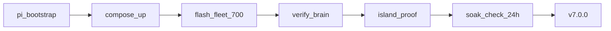

# DSC-HUB Pi appliance — operations

**Release:** DSC-HUB 7.0.0 — The Pi Release. Tip train through **`f10ad40`** (island product `f4299f6` + Modbus `504b82d` + flash seat quoting / Sonoff FW text).

**Full ops runbook:** [`docs/qa/PI-APPLIANCE-7.0.md`](../qa/PI-APPLIANCE-7.0.md) (architecture, LAN map, AP PSK, **noise_psk**, WiFi-pref, env recreate, FleetSnapshot `/fleet` + `/fleet/computed`, **fleet flash**, soak/island-proof, **Dockerfile.prebuilt** + eth0).  
**Compose / bootstrap:** [`services/dsc-hub/README.md`](../../services/dsc-hub/README.md).  
**Soak log:** [`docs/ops/SOAK-2026-08-26.md`](SOAK-2026-08-26.md).

## Network

- **AP:** `DSC-Brain` 2.4 GHz, locked channel (1/6/11), WPA2.
- **PSK:** Shared fleet secret — brain `ap_psk` / `DSC_AP_PSK` / hostapd / firmware `wifi_password` must match. Canonical value in Notion **API Keys & Credentials** (*DSC-Brain Pi AP*). Tip `8867b33` removed `changeme-dsc-brain` defaults; live Pi with that placeholder → `services/dsc-hub/pi/fix-ap-psk.sh`.
- **Subnet:** `10.42.0.0/24`, Pi AP `10.42.0.1`.
- **eth0:** House uplink (optional for climate; **required** for Docker Hub pulls during `compose build brain`). Deploy runs `bring-up-eth0.sh` before build. Climate island still works AP-only (hot-patch fallback).
- **Avahi:** `dsc-brain.local`

Fleet DHCP reservations live in `/etc/dsc-hub/dnsmasq.conf` (bootstrap template). After flash, add device MACs from Settings inventory. Default seats: hub `.10`, control `.11`, pots `.21–.24`, Sonoffs `.50/.51/.54/.55`.

## Cutover checklist

1. Bootstrap Pi (`pi-bootstrap.sh`), compose up, `/health` green. Confirm AP PSK matches firmware secrets (Notion credentials). `/opt/dsc-hub` + `/opt/dsc-hub-repo` symlinks exist.
2. Move SkyConnect from Unraid; z2m sees coordinator.
3. Build firmware **7.0.0.0** (`wifi-pi` stubs); rotate Noise API keys → `.env` + Notion **API Keys & Credentials** (never paste live keys into Wiki/PRs). After `.env` edits: `recreate-brain-env.sh` or deploy path that force-recreates brain (hot-patch alone does not reload env).
4. Flash order: hub → pot2 canary → remaining pots → Sonoffs → panel via `flash-fleet-700.ps1` (quotes seat list for Windows→plink). If hub still prefers SoftAP/Nest BSSID: `clear-hub-wifi-pref.sh` (see runbook).
5. Disable HA demand-follower automations and HA ESPHome integrations (do not delete packages until soak).
6. Hub ESP-NOW parked on Pi path; brain polls hub demand switches and drives Sonoff relays (45s stale OFF) via `appliance_driver.py` using **noise_psk** (`native_api.make_api_client`).
7. Deploy SPA: `services/dsc-hub/pi/deploy-brain.ps1` (prebuilt Dockerfile; eth0 for image-build, else hot-patch). Run `verify-brain.ps1` / `.sh`; confirm `/fleet` fans+countdowns + SPA `index-BJFHGKyp`; hard-refresh UI.
8. **Island proof:** Nest + HA off; tent on Pi AP; `island-proof.ps1`; fleet chip `7.0.0.0`.
9. With eth0 up: Settings → Test Ollama + Test CannaLib green.
10. With eth0 down: integrations HELD; catalog uses local fallback if present.
11. Hourly `soak-check.ps1` during 24h soak; stamp git tag `v7.0.0` only after soak.



## Acceptance tests

```bash
# Brain unit tests
pip install -r brain/requirements.txt pytest
pytest brain/tests -q

# Firmware config (on host with esphome)
esphome config firmware/v4/dsc-hub.yaml
esphome config firmware/v4/dsc-control.yaml

# SPA build (bundled into brain prebuilt image)
cd homeassistant/custom_components/dsc_hub/frontend
npm install && npm run build:spa
```

## Monitoring

- Uptime Kuma: `GET http://dsc-brain.local:8787/health`
- Fleet WS: `ws://dsc-brain.local:8787/ws/fleet`
- Computed helpers: `GET /fleet/computed`
- Control smoke: `POST /control/service` with a mapped number/fan; confirm `hub.values.controls` on `/fleet`
- Sensor/binary smoke: `jq '.hub.values | {room_temp_c, clone_temp_c, binaries}'` on `/fleet`
- History smoke: `GET /history?entity_id=sensor.dsc_hub_tent_temperature&hours=6` (also room/clone entity ids)
- Soak: `services/dsc-hub/pi/soak-check.ps1` — watch `warn: fans_all_zero`

## Honesty boundaries

- Pi power-off → AP dies; Sonoffs failsafe OFF.
- LLM prose is not catalog SoT.
- Zigbee plugs are additive; climate legs stay on Sonoffs.
- Sonoff **text** `Firmware Version` and `project.version` must both be **7.0.0.0** or the fleet chip lies.

## HA lab note

HA custom panel may still show surface **7.2.0** in lab. Product appliance is **7.0.0** on Pi.
