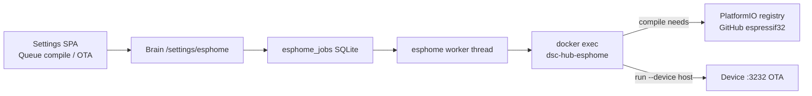

# ESPHome compile / OTA on Pi

**In one line:** Fleet OTA is operator-queued via brain → `docker exec dsc-hub-esphome esphome compile|run`. Compile needs outbound DNS/HTTPS from the Pi to fetch PlatformIO packages (e.g. espressif32 from GitHub). Without that, OTA is blocked — use USB or a prebuilt `.bin` from a networked host.

Verified tip note: `331b91f` / FOLLOWUPS (2026-08-29) — Pi ESPHome DNS fail fetching PlatformIO espressif32 from GitHub. Job path: `brain/dsc_brain/esphome_jobs.py`.

## Intent

Operators flash hub / DSC-Probe / Control from Settings without SSH. The worker is intentional (one compile at a time) and never auto-flashes.

## Architecture

| Piece | Code / container |
|-------|------------------|
| Queue | `esphome_jobs.queue_job` — actions `compile` \| `ota` |
| Worker | `start_esphome_worker` → `docker exec dsc-hub-esphome esphome …` |
| YAML map | seat `pot1`→`DSC-Probe1.yaml`, `hub`→`dsc-hub.yaml`, … |
| Constraint | **One compile** queued/running at a time on Pi |

## Symptom (2026-08-29)

- Code train `654d0f8` (dsc_probe rename + `cal_session`) is on master.
- Pi ESPHome compile fails resolving / fetching **PlatformIO espressif32** from **GitHub**.
- Result: **OTA blocked** until Pi has working internet DNS/HTTPS **or** firmware is built elsewhere and flashed USB / uploaded as prebuilt.

## Workarounds (pick one)

1. **Restore Pi uplink DNS** — eth0/house DNS must resolve `github.com` / PlatformIO hosts from inside `dsc-hub-esphome`. Retest: `docker exec dsc-hub-esphome esphome compile DSC-Probe2.yaml`.
2. **Compile on studio LAN** — build from `firmware/v4/` on a host with GitHub access; OTA upload to device IPs when `:3232` is up.
3. **USB flash** — required when OTA port refused (e.g. pot3 F-003) or bootloader-sensitive Control builds. Order below still applies.
4. **Do not** invent offline PlatformIO mirrors in docs without a verified lab procedure.

## Probe rename OTA train

Entity/provider rename requires a coordinated flash. Checklist: [`../qa/PROBE-RENAME-CLEANUP.md`](../qa/PROBE-RENAME-CLEANUP.md).

**Order:** hub (providers) → pot2 canary → pot1,3,4 → control (if not already on Climate Mode 0xD1 v2).

Hub + panel co-flash for Climate Mode: [`../qa/PANEL-HUB-COFLASH-CHECKLIST.md`](../qa/PANEL-HUB-COFLASH-CHECKLIST.md).

## Secrets

OTA / API / SoftAP secret **keys** remain `dsc_potN_*` and hub/control names — unchanged by the probe rename. Values live in Notion **API Keys & Credentials** and gitignored `secrets.yaml` — never paste into Wiki or PRs.

## Related

- [`PROBE-PLANT-MODEL.md`](../brain/PROBE-PLANT-MODEL.md) · [`SOFT-CAL.md`](SOFT-CAL.md)
- [`DSC-HUB-DOCKER.md`](DSC-HUB-DOCKER.md) · [`../FOLLOWUPS.md`](../FOLLOWUPS.md)
- Fallback SoftAP hub recover: `services/dsc-hub/pi/flash-hub-fallback-remote.sh` (assumes **already compiled** firmware in the container)
